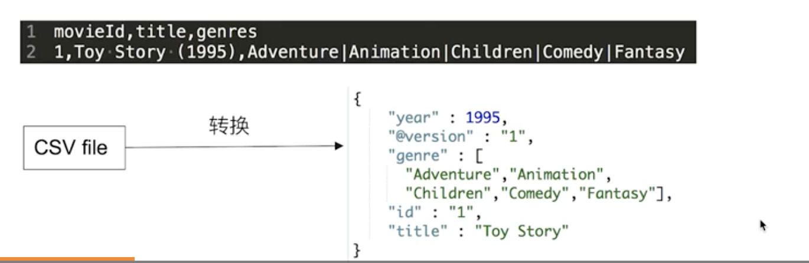

传统关系型数据库与ES区别类比

| RDBMS | Elasticsearch |
| :---- | ------------- |
| Table | Index(Type)   |
| Row | Document  |
| Column | Field   |
| Schema | Mapping   |
| SQL | DSL   |

- ES ------  Schemaless / 相关性 / 高性能全文检索
- RDMS ------ 事务性 / Join 


# 一、文档

- ES是面向文档的，文档是所有可搜索数据的最小单位
  - 日志文件中的日志项
  - 一本电影内的具体信息
  - 一篇PDF中的具体内容
- 文档会被序列化json格式，保存在ES中
  - JSON对象由字段组成
  - 每个字段有对应的字段类型（字符串/数值/布尔/日期/二进制/范围类型）
- 每个文档都有个 Unique ID
  - 你可以自己指定ID
  - 或者可以通过ES自动生成


## 1.JSON文档

- 一篇文档包含了一系列的字段，类似于数据库的一条记录
- JSON文档，格式灵活，不需要预先定义格式
  - 字段的类型可以指定，也可以由ES来进行推断
  - 支持数组 / 支持嵌套



## 2.文档的元数据

- 元数据，用于标注文档的相关信息
  - _index - 文档所属的索引名
  - _type - 文档所属的类型名
  - _id - 文档的唯一标识ID
  - _source - 文档的原始json数据信息
  - _all - 整合所有字段内容到该字段 【7.0版本后已废除】
  - _version - 文档的版本信息内容
  - _score - 查询内容相关性打分


# 二、索引

- Index - 索引是文档的容器，是一类文档的结合
  - Index 体现了逻辑空间的概念，每个索引都有自己的Mapping定义，用于定义包含的文档的字段名和字段类型
  - Shard 体现了物理空间的概念，索引中的数据分散在Shard上
- 索引的Mapping和Settings
  - Mapping定义文档字段的类型
  - Setting定义不同的数据分布


- Type
  - 在7.0 之前，一个Index 可以设置多个Type
  - 在6.0开始，Type已经被Deprecated。7.0开始，一个索引只能创建一个Type - “_doc”


# 三、ES的分布式特性

- Es的分布式架构的好处
  - 存储的水平扩容
  - 提高系统的可用性，部分节点停止服务，整个集群的服务不受影响
- Es的分布式架构
  - 不同的集群通过不同的名字来区分，默认名字“elasticsearch”
  - 通过配置文件修改，活在命令行中 `-E cluster.name=name`进行设定
  - 一个集群可以有一个或者多个节点

# 四、节点

- 节点是一个 Elasticsearch 的实例
  - 本质上就是一个JAVA进程
  - 一个机器上可以运行多个Elasticsearch进程，但是生产环境建议单台只运行一个实例
- 每一个节点都有名字，通过配置文件配置，或者启动的时候 `-E node.name=node`指定
- 每一个节点在启动后会分配一个UID，保存在data目录下


## 1.Master-eligible nodes 和 Master Node

- 每个节点启动后，默认就是一个 Master-eligible 节点
  - 可以设置 `node.master: false` 禁止
- Master-eligible节点可以参加选主的过程，成为Master节点
- 当一个节点启动时候，它会将自己选举为Master节点
- 每个节点都保存了集群的状态，只有Master节点才能修改集群的状态信息
  - 集群状态(`Cluster state`)维护了一个集群中的必要信息
    - 所有的节点信息
    - 所有的索引和其相关的Mapping与Setting信息
    - 分片的路由信息
  - 任意节点都能修改信息会导致数据的不一致

## 2.Data Node 与 Coordinating Node

- Data Node
  - 可以保存数据的节点。负责保存分片数据，在数据拓展上起到了至关重要的作用
- Coordinating Node
  - 负责接收Client的请求，将请求分发到合适的节点，最终把结果汇聚到一起
  - 每个节点默认都起到了Coordinating Node 的职责

## 3.Hot & Warm Node

- 不同硬件配置的Data Node， 用来实现 Hot & Warm架构，降低集群部署的成本

## 4.Machine Learning Node

- 负责跑 机器学习的Job，用来做异常检测

## 5.Tribe Node

- （5.3开始使用 Cross Cluster Search）Tribe Node 连接到不同的Es集群，并且支持将这些集群当成一个单独的集群处理。

## 6.配置节点类型


# 五、分片

- 主分片(Primary Shard)，用以解决数据水平拓展的问题。通过主分片，可以将数据分布到集群内的所有节点之上
  - 一个分片是一个运行的Lucene的实例
  - 主分片数载索引创建时指定，后续不允许修改，除非ReIndex
- 副本(Replica Shard)，用以解决数据高可用的问题。分片是主分片的拷贝
  - 副本分片数可以动态调整
  - 增加副本数，还可以在一定程度上提高服务的可用性（读取的吞吐）


## 1.分片的设定

- 对于生产环境中分片的设定，需要提前做好容量规划
  - 分片数设置过小
    - 导致后续无法增加节点实现水平拓展
    - 单个分片的数据量太大，导致数据重新分配耗时
  - 分片数设置过大(*7.0开始，默认主分片设置从5变成1，解决了 over-sharding的问题*)
    - 影响搜索结果的相关性打分，影响统计结果的准确性
    - 单个节点上过多的分片，会导致资源浪费，同时也会影响性能

## 2.分片的健康状况

```
GET _cluster/health
```

- Green - 主分片与副本分片都整成分片
- Yellow - 主分片全部正常分配，有副本分片未能正常分配
- Red - 有主分片未能分配
  - 例如，当服务器的磁盘容量超过85%时候，去创建了一个新的索引
