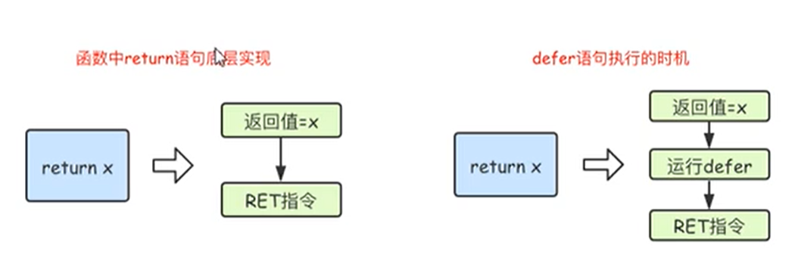

## 一、函数基础
Go语言中支持函数、匿名函数和闭包，并且函数在Go语言中属于“一等公民”
### 1. 函数定义
```
func 函数名(参数)(返回值) { 函数体 }

// 事例
func sum(x int, y int) (ret int) {
	// 同 func sum(x int, y int) int ，返回可以命名，可以不命名，命名的，在函数中可以直接使用，相当于提前声明了变量, 并且最后可以省略 return 如下
	ret = x + y 
	return // 相当于return ret
}
func fc()(int, string) {
	return 1, "string"s
}
func main(){
	r := sum(1, 2)
}
```
注意：(1) 参数类型简写，当连续参数中，多个参数类型一致，可以将非最后一个参数类型省略，如`func f(x,y,z int, h, s string) int {}`;  (2) 可变长参数如`func f(x string, y ...int) {}, 其中y在函数内会是个指定类型的slice切片，可变长参数要放到参数最后`; (3) Go语言中函数没有默认参数这个概念

### 2. defer 语句
Go语言中的defer语句将其后面跟随的语句进行延迟处理。在defer归属的函数即将返回时，将延迟处理的语句按defer定义的逆序进行执行，也就是说，先被defer的语句最后被执行，最后被defer的语句，最先被执行， 如下
**由于`defer`语句延迟调用的特性，所以其能方便的处理资源释放问题。比如资源清理、文件关闭、解锁以及记录时间等**
```
// 代码
func main() {
	fmt.Println("开始")
	defer fmt.Println(1)
	defer fmt.Println(2)
	defer fmt.Println(3)
	fmt.Println("结束")
}
// 执行结果
开始
结束
3
2
1
```

**defer执行时机**：在Go语言函数中 return 语句在底层并不是原子操作，它分为给返回值赋值和RET指令两步，而defer语句执行的时机就是在返回值赋值操作之后，RET指令执行之前。

```
// 第一步：返回值赋值
// defer
// 第二部：真正的RET返回
func f1() int {
	x := 5
	defer func() {
		x++ // 修改的x不是返回值
	}()
	return x
} // 结果为5

func f2() (x int) {
	defer func() {
		x++
	}()
	return 5 //返回值 = x
} // 结果为 6

func f3() (y int) {
	x := 5
	defer func() {
		x++
	}()
	return x // 返回值 y = x = 5, x++, return
} // 结果为 5

func f4() (x int) {
	defer func(x int) {
		x++ // 改变的是函数的副本，x是形参
	}(x)
	return 5
} // 结果为 5

```

## 二、函数进阶

### 1.变量作用域
**全局变量与局部变量**
函数中查找变量的顺序:`1. 先在函数内查找； 2. 找不到就往函数外查找，一直找到全局`
```
package main
import "fmt"
var num int64 = 10 // 全局变量
func test(){
	var age int64 = 100 // 局部变量，无法在函数外访问
}
```
**注意，for/if循环中定义的变量也只能在for/if语句块中使用，与其他语言不太一样**
```
	x := 1
	for x < 10 {
		y := 10
		x++
	}
	// fmt.Println(y) , 在这里输出就会报错，同理if
```

### 2. 函数类型和变量
我们可以使用`type`关键字来定义一个函数类型，具体格式如下
```
type calculation func(int, int) int
// 上面语句定义了一个 calculation 类型，它是一种函数类型，这种函数接受两个int类型参数并返回一个int类型的返回值，简单的说，凡是满足这个条件的函数都是 calculation 类型的函数，例如下面函数add、sub都是 calculation 类型

func add (x, y int) int {
	return x + y
}
func sub (x, y int) int {
	return x - y
}
```
函数也可以作为参数的类型，也可以作为返回值
```
func f2() int {
	return 5
}
func f3(x func() int) {
	ret := x()
}
func f4(x func() int)func(){
	ret := func (a, b int) int {
		return a + b
	}
	return ret
}
func main(){
	f5 = f4(f2)
}
```

## 三、匿名函数
```
// 形式一
var f1 = func(x, y int) int {
	return x + y
}

func main() {
	f1(1, 2)
	// 形式二
	f2 := func (x, y int) int {
		return x + y
	}
	f2(10, 20)
	// 形式三，如果只是调用一次的函数，可以简写成立即执行函数
	func(){
		fmt.Print("hello world")
	}()
	func(x, y int){
		fmt.Print("hello world")
	}(10, 20)
}
```

## 四、闭包
闭包指的是一个函数和与其相关的引用环境组合而成的实体，简单来说`闭包=函数+引用环境`。首先看一个例子
**1. 函数可以做返回值；2. 函数内部查找变量顺序，现在自己内部照，找不到往外层找**
```
func adder() func(int) int {
	var x int
	return func(y int) int {
		x += y
		return x
	}
}
func main(){
	var f = adder()
	fmt.Println(f(10)) // 10
	fmt.Println(f(20)) // 30
	fmt.Println(f(30)) // 60
	
	f1 := adder()
	fmt.Println(f1(40)) // 40
	fmt.Println(f1(50)) // 90
}
```
变量 f 是一个函数并且它引用了其他外部作用域中的 x 变量，此时 f 就是一个闭包。在 f 的生命周期内，变量 x 也一致有效。闭包进阶示例1:
```
// 要求 f1(f2) , 其中 f1是其他人写的，不可变更，
func f1(f func()) {
	fmt.Println("this is f1");
	f()
}
func f2(x, y int) {
	fmt.Println("this is f2");
	fmt.Println(x + y);
}
//思路， 建立一个f3函数接受x，y，返回一个无参数的函数
func f3(f func(int, int), x, y int) func() {
	tmp := func(){
		f(x, y)
	}
	return tmp
}
// 实际调用
func main(){
	ret := f3(f2, 100, 200) // 把原本需要传递两个int类型参数包装成一个不需要参数的函数
	f1(ret)
}
```

示例二
```
// 闭包=函数+引用环境
func makeSuffixFunc(suffix string) func(string) string {
	return func(name string) string {
		if !strings.HasSuffix(name, suffix) {
			return name + suffix
		}
		return name
	}
}
func main() {
	jpgFunc := makeSuffixFunc(".jpg")
	txtFunc := makeSuffixFunc(".txt")
	fmt.Println(jpgFunc("test"))
	fmt.Println(txtFunc("test"))
}
```
示例三
```
func calc(base int) (func(int) int, func(int) int) {
	add := func(i int) int {
		base += i
		return base
	}
	sub := func(i int) int {
		base -= i
		return base
	}
	return add, sub
}

func main() {
	add, sub := calc(10)
	fmt.Println(add(1), sub(1))
}
```

## 五、内置函数


|  内置函数   | 介绍  |
|  ----  | ----  |
|close| 主要是用来关闭channel |
|len| 用来求长度，比如string、array、slice、map、channel |
|new|用来分配内存，主要用来分配值类型，int、struct。返回的是指针|
|make|用来分配内存，主要用来分配引用类型，chan、map、slice|
|append|用来追加元素到数组、slice中|
|panic和recover|用来处理错误, panic可以在任何地方引发，recover只有在defer调用的函数中有效|


### 1. panic 用法
panic用法挺简单的, 其实就是throw exception。

panic是golang的内建函数，panic会中断函数F的正常执行流程, 从F函数中跳出来, 跳回到F函数的调用者. 对于调用者来说, F看起来就是一个panic, 所以调用者会继续向上跳出, 直到当前goroutine返回. 在跳出的过程中, 进程会保持这个函数栈. 当goroutine退出时, 程序会crash。

要注意的是, F函数中的defered函数会正常执行, 按照defer的规则。

同时引起panic除了我们主动调用panic之外, 其他的任何运行时错误, 例如数组越界都会造成panic
```
package main

import (
    "fmt"
)

func main() {
    test()
}

func test() {
    defer func() { fmt.Println("打印前") }()
    defer func() { fmt.Println("打印中") }()
    defer func() { fmt.Println("打印后") }()
    panic("触发异常")
    fmt.Println("test")
}

-------output-------
打印后 
打印中 
打印前 
panic: 触发异常 goroutine 1 [running]: 
main.test() 
　　　　D:/Go_Path/go/src/logDemo/main.go:15 +0x98 
　　　　main.main() D:/Go_Path/go/src/logDemo/main.go:8 +0x27 
exit status 2
```

### 2. recover用法
recover也是golang的一个内建函数， 其实就是try catch。

不过需要注意的是：
　　1. recover如果想起作用的话， **必须在defered函数中使用**。
　　2. 在正常函数执行过程中，调用recover没有任何作用, 他会返回nil。如这样：fmt.Println(recover()) 。
　　3. 如果当前的goroutine panic了，那么recover将会捕获这个panic的值，并且让程序正常执行下去。不会让程序crash。

```
func main() {
   fmt.Println("c")
   defer func() { // 必须要先声明defer，否则不能捕获到panic异常
      fmt.Println("d")
      if err := recover(); err != nil {
         fmt.Println(err) // 这里的err其实就是panic传入的内容
      }
      fmt.Println("e")
   }()
   f() //开始调用f
   fmt.Println("f") //这里开始下面代码不会再执行
}

func f() {
   fmt.Println("a")
   panic("异常信息")
   fmt.Println("b") //这里开始下面代码不会再执行
}
-------output-------
c
a
d
异常信息
e
--------------------------------------------------
```
注意，recover必须在defered函数中使用，以下情况不会生效
```
func doRecover() {
    fmt.Println("捕获到异常 =>", recover()) //输出: 捕获到异常 => <nil>
}
func main() {
    defer func() {
        doRecover() //注意：这里间接使用函数，在函数中调用了recover()函数，
        // panic 没有恢复,没有捕获到错误信息
    }()
    panic("手动抛出异常")
}
-------output-------
捕获到异常 => <nil>
panic: 手动抛出异常
goroutine 1 [running]:
main.main()
exit status 2
```

## 六、递归
其实就是自己调用自己，要有一个明确的退出条件
适合处理那种问题相同，规模越来越小的场景
```
// 计算阶乘
func f(n) int64 {
	if(n <= 1) {
		return 1
	}
	return n * f(n-1)
}
```