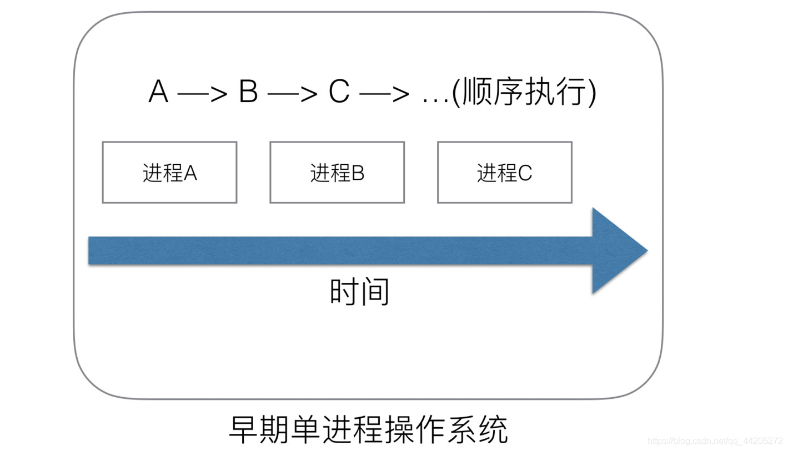
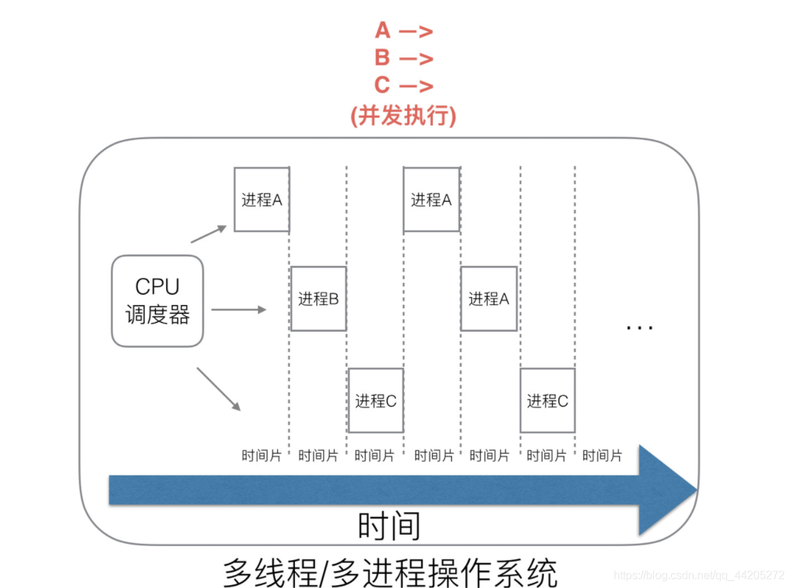
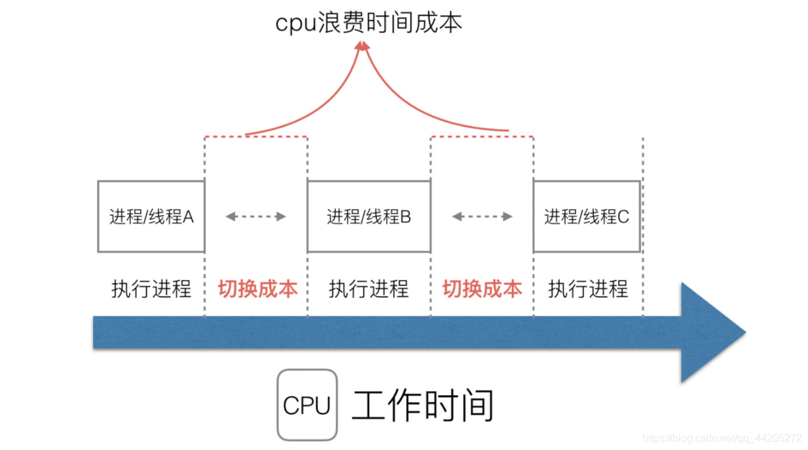
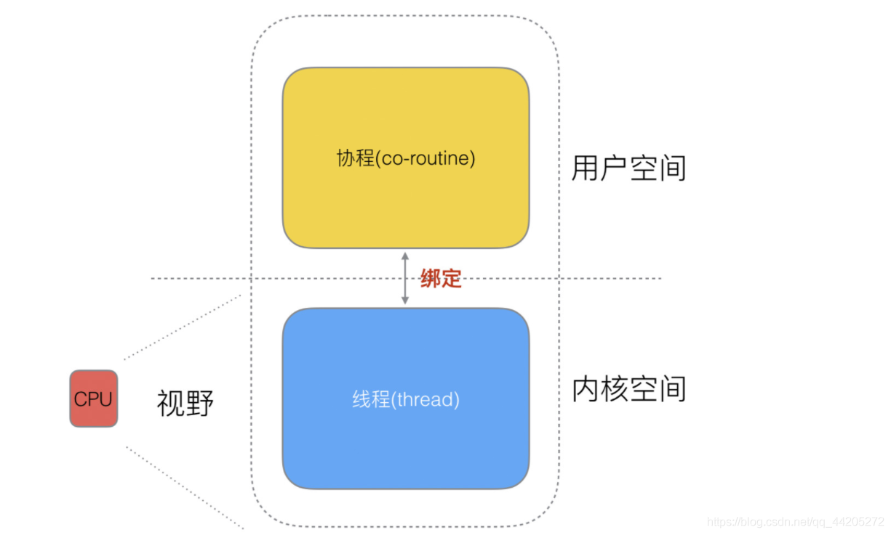
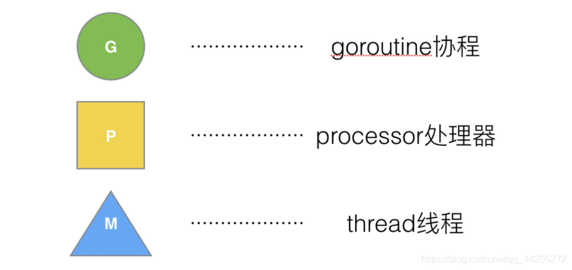
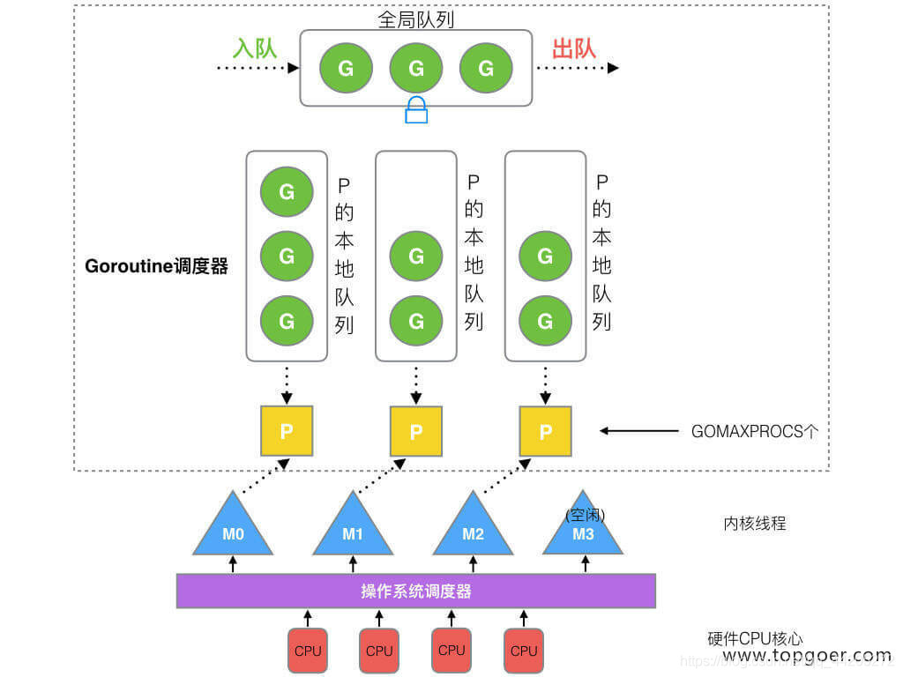

# 一、Golang “调度器” 的由来

## （1）单进程时代不需要调度器

我们知道，一切的软件都是跑在操作系统上，真正用来干活 (计算) 的是 CPU。早期的操作系统每个程序就是一个进程，知道一个程序运行完，才能进行下一个进程，就是 “单进程时代”一切的程序只能串行发生。

早期的单进程操作系统，面临 2 个问题：

- 单一的执行流程，计算机只能一个任务一个任务处理。

- 进程阻塞所带来的 CPU 时间浪费。

那么能不能有多个进程来宏观一起来执行多个任务呢？
后来操作系统就具有了最早的并发能力：多进程并发，当一个进程阻塞的时候，切换到另外等待执行的进程，这样就能尽量把 CPU 利用起来，CPU 就不浪费了。

## （2）多进程 / 线程时代有了调度器需求

在多进程 / 多线程的操作系统中，就解决了阻塞的问题，因为一个进程阻塞 cpu 可以立刻切换到其他进程中去执行，而且调度 cpu 的算法可以保证在运行的进程都可以被分配到 cpu 的运行时间片。这样从宏观来看，似乎多个进程是在同时被运行。

但新的问题就又出现了，进程拥有太多的资源，进程的创建、切换、销毁，都会占用很长的时间，CPU 虽然利用起来了，但如果进程过多，CPU 有很大的一部分都被用来进行进程调度了。

怎么才能提高 CPU 的利用率呢？

但是对于 Linux 操作系统来讲，cpu 对进程的态度和线程的态度是一样的。

很明显，CPU 调度切换的是进程和线程。尽管线程看起来很美好，但实际上多线程开发设计会变得更加复杂，要考虑很多同步竞争等问题，如锁、竞争冲突等。

## （3）协程来提高 CPU 利用率

多进程、多线程已经提高了系统的并发能力，但是在当今互联网高并发场景下，为每个任务都创建一个线程是不现实的，因为会消耗大量的内存 (进程虚拟内存会占用 4GB [32 位操作系统], 而线程也要大约 4MB)。

大量的进程 / 线程出现了新的问题

- 高内存占用
- 调度的高消耗 CPU

一个线程分为 “内核态 “线程和” 用户态 “线程。一个 “用户态线程” 必须要绑定一个 “内核态线程”，但是 CPU 并不知道有 “用户态线程” 的存在，它只知道它运行的是一个 “内核态线程”(Linux 的 PCB 进程控制块)。

细化去分类一下，内核线程依然叫 “线程 (thread)”，用户线程叫 “协程 (co-routine)”.

### 三种方式

1、N 个协程绑定 1 个线程，优点就是协程在用户态线程即完成切换，不会陷入到内核态，这种切换非常的轻量快速。但也有很大的缺点，1 个进程的所有协程都绑定在 1 个线程上

缺点：

- 某个程序用不了硬件的多核加速能力
- 一旦某协程阻塞，造成线程阻塞，本进程的其他协程都无法执行了，根本就没有并发的能力了。

2、1 个协程绑定 1 个线程，这种最容易实现。协程的调度都由 CPU 完成了，不存在 N:1 缺点。

缺点：协程的创建、删除和切换的代价都由 CPU 完成，有点略显昂贵了。

3、M 个协程绑定 1 个线程，是 N:1 和 1:1 类型的结合，克服了以上 2 种模型的缺点，但实现起来最为复杂。

**协程跟线程是有区别的，线程由 CPU 调度是抢占式的，协程由用户态调度是协作式的，一个协程让出 CPU 后，才执行下一个协程**。

## （4）Go 语言的协程 goroutine

Go 为了提供更容易使用的并发方法，使用了 goroutine 和 channel。goroutine 来自协程的概念，让一组可复用的函数运行在一组线程之上，即使有协程阻塞，该线程的其他协程也可以被 runtime 调度，转移到其他可运行的线程上。最关键的是，程序员看不到这些底层的细节，这就降低了编程的难度，提供了更容易的并发。

Go 中，协程被称为 goroutine，它非常轻量，一个 goroutine 只占几 KB，并且这几 KB 就足够 goroutine 运行完，这就能在有限的内存空间内支持大量 goroutine，支持了更多的并发。虽然一个 goroutine 的栈只占几 KB，但实际是可伸缩的，如果需要更多内容，runtime 会自动为 goroutine 分配。

Goroutine 特点：

- 占用内存更小（几 kb）
- 调度更灵活 (runtime 调度)

# 二、Goroutine 调度器的 GMP 模型的设计思想

Processor，它包含了运行 goroutine 的资源，如果线程想运行 goroutine，必须先获取 P，P 中还包含了可运行的 G 队列。

## （1）GMP 模型

在 Go 中，**线程是运行 goroutine 的实体**，调度器的功能是把可运行的 goroutine 分配到工作线程上。

- 全局队列（Global Queue）：存放等待运行的 G（协程）。

- P 的本地队列：同全局队列类似，存放的也是等待运行的 G，存的数量有限，不超过 256 个。新建 G时，G优先加入到 P 的本地队列，如果队列满了，则会把本地队列中一半的 G 移动到全局队列。

- P 列表：所有的 P 都在程序启动时创建，并保存在数组中，最多有 GOMAXPROCS(可配置) 个。

- M：线程想运行任务就得获取 P，从 P 的本地队列获取 G，P 队列为空时，M 也会尝试从全局队列拿一批 G 放到 P 的本地队列，或从其他 P 的本地队列偷一半放到自己 P 的本地队列。M 运行 G，G 执行之后，M 会从 P 获取下一个 G，不断重复下去。

Goroutine 调度器和 OS 调度器是通过 M 结合起来的，每个 M 都代表了 1 个内核线程，OS 调度器负责把内核线程分配到 CPU 的核上执行。

> 有关 P 和 M 的个数问题

1、P 的数量：

- 由启动时环境变量 $GOMAXPROCS 或者是由 runtime 的方法 GOMAXPROCS() 决定。在Go1.5之后GOMAXPROCS被默认设置可用的核数，而之前则默认为1。这意味着在程序执行的任意时刻都只有 $GOMAXPROCS 个 goroutine 在同时运行。

2、M 的数量:

- go 语言本身的限制：go 程序启动时，会设置 M 的最大数量，默认 10000. 但是内核很难支持这么多的线程数，所以这个限制可以忽略。

- runtime/debug 中的 SetMaxThreads 函数，设置 M 的最大数量

- 一个 M 阻塞了，会创建新的 M。

M 与 P 的数量没有绝对关系，一个 M 阻塞，P 就会去创建或者切换另一个 M，所以，即使 P 的默认数量是 1，也有可能会创建很多个 M 出来。

> P 和 M 何时会被创建

- P 何时创建：在确定了 P 的最大数量 n 后，运行时系统会根据这个数量创建 n 个 P。
- M 何时创建：没有足够的 M 来关联 P 并运行其中的可运行的 G。比如所有的 M 此时都阻塞住了，而 P 中还有很多就绪任务，**就会去寻找空闲的 M，而没有空闲的，就会去创建新的 M**。

## （2）调度器的设计策略

**复用线程：避免频繁的创建、销毁线程，而是对线程的复用**。

1）work stealing 机制

 当本线程无可运行的 G 时，尝试从其他线程绑定的 P 偷取 G，而不是销毁线程。

2）hand off 机制

 当本线程因为 G 进行系统调用阻塞时，线程释放绑定的 P，把 P 转移给其他空闲的线程执行。

- 利用并行：GOMAXPROCS 设置 P 的数量，最多有 GOMAXPROCS 个线程分布在多个 CPU 上同时运行。GOMAXPROCS 也限制了并发的程度，比如 GOMAXPROCS = 核数/2，则最多利用了一半的 CPU 核进行并行。

- 抢占：在 coroutine 中要等待一个协程主动让出 CPU 才执行下一个协程，在 Go 中，一个 goroutine 最多占用 CPU 10ms，防止其他 goroutine 被饿死，这就是 goroutine 不同于 coroutine 的一个地方。(**goroutine 可能发生并行执行；但 coroutine 始终顺序执行。**)

- 全局 G 队列：在新的调度器中依然有全局 G 队列，但功能已经被弱化了，当 M 执行 work stealing 从其他 P 偷不到 G 时，它可以从全局 G 队列获取 G。

## （3）go func () 调度流程

goroutines 意味着并行（或者可以以并行的方式部署），coroutines 一般来说不是这样的，goroutines 通过通道来通信；coroutines 通过让出和恢复操作来通信，goroutines 比 coroutines 更强大，也很容易从 coroutines 的逻辑复用到 goroutines。

狭义地说，goroutine 可能发生在多线程环境下，goroutine 无法控制自己获取高优先度支持；coroutine 始终发生在单线程，coroutine 程序需要主动交出控制权，宿主才能获得控制权并将控制权交给其他 coroutine。

goroutine 间使用 channel 通信，coroutine 使用 yield 和 resume 操作。

goroutine 和 coroutine 的概念和运行机制都是脱胎于早期的操作系统。

coroutine 的运行机制属于协作式任务处理，早期的操作系统要求每一个应用必须遵守操作系统的任务处理规则，应用程序在不需要使用 CPU 时，会主动交出 CPU 使用权。如果开发者无意间或者故意让应用程序长时间占用 CPU，操作系统也无能为力，表现出来的效果就是计算机很容易失去响应或者死机。

goroutine 属于抢占式任务处理，已经和现有的多线程和多进程任务处理非常类似。应用程序对 CPU 的控制最终还需要由操作系统来管理，操作系统如果发现一个应用程序长时间大量地占用 CPU，那么用户有权终止这个任务。

