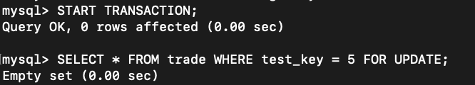
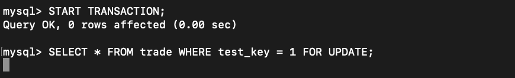
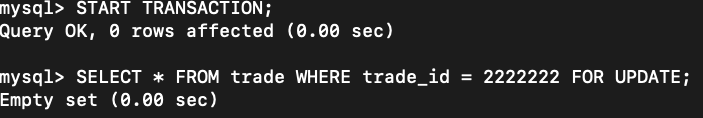
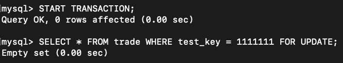
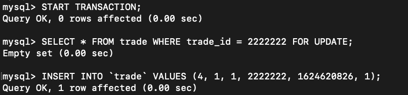
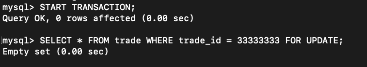
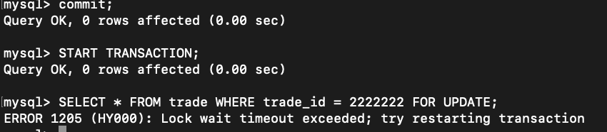

记录一次死锁问题事故产生。一次加款第一次超时或者什么，上游进行重试，第二个请求过来发生了事务死锁。在讨论的过程中，对于select语句for update 是否会给表加锁，产生了异议，故进行尝试。

表结构

```
// 环境准备[我当前线下环境为mysql8]
SELECT @@transaction_isolation; // REPEATABLE-READ 可重复读
SHOW VARIABLES LIKE '%autocommit%'; // 如果是开的就需要关闭 SET @@autocommit=0;

// DDL
CREATE TABLE `trade` (
  `id` bigint(20) unsigned NOT NULL DEFAULT '0' COMMENT '交易id',
  `company_id` bigint(20) unsigned NOT NULL DEFAULT '0' COMMENT '公司id',
  `account_id` bigint(20) unsigned NOT NULL DEFAULT '0' COMMENT '账户id',
  `trade_id` bigint(20) unsigned NOT NULL DEFAULT '0' COMMENT '交易号',
  `create_time` bigint(20) unsigned NOT NULL DEFAULT '0' COMMENT '创建时间',
  `test_key` int(10) unsigned NOT NULL DEFAULT '0' COMMENT '测试字段',
  PRIMARY KEY (`id`),
  UNIQUE KEY `uniq_idx_tid_aid` (`trade_id`,`account_id`),
  KEY `idx_cid_ctime` (`company_id`,`create_time`)
) ENGINE=InnoDB DEFAULT CHARSET=utf8 COMMENT='测试表';

// 准备数据
INSERT INTO `trade` VALUES (1, 1, 1, 202106251933, 1624620826, 1), (2, 1, 1, 202106251934, 1624620826, 2),(3, 1, 1, 202106251935, 1624620826, 3);
```


## 情况一：没有命中索引，搜索无结果

结论：事务一开始了后，执行事务二，事务二锁等待中，一直没往下执行，直到事务一commit，事务二才进行，说明**当没有命中索引的时候，触发了表锁**

```
事务一:
START TRANSACTION;
SELECT * FROM trade WHERE test_key = 5 FOR UPDATE;

事务二:
START TRANSACTION;
SELECT * FROM trade WHERE test_key = 1 FOR UPDATE;
```






## 情况二：命中了索引，搜索无结果

结论：事务一开始了后，执行事务二，事务二执行，没有被阻塞，所以 **当命中索引了，虽然没有查到数据，不会触发表锁**

```
事务一:
START TRANSACTION;
SELECT * FROM trade WHERE trade_id = 2222222 FOR UPDATE;

事务二:
START TRANSACTION;
SELECT * FROM trade WHERE test_key = 1111111 FOR UPDATE;
```






## 情况三：命中了索引，没有查询结果，但是插入了一条sql，验证锁

结论：事务一执行后，事务二阻塞，事务三执行成功，结论**插入语句出发了行锁**

```
事务一：
START TRANSACTION;
SELECT * FROM trade WHERE trade_id = 2222222 FOR UPDATE;
INSERT INTO `trade` VALUES (4, 1, 1, 2222222, 1624620826, 1);

事务二：
START TRANSACTION;
SELECT * FROM trade WHERE trade_id = 2222222 FOR UPDATE;

事务三：
START TRANSACTION;
SELECT * FROM trade WHERE trade_id = 33333333 FOR UPDATE;
```





