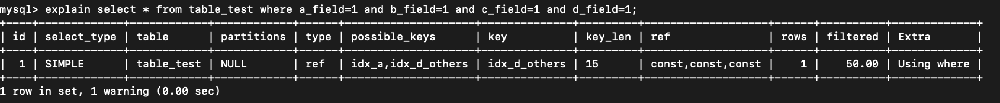
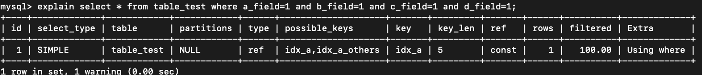
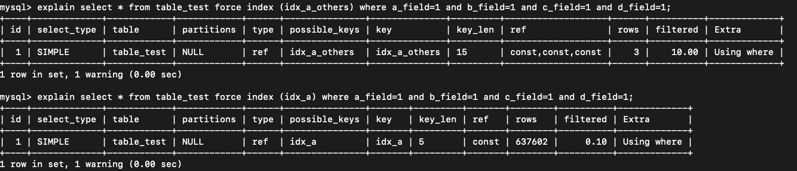
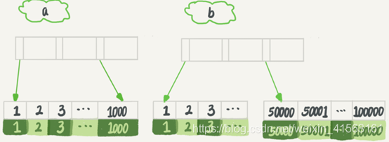

## 场景

在 MySQL 中一张表是可以支持多个索引的。但是，在写 SQL 语句的时候，很少使用 `force index(idx_xxx)`主动指定使用哪个索引。也就是说，使用哪个索引是由 MySQL来确定的。

在此基础上，有的时候会遇到一种情况，一条本来可以执行得很快的语句，却由于 MySQL 选错了索 引，而导致执行速度变得很慢。举个例子，假设创建一个表

```
CREATE TABLE `table_test` (
	`id` int(11) NOT NULL PRIMARY KEY AUTO_INCREMENT, 
	`a_field` int(11) DEFAULT NULL, 
	`b_field` int(11) DEFAULT NULL, 
	`c_field` int(11) DEFAULT NULL, 
	`d_field` int(11) DEFAULT NULL, 
	`e_field` int(11) DEFAULT NULL, 
	`f_field` int(11) DEFAULT NULL, 
KEY `idx_a` (`a_field`),
KEY `idx_a_others` (`a_field`, `b_field`, `c_field`) 
) ENGINE=InnoDB;
```

然后，我们往表中插入100万行记录，取值按整数递增，如：(1,1,1)，(2,2,2)，(3,3,3) 直到百万。

```
-- 存储方式
delimiter //
create procedure idata() 
begin 
	declare i int; 
	set i=1; 
	while(i<=10000000)do 
		insert into table_test values(null, 1, i, i, i, i, i); 
		set i=i+1;
	end while;
end;
//
-- 调用
call idata(); 
```

完成这之后，执行语句 `explain select * from table_test where a_field=1 and b_field=1 and c_field=1 and d_field=1` 得到结果



从上图看上去，key 使用的是 idx_d_others，表示优化器选 择了索引 idx_d_others，这条查询语句的执行确实符合预期，看起来很和谐没什么问题，但是当使用些极端的骚操作的时候，如下。

| SessionA                                     | SessionB |
| -------------------------------------------- | -------- |
| `start transation with consistent snapshot;` |          |
|`select sleep(20);`|`delete from table_test; call idata();`|
|`commit;`||
||`explain select * from table_test where a_field=1 and b_field=1 and c_field=1 and d_field=1`|

为了更能够简单的查看选择器选择的结果，之后将引入使用 `foce index(idx_a)`的方式建立对照组，同时需要将慢查询日志的阈值设置为0，把所有的语句都记录到日志之中`set global slow_query_log=1; set long_query_time=0;`，分别执行以下两个语句对比结果。如下图所示会概率出现选错索引的问题。*当然这里出现的问题也主要是区分度较低的问题，当然idx_a_others修改为没有a，是bcd的联合索引也可能会出现这类问题*

```
explain select * from table_test where a_field=1 and b_field=1 and c_field=1 and d_field=1;
explain select * from table_test force index (idx_a_others) where a_field=1 and b_field=1 and c_field=1 and d_field=1;
explain select * from table_test force index (idx_a) where a_field=1 and b_field=1 and c_field=1 and d_field=1;
```




## 优化器的逻辑

优化器选择索引的目的，是找到一个最优的执行方案，并用最小的代价去执行语句。在数据库里面，**扫描行数**是影响执行代价的因素之一。扫描的行数越少，意味着访问磁盘数据的次数越少，消耗的 CPU 资源越少。

当然，扫描行数并不是唯一的判断标准，优化器还会结合是**否使用临时表、是否排序等因素进行**综合判断。

我们这个简单的查询语句并没有涉及到临时表和排序，所以 MySQL 选错索引肯定是在判断扫描 行数的时候出问题了。

那么**扫描行数是怎么判断的？**

MySQL 在真正开始执行语句之前，并不能精确地知道满足这个条件的记录有多少条，而只能根 据统计信息来估算记录数。

这个统计信息就是索引的“区分度”。**一个索引上不同的值越多，这个索引的区分度就越好**。而一个索引上不同的值的个数，我们称之为“基数”。也就是说，这个基数（`cardinality`）越大，索引的区分度越好。

我们可以使用 `show index from table_test` 方法，看到一个索引的基数。如下图所示，就是表`show index`的结果 。虽然这个表的每一行的两个字段都是一样的，但是在统计信息中，这两个索引的基数值并不同，而且其实都不准确。


## MySQL 是怎样得到索引的基数的呢？

这里，我给你简单介绍一下 MySQL 采样统计的方法。


为什么要采样统计呢？因为把整张表取出来一行行统计，虽然可以得到精确的结果，但是代价太 高了，所以只能选择“采样统计”。

 采样统计的时候，InnoDB 默认会选择 N 个数据页，统计这些页面上的不同值，得到一个平均 值，然后乘以这个索引的页面数，就得到了这个索引的基数。

而数据表是会持续更新的，索引统计信息也不会固定不变。所以，当变更的数据行数超过 1/M 的时候，会自动触发重新做一次索引统计。

在 MySQL 中，有两种存储索引统计的方式，可以通过设置参数 `innodb_stats_persistent` 的值 来选择：

**设置为 on 的时候，表示统计信息会持久化存储。这时，默认的 N 是 20，M 是 10。**

**设置为 off 的时候，表示统计信息只存储在内存中。这时，默认的 N 是 8，M 是 16。**

由于是采样统计，所以不管 N 是 20 还是 8，这个基数都是很容易不准的。 但，这还不是全部。 你可以从图 4 中看到，这次的索引统计值（cardinality 列）虽然不够精确，但大体上还是差不 多的，选错索引一定还有别的原因。

其实索引统计只是一个输入，对于一个具体的语句来说，优化器还要判断，执行这个语句本身要 扫描多少行。 接下来，我们再一起看看优化器预估的，这两个语句的扫描行数是多少。



rows 这个字段表示的是预计扫描行数。

其中，1 的结果还是符合预期的，rows 的值是 3；但是 2 的 rows 值是 637602，偏差就大了。而我们用 explain 命令看到的 rows 是只有 1 行，是这个偏差误导了优化器的判断。

到这里，可能你的第一个疑问不是为什么不准，而是优化器为什么放着扫描 3 行的执行计 划不用，却选择了扫描行数是 637602 的执行计划呢？

这是因为，如果使用索引 a，每次从索引 a 上拿到一个值，都要回到主键索引上查出整行数据， 这个代价优化器也要算进去的。

而如果选择扫描 10 万行，是直接在主键索引上扫描的，没有额外的代价。

优化器会估算这两个选择的代价，从结果看来，优化器认为直接扫描主键索引更快。当然，从执行时间看来，这个选择并不是最优的。

使用普通索引需要把回表的代价算进去，在执行 explain 的时候，也考虑了这个策略的代价 ，但之前图1的选择是对的。也就是说，这个策略并没有问题。

所以冤有头债有主，MySQL 选错索引，这件事儿还得归咎到没能准确地判断出扫描行数。至于 为什么会得到错误的扫描行数，这个原因就作为课后问题，留给你去分析了。

**既然是统计信息不对，那就修正。`analyze table t` 命令，可以用来重新统计索引信息。**

其实，如果只是索引统计不准确，通过 analyze 命令可以解决很多问题，但是前面我们说了， 优化器可不止是看扫描行数。现在简化下表`table_test`,让其只有字段a和b并单独建立索引

`select * from table_test where (a_field between 1 and 1000) and (b_field between 50000 and 100000) order by b`

从条件上看，这个查询没有符合条件的记录，因此会返回空集合。 在开始执行这条语句之前，你可以先设想一下，如果你来选择索引，会选择哪一个呢？ 为了便于分析，我们先来看一下 a、b 这两个索引的结构图。



如果使用索引 a 进行查询，那么就是扫描索引 a 的前 1000 个值，然后取到对应的 id，再到主 键索引上去查出每一行，然后根据字段 b 来过滤。显然这样需要扫描 1000 行。

如果使用索引 b 进行查询，那么就是扫描索引 b 的最后 50001 个值，与上面的执行过程相同， 也是需要回到主键索引上取值再判断，所以需要扫描 50001 行。从这个结果中，你将可以得到两个结论： 1. 扫描行数的估计值依然不准确； 2. 这个例子里 MySQL又选错了索引。


## 索引选择异常和处理

其实大多数时候优化器都能找到正确的索引，但偶尔你还是会碰到我们上面举例的这两种情况： 原本可以执行得很快的 SQL 语句，执行速度却比预期的慢很多，应该怎么办呢？


**一种方法是，像我们第一个例子一样，采用 force index 强行选择一个索引**。MySQL 会根据词 法解析的结果分析出可能可以使用的索引作为候选项，然后在候选列表中依次判断每个索引需要 扫描多少行。如果 force index 指定的索引在候选索引列表中，就直接选择这个索引，不再评估 其他索引的执行代价

不过很多程序员不喜欢使用 force index，一来这么写不优美，二来如果索引改了名字，这个语 句也得改，显得很麻烦。而且如果以后迁移到别的数据库的话，这个语法还可能会不兼容。

但其实使用 force index 最主要的问题还是变更的及时性。因为选错索引的情况还是比较少出现 的，所以开发的时候通常不会先写上 force index。而是等到线上出现问题的时候，你才会再去修改 SQL 语句、加上 force index。但是修改之后还要测试和发布，对于生产系统来说，这个 过程不够敏捷。 所以，数据库的问题最好还是在数据库内部来解决。那么，在数据库里面该怎样解决呢？


**第二种方法就是，我们可以考虑修改语句，引导 MySQL 使用我们期望的索引。**还是用上述的例子来说明，把`order by b limit 1`改成 `order by b,a limit 1` ，语义的逻辑是相同的。

当然，这种修改并不是通用的优化手段，只是刚好在这个语句里面有 limit 1，因此如果有满足 条件的记录， order by b limit 1 和 order by b,a limit 1 都会返回 b 是最小的那一行，逻辑上 一致，才可以这么做。


**第三种方法是，新建一个更合适的索引，来提供给优化器做选择，或删 掉误用的索引。** 当然是最优先推荐第三种方式，不过有的时候做这种ddl的时候可能会造成额外的问题，需要谨慎处理。


## 小结

要记住，**设计好索引才是王道**

