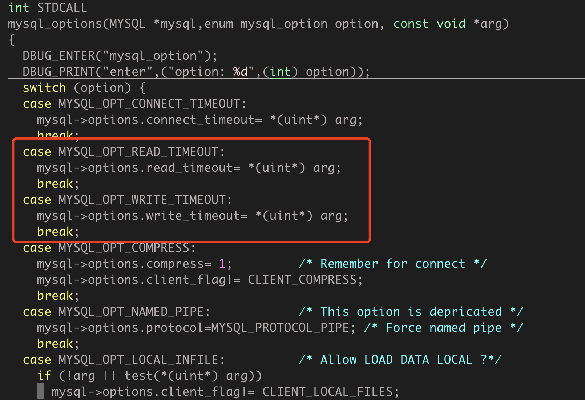

# 一、背景简述

在使用php开发中，有些时候我们需要查询读写超时，比如说我们一个数据库压力很大，或者连接很多，那么数据库查询就很缓慢，但是我希望某些不重要的数据，比如说文章点击数这种如果查询超时了就不显示，至少能够保证主体页面正确显示，但是查遍PHP手册没有发现这个操作选项或者函数。但是在PHP7.2版本前并不不支持读超时。


网络上有很多说法是可以提前解决的，其中提到是可以设置超时时间的，只需要自己定义一个变量，但实际测试中发现并不行，同时官网也指出PHP7.2才开始支持，由于博客中含有鸟哥的文章让我深深的自我怀疑，所以决定找下原因。**先说结论，这个方法再PHP7.2前确实不可以。**

- 可行案例文章：

  https://www.laruence.com/2011/04/27/1995.html

  https://blog.csdn.net/heiyeshuwu/article/details/5869813

- 源码

  https://dev.mysql.com/downloads/c-api/

  https://github.com/php/php-src

# 二、分析

### 1.PHP测试代码

```
<?php

//自己定义读写超时常量
if (!defined('MYSQL_OPT_READ_TIMEOUT')) {
    define('MYSQL_OPT_READ_TIMEOUT',  11);
}

$connection = mysqli_init();
var_dump($connection->options(MYSQLI_OPT_CONNECT_TIMEOUT, 1));
var_dump($connection->options(MYSQL_OPT_READ_TIMEOUT, 1)); // 其中这个在php7.0.6环境下返回了false
$connection->real_connect('localhost', 'root', '11111111', 'test');

$result = $connection->query("SELECT * FROM trade;");

$row=mysqli_num_rows($result);
var_dump($row);

try {
    $result = $connection->query("select sleep(5)");
    var_dump($row);
} catch (\Exception $e) {
    echo $e->getMessage();
}

mysqli_close($connection);
```


### 2.PHP-MySQL的调用关系

基本关系如下，不做详细描述:


### 3.MySQL提供的基础驱动 mysqlnd / libmysql

mysqlnd / libmysql 都是MySQL提供给PHP使用的驱动，但是由于 LICENSE 问题，后续MySQL主要使用 mysqlnd 为PHP提供驱动能力。

以上两个驱动对读超时的支持

| 源码                                                         | 解析                                                         |
| :----------------------------------------------------------- | :----------------------------------------------------------- |
|  | 图是mysql-5.1.30/sql-common/client.c文件图中可以看到，mysql是支持对读写超时进行设置的（从MySQL-4.1.0版本就支持客户端设置读写超时） -- 结论：上游可以通过设置读写超时来决定业务的执行时间 |


### 4.PHP扩展对MySQL驱动的支持 mysqli / mysql /pod_mysql

| 扩容                                                         | 说明                                                         |
| :----------------------------------------------------------- | :----------------------------------------------------------- |
|  | mysqli: 框架目前使用的方式 ;mysql: PHP7.X版本开始抛弃; mysqlnd: 官方后续主要支持的扩展 |

业务上主要使用的是CI2.0 - mysqli扩展，对mysqli进行分析(调用逻辑 PHP.mysqli->options → CI.options → mysqli_api.PHP_FUNCTION(mysqli_options))

```
/* {{{ proto bool mysqli_options(object link, int flags, mixed values)
   Set options */
PHP_FUNCTION(mysqli_options)
{
    MY_MYSQL        *mysql;
    zval            *mysql_link = NULL;
    zval            **mysql_value;
    long            mysql_option;
    unsigned int    l_value;
    long            ret;
    int             expected_type;
 
 
    if (zend_parse_method_parameters(ZEND_NUM_ARGS() TSRMLS_CC, getThis(), "OlZ", &mysql_link, mysqli_link_class_entry, &mysql_option, &mysql_value) == FAILURE) {
        return;
    }
    MYSQLI_FETCH_RESOURCE_CONN(mysql, &mysql_link, MYSQLI_STATUS_INITIALIZED);
 
#if PHP_API_VERSION < 20100412
    if ((PG(open_basedir) && PG(open_basedir)[0] != '\0') || PG(safe_mode)) {
#else
    if (PG(open_basedir) && PG(open_basedir)[0] != '\0') {
#endif
        if(mysql_option == MYSQL_OPT_LOCAL_INFILE) {
            RETURN_FALSE;
        }
    }
    expected_type = mysqli_options_get_option_zval_type(mysql_option);
    if (expected_type != Z_TYPE_PP(mysql_value)) {
        switch (expected_type) {
            case IS_STRING:
                convert_to_string_ex(mysql_value);
                break;
            case IS_LONG:
                convert_to_long_ex(mysql_value);
                break;
            default:
                break;
        }
    }
    switch (expected_type) {
        case IS_STRING:
            ret = mysql_options(mysql->mysql, mysql_option, Z_STRVAL_PP(mysql_value));
            break;
        case IS_LONG:
            l_value = Z_LVAL_PP(mysql_value);
            ret = mysql_options(mysql->mysql, mysql_option, (char *)&l_value);
            break;
        default:
            ret = 1;
            break;
    }
 
    RETURN_BOOL(!ret);
}
```

mysqli_options_get_option_zval_type 回判断是当前的mysqli是否对 flags 进行了支持

```
/* {{{ mysqli_options_get_option_zval_type */
static int mysqli_options_get_option_zval_type(int option)
{
    switch (option) {
#ifdef MYSQLI_USE_MYSQLND
#if PHP_MAJOR_VERSION >= 6
        case MYSQLND_OPT_NUMERIC_AND_DATETIME_AS_UNICODE:
#endif
        case MYSQLND_OPT_NET_CMD_BUFFER_SIZE:
        case MYSQLND_OPT_NET_READ_BUFFER_SIZE:
#ifdef MYSQLND_STRING_TO_INT_CONVERSION
        case MYSQLND_OPT_INT_AND_FLOAT_NATIVE:
#endif
#endif /* MYSQLI_USE_MYSQLND */
        case MYSQL_OPT_CONNECT_TIMEOUT:
#ifdef MYSQL_REPORT_DATA_TRUNCATION
        case MYSQL_REPORT_DATA_TRUNCATION:
#endif
        case MYSQL_OPT_LOCAL_INFILE:
        case MYSQL_OPT_NAMED_PIPE:
#ifdef MYSQL_OPT_PROTOCOL
                case MYSQL_OPT_PROTOCOL:
#endif /* MySQL 4.1.0 */
#ifdef MYSQL_OPT_READ_TIMEOUT
        case MYSQL_OPT_READ_TIMEOUT:
        case MYSQL_OPT_WRITE_TIMEOUT:
        case MYSQL_OPT_GUESS_CONNECTION:
        case MYSQL_OPT_USE_EMBEDDED_CONNECTION:
        case MYSQL_OPT_USE_REMOTE_CONNECTION:
        case MYSQL_SECURE_AUTH:
#endif /* MySQL 4.1.1 */
#ifdef MYSQL_OPT_RECONNECT
        case MYSQL_OPT_RECONNECT:
#endif /* MySQL 5.0.13 */
#ifdef MYSQL_OPT_SSL_VERIFY_SERVER_CERT
        case MYSQL_OPT_SSL_VERIFY_SERVER_CERT:
#endif /* MySQL 5.0.23 */
#ifdef MYSQL_OPT_COMPRESS
        case MYSQL_OPT_COMPRESS:
#endif /* mysqlnd @ PHP 5.3.2 */
#ifdef MYSQL_OPT_SSL_VERIFY_SERVER_CERT
    REGISTER_LONG_CONSTANT("MYSQLI_OPT_SSL_VERIFY_SERVER_CERT", MYSQL_OPT_SSL_VERIFY_SERVER_CERT, CONST_CS | CONST_PERSISTENT);
#endif /* MySQL 5.1.1., mysqlnd @ PHP 5.3.3 */
#if (MYSQL_VERSION_ID >= 50611 && defined(CLIENT_CAN_HANDLE_EXPIRED_PASSWORDS)) || defined(MYSQLI_USE_MYSQLND)
        case MYSQL_OPT_CAN_HANDLE_EXPIRED_PASSWORDS:
#endif
            return IS_LONG;
 
 
#ifdef MYSQL_SHARED_MEMORY_BASE_NAME
                case MYSQL_SHARED_MEMORY_BASE_NAME:
#endif /* MySQL 4.1.0 */
#ifdef MYSQL_SET_CLIENT_IP
        case MYSQL_SET_CLIENT_IP:
#endif /* MySQL 4.1.1 */
        case MYSQL_READ_DEFAULT_FILE:
        case MYSQL_READ_DEFAULT_GROUP:
        case MYSQL_INIT_COMMAND:
        case MYSQL_SET_CHARSET_NAME:
        case MYSQL_SET_CHARSET_DIR:
#if MYSQL_VERSION_ID > 50605 || defined(MYSQLI_USE_MYSQLND)
        case MYSQL_SERVER_PUBLIC_KEY:
#endif
            return IS_STRING;
 
        default:
            return IS_NULL;
    }
}
```

#ifdef MYSQL_OPT_READ_TIMEOUT mysqli会判断变量是否定义，可以看到PHP7.2之前的扩展是没有定义这个变量的

```
/* mysqli_options */
REGISTER_LONG_CONSTANT("MYSQLI_READ_DEFAULT_GROUP", MYSQL_READ_DEFAULT_GROUP, CONST_CS | CONST_PERSISTENT);
REGISTER_LONG_CONSTANT("MYSQLI_READ_DEFAULT_FILE", MYSQL_READ_DEFAULT_FILE, CONST_CS | CONST_PERSISTENT);
REGISTER_LONG_CONSTANT("MYSQLI_OPT_CONNECT_TIMEOUT", MYSQL_OPT_CONNECT_TIMEOUT, CONST_CS | CONST_PERSISTENT);
REGISTER_LONG_CONSTANT("MYSQLI_OPT_LOCAL_INFILE", MYSQL_OPT_LOCAL_INFILE, CONST_CS | CONST_PERSISTENT);
REGISTER_LONG_CONSTANT("MYSQLI_INIT_COMMAND", MYSQL_INIT_COMMAND, CONST_CS | CONST_PERSISTENT);
```

源码中只针对以上内容进行了注册，其中不包括对读写超时的设置

**总结：PHP7.2以下版本对读超时不支持，但不是驱动不支持，而是PHP对应的扩展不支持**

### 5. 什么是mysql、mysqli、pdo、mysqlnd、libmysql

- mysql 也叫 Original MySQL，PHP4版本的MYSQL扩展，从PHP5起已经被废弃，并别从PHP7开始已经被移除。

- mysqli 叫做 “MySQL增强扩展”。

- pdo 是PHP应用中的一个数据库抽象层规范。

- mysqlnd、libmysq  是 MYSQL 的 “原生驱动”


# 三、不同版本MySQL对超时支持

| 5.1.30                                                       | 5.6.10                                                       | 8.0.26                                                       |
| :----------------------------------------------------------- | :----------------------------------------------------------- | :----------------------------------------------------------- |
| 这个时候只支持秒级别的超时 | 代码逻辑上是支持ms级别，但是传递过来的参数是秒级应该是为后面支持毫秒做铺垫 | 直接支持毫秒级的读超时时间 |