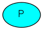

# 一、基础使用

## 1.介绍

RabbitMQ是一个消息代理器：它接受和转发消息。你可以把它当作一个邮局：当你把邮件放在信箱里时，你可以肯定邮差先生最终会把邮件送到你的收件人那里。在这个比喻中，RabbitMQ就是这里的邮箱，邮局和邮差。

RabbitMQ和邮局之间的主要区别是，它不处理纸张，而是接受、存储和转发二进制数据‒消息。

RabbitMQ，和一般的消息传递，使用专业术语。

生产者的工作就是发送消息。发送消息的程序是生产者：



队列类比一个邮箱，存在于RabbitMQ， 然而信息流通过RabbitMQ和您的应用程序，他们只能存储在一个队列。队列只受主机内存和磁盘限制的约束，它本质上是一个很大的消息缓冲区。会有许多生产者可以发送到一个队列的消息，许多消费者可以尝试从一个队列接收数据。这就是我们如何表示队列的方式：


消费者和生产者有着相似的意义. 消费者无非就是等待消息然后处理的程序:


请注意，生产者、消费者和代理不必同一主机上；事实上，在大多数应用程序中它们没有这样做。

## 2."Hello World"

（使用PHP amqplib客户端）

在本教程的这一部分中，我们将用PHP编写两个程序；一个生产者发送一条消息，一个用户接收消息并将它们打印出来。我们会PHP amqplib API的忽略一些细节，集中在这个非常简单的事情刚刚开始。这是一个“Hello World”的消息传递。

在下图中，“p”是我们的生产商，“C”是我们的消费者。在中间的框是一个队列的消息缓冲区，RabbitMQ保持代表的消费。


### 2.1.PHP amqplib客户端库

RabbitMQ有很多协议。本教程介绍AMQP 0-9-1，这是一个开放的、通用的协议消息。有许多不同的语言RabbitMQ一批客户。我们将在本教程中使用PHP amqplib，composer解决依赖管理。

添加composer.json:

```
{
    "require": {
        "php-amqplib/php-amqplib": ">=2.6.1"
    }
}
composer install

# 或者 直接运行包引入
composer require php-amqplib/php-amqplib
```

## 3.现在我们可以开始我们的hello world

### 3.1生产者（消息发送方）


我们命令我们的消息发布者（发送者）send.php和消息接收receive.php。发送者将连接到RabbitMQ，发送一条消息，然后退出。

```
require_once __DIR__ . '/vendor/autoload.php';
use PhpAmqpLib\Connection\AMQPStreamConnection;
use PhpAmqpLib\Message\AMQPMessage;
```

现在我们能创建一个连接服务器的Connection:

```
$connection = new AMQPStreamConnection('localhost', 5672, 'guest', 'guest');
$channel = $connection->channel();
```

该连接抽象套接字(socket)连接，并为我们负责协议版本协商和认证等。这里，我们连接到一个rabbitmq代理器在本地机器上-使用localhost。如果我们想在不同的机器上连接到一个代理，我们只需在这里指定它的名称或IP地址。

接下来，我们创建一个通道，这是处理事情的大部分API的地方。

发送消息前，我们必须声明一个队列为我们发送做准备；然后我们可以向队列发布消息：

```
$channel->queue_declare('hello', false, false, false, false);

$msg = new AMQPMessage('Hello World!');
$channel->basic_publish($msg, '', 'hello');

echo " [x] Sent 'Hello World!'\n";
```

声明队列是幂等的（原句：Declaring a queue is idempotent，这里的idempotent不知道是什么意思） - 只有在它不存在时才会创建队列。消息内容是一个字节数组，因此您可以在那里编码用你喜欢的方式。

最后，我们关闭通道和连接；

```
$channel->close();
$connection->close();
```

上面我们完成了send.php.

接下来我们完成消费方的代码

### 3.2消费者（接收方，任务处理方）

消费者从RabbitMQ接收推来的消息，我们会保持运行监听消息并打印出来。


引入lib

```
require_once __DIR__ . '/vendor/autoload.php';
use PhpAmqpLib\Connection\AMQPStreamConnection;
```

设置与发布程序相同；我们打开一个连接和一个通道，并声明将要消耗的队列。注意，这与发送发布的队列匹配。

```
$connection = new AMQPStreamConnection('localhost', 5672, 'guest', 'guest');
$channel = $connection->channel();

$channel->queue_declare('hello', false, false, false, false);

echo ' [*] Waiting for messages. To exit press CTRL+C', "\n";
```

注意，我们也在这里声明队列。因为我们可能在发布之前启动消费者，我们希望在我们尝试从它那里消费消息之前确定队列的存在。

我们将告诉服务器从队列中发送消息。我们将定义一个PHP可调用，它将接收服务器发送的消息。请记住，消息是从服务器异步发送到客户机的。

```
$callback = function($msg) {
  echo " [x] Received ", $msg->body, "\n";
};

$channel->basic_consume('hello', '', false, true, false, false, $callback);

while(count($channel->callbacks)) {
    $channel->wait();
}
```

当调用basic_consume，我们的代码会阻塞。当我们收到消息时，我们的回调函数将通过接收到返回的消息传递。

以上是我们receive.php的代码

## 4.运行测试

### 4.1运行消费者

```
php receive.php
```

### 4.2运行消息发送方

```
php send.php
```

## 5.列出队列

```
rabbitmqctl list_queues
```

## 6.完整源码（调整过）

### 6.1.config.php

```
<?php
return [
    'vendor' => [
        'path' => dirname(dirname(__DIR__)) . '/vendor'
    ],
    'rabbitmq' => [
        'host' => '127.0.0.1',
        'port' => '5672',
        'login' => 'qkl',
        'password' => '123456',
        'vhost' => '/'
    ]
];
?>
```

### 6.2.receive.php

```
<?php
$config = require "../config.php";

require_once $config['vendor']['path'] . '/autoload.php';

use PhpAmqpLib\Connection\AMQPStreamConnection;
use PhpAmqpLib\Message\AMQPMessage;

$connection = new AMQPStreamConnection($config['rabbitmq']['host'], $config['rabbitmq']['port'],
    $config['rabbitmq']['login'], $config['rabbitmq']['password'], $config['rabbitmq']['vhost']);
$channel = $connection->channel();

$channel->queue_declare('hello', false, false, false, false);
 
echo ' [*] Waiting for messages. To exit press CTRL+C', "\n";

$callback = function($msg) {
    echo " [x] Received ", $msg->body, "\n";
};

$channel->basic_consume('hello', '', false, true, false, false, $callback);

while(count($channel->callbacks)) {
    $channel->wait();
}

$channel->close();
$connection->close();
?>
```

### 6.3.send.php

```
<?php
$config = require "../config.php";

require_once $config['vendor']['path'] . '/autoload.php';

use PhpAmqpLib\Connection\AMQPStreamConnection;
use PhpAmqpLib\Message\AMQPMessage;

$connection = new AMQPStreamConnection($config['rabbitmq']['host'], $config['rabbitmq']['port'],
    $config['rabbitmq']['login'], $config['rabbitmq']['password'], $config['rabbitmq']['vhost']);
$channel = $connection->channel();

//发送方其实不需要设置队列， 不过对于持久化有关，建议执行该行
$channel->queue_declare('hello', false, false, false, false);

$msg = new AMQPMessage('Hello World!');
$channel->basic_publish($msg, '', 'hello');

echo " [x] Sent 'Hello World!'\n";

$channel->close();
$connection->close();
?>
```


# 二、构建一个简单的工作队列


## 1.介绍

在节中，我们将创建一个工作队列，用于在多个工人(消费者)之间分配耗时的任务。

工作队列（又名任务队列）背后的主要思想是避免立即执行资源密集型任务，必须等待它完成。相反，我们计划稍后完成任务。我们将任务封装为消息并将其发送到队列中。后台运行的一个工作进程将弹出任务并最终执行该任务。当你运行许多工人（消费者）时，任务将在他们之间分担。

这个概念在Web应用程序中尤其有用，因为在短HTTP请求中不可能处理复杂的任务。

## 2.先决条件

在本教程的前一部分，我们发送了一条包含“Hello World”的消息。现在，我们将发送支持复杂任务的字符串。我们没有一个真实环境的任务，如图像进行调整或PDF文件的渲染，让我们利用sleep()模拟真实环境的业务功能。我们将字符串中的点数作为其复杂度；每个点都将占“工作”的一秒钟。例如，由`Hello...`描述的一个伪任务…需要三秒。

## 3.new_task.php

我们会稍微修改send.php代码从我们先前的例子，允许任意的消息是从命令行发送。这一计划将任务分配给我们的工作队列，所以我们命名它 `new_task.php`：

```
$data = implode(' ', array_slice($argv, 1));
if(empty($data)) $data = "Hello World!";
$msg = new AMQPMessage($data);

$channel->basic_publish($msg, '', 'hello');

echo " [x] Sent ", $data, "\n";
```

我们的上一个版本的`receive.php`脚本也需要一些改变：它需要假第二工作在消息体中每一点。它会从队列弹出消息和执行任务，所以让我们把命名worker.php：

```
$callback = function($msg){
  echo " [x] Received ", $msg->body, "\n"; //根据"."数量个数获取延迟时间，单位秒
  sleep(substr_count($msg->body, '.'));  //模拟业务执行时间延迟
  echo " [x] Done", "\n";
};
$channel->basic_consume('hello', '', false, true, false, false, $callback);
```

### 3.1.单worker简单运行测试

#### 3.1.1.消费者

```
php worker.php
```

#### 3.1.2.消息生产者

```
php new_task.php "A very hard task which takes two seconds.."
```

### 3.2.循环调度

一个使用任务队列的优点是容易并行工作的能力。如果我们积压了大量的工作，我们可以增加更多的工人，这样就可以轻松地规模化。

首先，让我们尝试同时运行两worker.php脚本。他们都会从队列中获得消息，看看效果如何？让我们看看。

你需要打开三个console命令。两将运行worker.php脚本。这些控制台将是我们的两个消费者C1和C2。

#### 3.2.1.消费者1

```
php worker.php
```

#### 3.2.2.消费者2

```
php worker.php
```

#### 3.2.3.消息生产者

```
php new_task.php msg1...
```

默认情况下，RabbitMQ将会发送的每一条消息给下一个消费者，在序列。平均每个消费者将得到相同数量的消息。这种分发消息的方式称为循环轮询。试着用三个或更多的工人。

### 3.3.消息确认

完成任务可能需要几秒钟。你可能遇到如果一个消费者开始一个长期的任务，并且只完成了部分任务，那么会发生什么？。我们目前的代码，一旦RabbitMQ发送一个消息给客户立即标记为删除。在这种情况下，如果您中止一个消费者，我们将丢失它正在处理的消息。我们还将丢失发送给该消费者所有的尚未处理的消息。

如果我们不想失去任何任务。如果一个消费者意外中止了，我们希望把任务交给另一个消费者。

为了确保消息不会丢失，RabbitMQ支持消息确认。ACK（nowledgement）消费者返回的结果告诉RabbitMQ有一条消息收到，你可以自由可控的删除他

如果一个消费者中止了（其通道关闭，连接被关闭，或TCP连接丢失）不发送ACK，RabbitMQ将会理解这个消息并没有完全处理，将它重新加入队列。如果有其他用户同时在线，它就会快速地传递到另一个消费者。这样，即使意外中止了，也可以确保没有丢失信息。

没有任何消息超时；当这个消费者中止了，RabbitMQ将会重新分配消息时。即使处理消息花费很长很长时间也很好。

消息确认是默认关闭。可通过设置的第四个参数basic_consume设置为false（true意味着没有ACK）和从消费者发送合适的确认，一旦我们完成一个任务。

```
$callback = function($msg){
  echo " [x] Received ", $msg->body, "\n";
  sleep(substr_count($msg->body, '.'));
  echo " [x] Done", "\n";
  $msg->delivery_info['channel']->basic_ack($msg->delivery_info['delivery_tag']);
};

$channel->basic_consume('task_queue', '', false, false, false, false, $callback);
```

使用此代码，我们可以确信，即使在处理消息时使用`Ctrl + C`杀死一名消费者，也不会丢失任何东西。消费者中止都未确认的消息后很快会被重新分配。

## 4.忘了确认（Forgotten acknowledgment）

丢失ACK确认是一个常见的错误。这是一个容易犯的错误，但后果很严重。当你的客户退出，消息会被重新分配（这可能看起来像是随机的分配），RabbitMQ将会消耗更多的内存，它不会释放任何延迟确认消息。

为了调试这种错误，你可以使用rabbitmqctl打印messages_unacknowledged字段：

```
rabbitmqctl list_queues name messages_ready messages_unacknowledged
```

### 4.1.消息持久化(Message durability)

我们已经学会了如何确保即使消费者死了，任务也不会丢失。但是如果RabbitMQ服务器停止了,我们的任务仍然有可能会丢失。

当RabbitMQ退出或崩溃了，会丢失队列和消息除非你不要。要确保消息不会丢失，需要两件事：我们需要将队列和消息都标记为持久的。

首先，我们需要确保RabbitMQ永远不会丢失队列。为了做到这一点，我们需要声明它是持久的。为此我们通过queue_declare作为第三参数为true：

```
$channel->queue_declare('hello', false, true, false, false);
```

虽然这个命令本身是正确的，但它在我们当前的设置中不起作用。这是因为我们已经定义了一个名为hello的队列，该队列不持久。RabbitMQ不允许你重新定义现有队列用不同的参数，将返回一个错误的任何程序，试图这么做。但有一个快速的解决方法-让我们声明一个名称不同的队列，例如task_queue:

```
$channel->queue_declare('task_queue', false, true, false, false);
```

需要应用到生产者和消费者代码中设置为true。

在这一点上，我们可以确保即使RabbitMQ重启了，task_queue队列不会丢失。现在我们要标记我们的消息持续通过设置delivery_mode = 2消息属性，amqpmessage作为属性数组的一部分。

```
$msg = new AMQPMessage($data, array('delivery_mode' => AMQPMessage::DELIVERY_MODE_PERSISTENT) );
```

### 4.2.关于消息持久性的说明(Note on message persistence)

将消息标记为持久性不能完全保证消息不会丢失。虽然它告诉RabbitMQ保存信息到磁盘上，还有一个短的时间窗口时，RabbitMQ 已经接受信息并没有保存它。另外，RabbitMQ不做fsync(2)每一个消息--它可能只是保存到缓存并没有真正写入到磁盘。持久性保证不强，但对于我们的简单任务队列来说已经足够了。如果你需要更强的保证，那么你可以使用消费者确认。

#### 公平调度

您可能已经注意到，调度仍然不完全按照我们的要求工作。例如，在一个有两个消费者的情况下，当所有的奇数信息都很重，甚至很轻的消息，一个消费者会一直忙，而另一个消费者几乎不做任何工作。嗯，RabbitMQ不知道发生了什么事，仍将均匀消息发送。

这是因为RabbitMQ只是调度消息时，消息进入队列。当存在未确认的消息时。它只是盲目的分发n-th条消息给n-th个消费者。


为了改变这个分配方式，我们可以调用basic_qos方法，设置参数prefetch_count = 1。这告诉RabbitMQ不要在一个时间给一个消费者多个消息。或者，换句话说，在处理和确认以前的消息之前，不要向消费者发送新消息。相反，它将发送给下一个仍然不忙的消费者。

```
$channel->basic_qos(null, 1, null);
```

> 关于队列大小的注释（Note about queue size）
>
> 如果所有的消费者都很忙，你的队列填满了。你会想留意到这一点，也许增加更多的工人，或者有其他的策略。

## 5.源码

### 5.1.new_task.php

```
<?php

require_once __DIR__ . '/vendor/autoload.php';
use PhpAmqpLib\Connection\AMQPStreamConnection;
use PhpAmqpLib\Message\AMQPMessage;

$connection = new AMQPStreamConnection('localhost', 5672, 'guest', 'guest');
$channel = $connection->channel();

$channel->queue_declare('task_queue', false, true, false, false);

$data = implode(' ', array_slice($argv, 1));
if(empty($data)) $data = "Hello World!";
$msg = new AMQPMessage($data,
                        array('delivery_mode' => AMQPMessage::DELIVERY_MODE_PERSISTENT)
                      );

$channel->basic_publish($msg, '', 'task_queue');

echo " [x] Sent ", $data, "\n";

$channel->close();
$connection->close();

?>
```

### 5.2.worker.php

```
<?php

require_once __DIR__ . '/vendor/autoload.php';
use PhpAmqpLib\Connection\AMQPStreamConnection;

$connection = new AMQPStreamConnection('localhost', 5672, 'guest', 'guest');
$channel = $connection->channel();

$channel->queue_declare('task_queue', false, true, false, false);

echo ' [*] Waiting for messages. To exit press CTRL+C', "\n";

$callback = function($msg){
  echo " [x] Received ", $msg->body, "\n";
  sleep(substr_count($msg->body, '.'));
  echo " [x] Done", "\n";
  $msg->delivery_info['channel']->basic_ack($msg->delivery_info['delivery_tag']);
};

$channel->basic_qos(null, 1, null);
$channel->basic_consume('task_queue', '', false, false, false, false, $callback);

while(count($channel->callbacks)) {
    $channel->wait();
}

$channel->close();
$connection->close();

?>
```

使用消息的确认和预取，你可以设置一个工作队列。耐久性的配置选项让任务存在，即使RabbitMQ重启。


# 三、Publish/Subscribe

## 1.使用 [php-amqplib](https://github.com/php-amqplib/php-amqplib)

## 2.介绍

在前面的教程中，我们创建了一个工作队列。工作队列背后的假设是每个任务都交付给一个工作人员处理。在这一部分中，我们将做一些完全不同的事情——我们将向多个消费者发送消息。此模式称为“发布/订阅”。

为了说明这个模式，我们将构建一个简单的日志系统。它将由两个程序组成，第一个程序将发出日志消息，第二个程序将接收并打印它们。

在我们的日志系统中，接收程序的每个运行副本都会收到消息。这样我们就可以运行一个接收器，并将日志引导到磁盘；同时，我们还可以运行另一个接收器，并在屏幕上看到日志。

本质上，已发布的日志消息将被广播到所有接收器。

## 3.交换机(Exchanges)

在本教程的前几部分中，我们从队列中发送和接收消息。现在是在Rabbit中引入完整消息传递模型的时候了。

让我们快速浏览一下前面教程中介绍的内容：

1. 生产者是发送消息的用户应用程序。
2. 队列是存储消息的缓冲区。
3. 消费者是接收消息的用户应用程序。

RabbitMQ消息传递模型的核心思想是，生产者不发送任何信息直接到队列。事实上，生产者甚至不知道消息是否会发送到任何队列。

相反，生产商只能向交换机（Exchange）发送消息。交换机做的事情很简单。一方面，它接收来自生产者的信息，另一边则推他们排队。Exchange必须知道如何处理接收到的消息。应该附加到特定队列吗？它应该被添加到多个队列？还是应该被抛弃？。这个规则是由交换类型定义的。


有几种交换类型可用：direct, topic, headers 和 fanout。我们将集中讨论最后一个——fanout。让我们创建这种类型的交换，并称之为日志：

```
$channel->exchange_declare('logs', 'fanout', false, false, false);
```

fanout交换非常简单。正如你可能从这个名字猜到的，它只广播它收到的所有消息给它所知道的所有队列。这正是我们需要的记录器。

> ### Listing exchanges
>
> 列出服务器上的交换机，你可以运行rabbitmqctl:
>
> ```
> sudo rabbitmqctl list_exchanges
> ```
>
> 在这个列表中会有一些amq. *交流和默认（未命名）交换。默认情况下创建这些>，但目前不太可能使用它们。
>
> ### 默认的交换机
>
> 在本教程的前几部分中，我们对交换机一无所知，但仍然能够将消息发送到队列中。这是可能的，因为我们使用的是默认的交换，我们通过空字符串（“”）来标识它们。
>
> 回想一下我们之前如何发布消息:
>
> ```
> $channel->basic_publish($msg, '', 'hello');
> ```
>
> 我们在这里使用默认的或无名的交换：消息路由到指定的`routing_key`名称的队列，如果它存在的话。路由键是第三个参数：`basic_publish`

现在，我们可以将其发布到我们命名的Exchange中：

```
$channel->exchange_declare('logs', 'fanout', false, false, false);
$channel->basic_publish($msg, 'logs');
```

## 4.临时队列(Temporary queues)

也许你还记得以前我们使用的队列所指定的名称（记得`hello`和`task_queue`?）. 能够说出一个队列对我们来说至关重要 -- 我们需要把工人指向同一个队列。当你想在生产者和消费者之间共享一个队列时，给队列一个名字是很重要的。

但我们的记录器不是这样的。我们想了解所有日志消息，而不仅仅是其中的一个子集。我们也只对当前流动的消息感兴趣，而不是旧消息。为了解决这个问题，我们需要两件事。

首先，每当我们与Rabbit连接时，我们需要一个新的空队列。为此，我们可以创建一个带有随机名称的队列，或者更好 - 让服务器为我们选择一个随机队列名。

第二，一旦断开消费者，队列应该自动删除。

在php客户端中，当我们将队列名称作为空字符串提供时，我们创建一个带有生成名称的非持久队列：

```
list($queue_name, ,) = $channel->queue_declare("");
```

方法返回时，`queue_name`变量包含一个随机生成的RabbitMQ队列名称。例如，它可能看起来像`amq.gen-jzty20brgko-hjmujj0wlg`

当声明它关闭的连接时，队列将被删除，因为它被声明为独占。

## 5.绑定(Bindings)


我们已经创建了fanout交换机和队列。现在我们需要告诉Exchange发送消息到我们的队列中。交换和队列之间的关系称为绑定。

```
$channel->queue_bind($queue_name, 'logs');
```

从现在开始，日志交换将向队列添加消息。

> ### 列出绑定列表(Listing bindings)
>
> 您可以使用现有的绑定列表，使用下面命令：
>
> ```
> rabbitmqctl list_bindings
> ```

## 6.让我们把所有整理在一起(Putting it all together)


生成日志消息的生成程序与前面的教程没有多大区别。最重要的变化是，我们现在希望把消息发布到我们的日志交换，而不是无名的。这里给出`emit_log.php`代码：

```
<?php

require_once __DIR__ . '/vendor/autoload.php';
use PhpAmqpLib\Connection\AMQPStreamConnection;
use PhpAmqpLib\Message\AMQPMessage;

$connection = new AMQPStreamConnection('localhost', 5672, 'guest', 'guest');
$channel = $connection->channel();

$channel->exchange_declare('logs', 'fanout', false, false, false);

$data = implode(' ', array_slice($argv, 1));
if(empty($data)) $data = "info: Hello World!";
$msg = new AMQPMessage($data);

$channel->basic_publish($msg, 'logs');

echo " [x] Sent ", $data, "\n";

$channel->close();
$connection->close();

?>
```

[emit_log.php源码](https://github.com/rabbitmq/rabbitmq-tutorials/blob/master/php/emit_log.php)

如您所见，在建立连接之后，我们声明交换。这一步是必要的，因为发布到一个不存在的交换机是禁止的。

如果没有队列绑定到Exchange，消息将丢失，但这对我们来说是好的；如果没有用户正在监听，我们可以安全地丢弃消息。

receive_logs.php代码：

```
<?php

require_once __DIR__ . '/vendor/autoload.php';
use PhpAmqpLib\Connection\AMQPStreamConnection;

$connection = new AMQPStreamConnection('localhost', 5672, 'guest', 'guest');
$channel = $connection->channel();

$channel->exchange_declare('logs', 'fanout', false, false, false);

list($queue_name, ,) = $channel->queue_declare("", false, false, true, false);

$channel->queue_bind($queue_name, 'logs');

echo ' [*] Waiting for logs. To exit press CTRL+C', "\n";

$callback = function($msg){
  echo ' [x] ', $msg->body, "\n";
};

$channel->basic_consume($queue_name, '', false, true, false, false, $callback);

while(count($channel->callbacks)) {
    $channel->wait();
}

$channel->close();
$connection->close();

?>
```

[receive_logs.php](https://github.com/rabbitmq/rabbitmq-tutorials/blob/master/php/receive_logs.php)

如果要将日志保存到文件中，只需打开控制台并键入：

```
php receive_logs.php > logs_from_rabbit.log
```

如果您希望看到屏幕上的日志，生成一个新的终端并运行：

```
php receive_logs.php
```

当然，然后触发日志类型：

```
php emit_log.php
```

使用`rabbitmqctl list_bindings`可以验证代码实际上是创建绑定和队列是我们想要的。两receive_logs.php程序运行你应该看到：

```
sudo rabbitmqctl list_bindings
# => Listing bindings ...
# => logs    exchange        amq.gen-JzTY20BRgKO-HjmUJj0wLg  queue           []
# => logs    exchange        amq.gen-vso0PVvyiRIL2WoV3i48Yg  queue           []
# => ...done.
```

对结果的解释很简单：来自Exchange日志的数据使用服务器分配的名称到两个队列中。这正是我们想要的。s


# 四、侦听一个消息的子集 Routing

## 1.using [php-amqplib](https://github.com/php-amqplib/php-amqplib)

## 2.开始

在本教程中，我们将为它添加一个特性——我们将只可能订阅消息的一个子集。例如，我们只能够将关键错误消息直接指向日志文件（以节省磁盘空间），同时仍然能够打印控制台上的所有日志消息。

## 3.绑定（Bindings）

在前面的示例中，我们已经创建绑定。您可能还记得代码：

```
$channel->queue_bind($queue_name, 'logs');
```

绑定是交换和队列之间的一种关系。这可以简单地理解为：队列对来自此交换的消息感兴趣。

绑定可以采取额外的routing_key参数。避免混淆和$channel::basic_publish参数我们要叫它绑定key。这就是我们如何用键创建绑定的原因：

```
$binding_key = 'black';
$channel->queue_bind($queue_name, $exchange_name, $binding_key);
```

绑定键的含义取决于交换类型。我们以前使用的fanout交换将忽略了它的值。

## 4.Direct exchange

我们以前的教程中的日志系统将所有消息广播给所有消费者。我们希望扩展这一点，允许基于其一定严重性程度来过滤消息。例如，我们可能希望将日志消息写入到磁盘的脚本只接收关键错误，而不会在警告或信息日志消息上浪费磁盘空间。

我们使用的是fanout交换机，这并不能给我们带来很大的灵活性——它只能进行无意识的广播。

我们将使用`direct`交换机替代。`direct`交换机背后的路由算法很简单-消息传递到队列，其绑定键完全匹配消息的路由键。

为了说明这一点，请考虑以下设置：


在这个设置中，我们可以看到两个队列绑定到它的`direct`交换机X。第一个队列与绑定键`orange`绑定，第二个绑定有两个绑定，一个绑定键`black`，另一个绑定`green`。

在这样的设置中，将路由消息发送到Exchange的路由密钥`orange`将被路由到队列`Q1`。带有`black`或`green`路由键的消息将转到Q2。所有其他消息都将被丢弃。

## 5.多个绑定 (Multiple bindings)


用相同的绑定键绑定多个队列是完全合法的。在我们的示例中，我们可以在绑定绑定键`X`和`Q1`之间添加一个绑定。在这种情况下，`direct`交换机将表现为fanout交换机，并将消息发送到所有匹配队列。将带有路由键`black`的消息发送给`Q1`和`Q2`。

## 6.Emitting logs

我们将使用这个模型作为我们的日志系统。我们将把消息发送给`direct`交换机，而不是`fanout`交换机。我们将提供日志严重性作为路由键。这样，接收脚本将能够选择它想要接收的严重性。让我们先专注于发布日志。

和以往一样，我们需要首先创建一个交换：

```
$channel->exchange_declare('direct_logs', 'direct', false, false, false);
```

我们已经准备好发送消息了：

```
$channel->exchange_declare('direct_logs', 'direct', false, false, false);
$channel->basic_publish($msg, 'direct_logs', $severity);
```

为了简化事情，我们会假设严重错误有可以是`info`, `warning`, `error`的一种。

## 7.订阅 (Subscribing)

接收消息将与前面的教程一样，只有一个例外——我们将为我们感兴趣的每个严重性创建一个新的绑定。

```
foreach($severities as $severity) {
    $channel->queue_bind($queue_name, 'direct_logs', $severity);
}
```

代码都放在一起：


emit_log_direct.php源码:

```
<?php

require_once __DIR__ . '/vendor/autoload.php';
use PhpAmqpLib\Connection\AMQPStreamConnection;
use PhpAmqpLib\Message\AMQPMessage;

$connection = new AMQPStreamConnection('localhost', 5672, 'guest', 'guest');
$channel = $connection->channel();

$channel->exchange_declare('direct_logs', 'direct', false, false, false);

$severity = isset($argv[1]) && !empty($argv[1]) ? $argv[1] : 'info';

$data = implode(' ', array_slice($argv, 2));
if(empty($data)) $data = "Hello World!";

$msg = new AMQPMessage($data);

$channel->basic_publish($msg, 'direct_logs', $severity);

echo " [x] Sent ",$severity,':',$data," \n";

$channel->close();
$connection->close();

?>
```

receive_logs_direct.php源码:

```
<?php

require_once __DIR__ . '/vendor/autoload.php';
use PhpAmqpLib\Connection\AMQPStreamConnection;

$connection = new AMQPStreamConnection('localhost', 5672, 'guest', 'guest');
$channel = $connection->channel();

$channel->exchange_declare('direct_logs', 'direct', false, false, false);

list($queue_name, ,) = $channel->queue_declare("", false, false, true, false);

$severities = array_slice($argv, 1);
if(empty($severities )) {
    file_put_contents('php://stderr', "Usage: $argv[0] [info] [warning] [error]\n");
    exit(1);
}

foreach($severities as $severity) {
    $channel->queue_bind($queue_name, 'direct_logs', $severity);
}

echo ' [*] Waiting for logs. To exit press CTRL+C', "\n";

$callback = function($msg){
  echo ' [x] ',$msg->delivery_info['routing_key'], ':', $msg->body, "\n";
};

$channel->basic_consume($queue_name, '', false, true, false, false, $callback);

while(count($channel->callbacks)) {
    $channel->wait();
}

$channel->close();
$connection->close();

?>
```

如果您只想保存`warning` 和 `error`（不包含`info`）日志消息到文件，只需打开控制台并键入：

```
php receive_logs_direct.php warning error > logs_from_rabbit.log
```

如果您想查看屏幕上的所有日志消息，请打开一个新的终端并执行：

```
php receive_logs_direct.php info warning error
# => [*] Waiting for logs. To exit press CTRL+C
```

例如，触发错误日志消息：

```
php emit_log_direct.php error "Run. Run. Or it will explode."
# => [x] Sent 'error':'Run. Run. Or it will explode.'
```

(全部源码 [emit_log_direct.php source](https://github.com/rabbitmq/rabbitmq-tutorials/blob/master/php/emit_log_direct.php) and [receive_logs_direct.php source](https://github.com/rabbitmq/rabbitmq-tutorials/blob/master/php/receive_logs_direct.php))


# 五、基于模式侦听消息 Topics

## 1.开始

在前面的教程中，我们改进了日志系统。我们使用的是一种直接广播方式，而不是只使用一种直接(direct)广播方式的fanout交换机，从而获得了有选择地接收日志的可能性。

虽然使用直接`direct`交换机改进了我们的系统，但它仍然有局限性——它不能根据多个标准进行路由。

在我们的日志系统中，我们可能希望订阅基于严重性的日志，但也要基于发出日志的源。你可能从syslog UNIX工具知道这个概念，路由日志基于严重性（info/warn/crit…）和设备（auth/cron/kern…）。

这会给我们很大的灵活性，我们可能要听关键的错误来自`kern`, 所有日志来自`kern`”。

为了在日志系统中实现这一点，我们需要了解一个更复杂的主题`topic`交换机。

## 2.Topic exchange

发送到一个话题交换机(topic exchange)信息，不能是任意routing_key -它必须是一个单词的列表，用逗号分隔。这些词可以是任何东西，但通常它们指定连接到消息的某些特性。一些有效的路由键的例子：`stock.usd.nyse`、`nyse.vmw`、`"quick.orange.rabbit"`。在你喜欢的路由键中，最多可以有255个字节的单词。

绑定键也必须是相同的形式。主题交换背后的逻辑类似于一个直接的消息，用特定的路由键发送的消息将被发送到绑定到绑定键的所有队列中。但是有两个重要的绑定键的特殊情况：

*（星号）可以代替一个词。
\#（哈希）可以代替零个或更多的单词。

在一个例子中解释这一点是最容易的：


在这个示例中，我们将发送所有描述动物的消息。消息将用一个包含三个单词（两个点）的路由键发送。路由键中的第一个字将描述速度，第二个颜色和第三个种：`<speed>.<colour>.<species>`。

我们创建三的绑定：Q1绑定绑定键`*.orange.*` 和 Q2 with `*.*.rabbit` 和 `lazy.#`。

这些绑定可以概括为：

Q1对所有的橙色(`orange`)动物很感兴趣。
Q2想听关于兔子(`rabbits`)的一切，关于懒惰(`lazy`)动物的一切。

带有`quick.orange.rabbit`的路由键的消息将传送到两个队列中。信息`lazy.orange.elephant`也将去他们俩。另一方面，`quick.orange.fox`只会进入第一排，而`lazy.brown.fox`只到第二个。`lazy.pink.rabbit`将被送到第二个队列只有一次，即使它匹配两个绑定。`quick.brown.fox`不匹配任何绑定，所以它将被丢弃。

如果我们违背合同，用一个或四个词，如`orange`或`quick.orange.male.rabbit`？那么，这些消息将不匹配任何绑定并将丢失。

另一方面，`lazy.orange.male.rabbit`，即使它有四个词，将匹配最后的绑定，并将交付给第二个队列。

> ### Topic exchange
>
> 主题交换(Topic exchange)功能强大，可以像其他交换机一样。
>
> 当队列绑定`#`（hash）绑定键-它将收到的所有邮件，不管路由关键一样的fanout交换机。
>
> 当特殊字符`*`（star）和`#`（hash）中不使用绑定，主题交换机会表现的像一个direct交换机。

## 3.汇总（Putting it all together）

我们将在日志系统中使用主题交换机(topic exchange)。我们将从一个工作假设开始，假设日志的路由键有两个词：`<facility>.<severity>`。

代码与前面的教程几乎相同。

emit_log_topic.php代码：

```
<?php

require_once __DIR__ . '/vendor/autoload.php';
use PhpAmqpLib\Connection\AMQPStreamConnection;
use PhpAmqpLib\Message\AMQPMessage;

$connection = new AMQPStreamConnection('localhost', 5672, 'guest', 'guest');
$channel = $connection->channel();

$channel->exchange_declare('topic_logs', 'topic', false, false, false);

$routing_key = isset($argv[1]) && !empty($argv[1]) ? $argv[1] : 'anonymous.info';
$data = implode(' ', array_slice($argv, 2));
if(empty($data)) $data = "Hello World!";

$msg = new AMQPMessage($data);

$channel->basic_publish($msg, 'topic_logs', $routing_key);

echo " [x] Sent ",$routing_key,':',$data," \n";

$channel->close();
$connection->close();

?>
```

receive_logs_topic.php代码:

```
<?php

require_once __DIR__ . '/vendor/autoload.php';
use PhpAmqpLib\Connection\AMQPStreamConnection;

$connection = new AMQPStreamConnection('localhost', 5672, 'guest', 'guest');
$channel = $connection->channel();

$channel->exchange_declare('topic_logs', 'topic', false, false, false);

list($queue_name, ,) = $channel->queue_declare("", false, false, true, false);

$binding_keys = array_slice($argv, 1);
if( empty($binding_keys )) {
    file_put_contents('php://stderr', "Usage: $argv[0] [binding_key]\n");
    exit(1);
}

foreach($binding_keys as $binding_key) {
    $channel->queue_bind($queue_name, 'topic_logs', $binding_key);
}

echo ' [*] Waiting for logs. To exit press CTRL+C', "\n";

$callback = function($msg){
  echo ' [x] ',$msg->delivery_info['routing_key'], ':', $msg->body, "\n";
};

$channel->basic_consume($queue_name, '', false, true, false, false, $callback);

while(count($channel->callbacks)) {
    $channel->wait();
}

$channel->close();
$connection->close();

?>
```

接收所有日志:

```
php receive_logs_topic.php "#"
```

接受所有的日志来自`kern`：

```
php receive_logs_topic.php "kern.*"
```

或者，如果您只想听关于`critical`的日志：

```
php receive_logs_topic.php "*.critical"
```

你可以创建多个绑定：

```
php receive_logs_topic.php "kern.*" "*.critical"
```

触发一个日志来自路由键`kern.critical`类型

```
php emit_log_topic.php "kern.critical" "A critical kernel error"
```

这些程序让我们觉得很好玩。请注意，代码对路由或绑定键不作任何假设，您可能希望使用两个以上的路由键参数。

（全部源码：[emit_log_topic.php](https://github.com/rabbitmq/rabbitmq-tutorials/blob/master/php/emit_log_topic.php) 和 [receive_logs_topic](https://github.com/rabbitmq/rabbitmq-tutorials/blob/master/php/receive_logs_topic.php)）


# 六、通过一个远程过程调用来执行往返消息 RPC

## 1.开始

在第二个节中，我们学习了如何使用工作队列在多个工人之间分配耗时的任务。

但是如果我们需要在远程计算机上运行一个函数并等待结果呢？嗯，那是另一回事了。这种模式通常称为远程过程调用或RPC。

在本教程中我们将使用RabbitMQ搭建一个RPC系统：一个客户端和一个可扩展的RPC服务器。由于我们没有任何值得分配的耗时的任务，所以我们将创建一个返回`Fibonacci`数的模拟一个RPC服务。

## 2.Client interface

为了说明如何使用RPC服务，我们将创建一个简单的客户类。它将公开一个名为调用的方法，该方法发送一个RPC请求并阻塞直到接收到结果为止：

```
$fibonacci_rpc = new FibonacciRpcClient();
$response = $fibonacci_rpc->call(30);
echo " [.] Got ", $response, "\n";
```

> ### 关于RPC的一些建议
>
> 虽然RPC是计算中非常常见的模式，但它经常遭到批评。当程序员不知道函数调用是本地的，或者它是一个缓慢的RPC时，问题就出现了。这样的混乱导致了不可预知的系统，并给调试增加了不必要的复杂性。而简化软件，滥用会导致难以维护的RPC代码。
>
> 考虑到这一点，请考虑以下建议：
>
> 确保很明显哪个函数调用是本地调用，并且它是远程的。
> 记录系统。使组件之间的依赖关系清晰。
> 处理错误案例。RPC服务器长时间处于下行状态时，客户端应如何响应？
> 有疑问时避免RPC。如果可以，则应该使用异步管道，而不是像阻塞这样的RPC，结果被异步推送到下一个计算阶段。

## 3.回调队列(Callback queue)

一般在RabbitMQ做RPC是容易的。客户端发送一条请求消息和一个响应消息的服务器回复。为了接收响应，我们需要向请求发送一个“回调”队列地址。我们可以使用默认队列。让我们试试看：

```
list($queue_name, ,) = $channel->queue_declare("", false, false, true, false);

$msg = new AMQPMessage(
    $payload,
    array('reply_to' => $queue_name));

$channel->basic_publish($msg, '', 'rpc_queue');
# ... then code to read a response message from the callback_queue ...
```

> 消息属性
>
> AMQP协议(0-9-1 protocol)预定义了一套14个属性，去一个消息。大多数属性很少使用，除了以下内容：
>
> `delivery_mode`: 将消息标记为持久性。 (with a value of 2) or transient (1). 您可能会从第二个教程中记住这个属性。
> `content_type`：用来描述编码的MIME类型。例如，对于常用的JSON编码，将此属性设置为应用程序/ JSON是一个很好的做法。
> `reply_to`：常用的名字一个回调队列。
> `correlation_id`：有助于将RPC响应与请求关联起来。

## 4.Correlation Id

在上面介绍的方法中，我们建议为每个RPC请求创建一个回调队列。这是非常低效的，但幸运的是有一个更好的方法——让我们为每个客户机创建一个回调队列。

这引发了一个新问题，在队列中收到了响应，不清楚响应的请求属于哪个。那时候correlation_id属性用于。我们将把它设置为每个请求的唯一值。稍后，当我们在回调队列中接收消息时，我们将查看这个属性，并在此基础上，我们将能够将响应与请求匹配。如果我们看到一个未知的correlation_id值，我们可以安全地忽略信息-它不属于我们的请求。

您可能会问，为什么我们应该忽略回调队列中的未知消息，而不是失败出错呢？这是由于服务器端可能出现竞争情况。虽然不太可能，RPC服务器可能在发送完答案后死亡，但在发出请求的确认消息之前。如果发生这种情况，重新启动的RPC服务器将再次处理请求。这就是为什么在客户机上我们必须优雅地处理重复响应，而RPC应该理想地是幂等的。

## 5.总结


我们的RPC会像这样工作：

当客户端启动时，它创建一个匿名的独占回调队列。

一个RPC请求，客户端发送消息，两个属性：`reply_to`，设置回调队列和`correlation_id`，它被设置为每个请求的唯一值。

请求被发送到一个rpc_queue队列。

RPC worker（又名：服务器）正在等待该队列上的请求。当一个请求时，它的工作和发送消息的结果返回给客户端，使用从reply_to队列。

客户机等待回调队列上的数据。当消息出现时，它检查correlation_id属性。如果它与请求的值匹配，则返回对应用程序的响应。

## 汇总

Fibonacci 递归源码:

```
function fib($n) {
    if ($n == 0)
        return 0;
    if ($n == 1)
        return 1;
    return fib($n-1) + fib($n-2);
}
```
我们声明fibonacci(斐波那契)函数。它只假设有效的正整数输入。（不要指望这一个能为大数字工作，而且这可能是最慢的递归实现）。

我们的RPC服务器rpc_server.php代码看起来像这样：
```

<?php

require_once **DIR** . '/vendor/autoload.php';
use PhpAmqpLibConnectionAMQPStreamConnection;
use PhpAmqpLibMessageAMQPMessage;

$connection = new AMQPStreamConnection('localhost', 5672, 'guest', 'guest');
channel =*c**h**a**n**n**e**l*=connection->channel();

$channel->queue_declare('rpc_queue', false, false, false, false);

function fib($n) {
	if ($n == 0)
    return 0;
	if ($n == 1)
    return 1;
	return fib($n-1) + fib($n-2);
}

echo " [x] Awaiting RPC requestsn";
callback = function(*c**a**l**l**b**a**c**k*=*f**u**n**c**t**i**o**n*(req) {

$n = intval($req->body);
echo " [.] fib(", $n, ")\n";

$msg = new AMQPMessage(
    (string) fib($n),
    array('correlation_id' => $req->get('correlation_id'))
    );

$req->delivery_info['channel']->basic_publish(
    $msg, '', $req->get('reply_to'));
$req->delivery_info['channel']->basic_ack(
    $req->delivery_info['delivery_tag']);

};

$channel->basic_qos(null, 1, null);
channel->basic_consume('rpc_queue', '', false, false, false, false,*c**h**a**n**n**e**l*−>*b**a**s**i**c**c*​*o**n**s**u**m**e*(′*r**p**c**q*​*u**e**u**e*′,′′,*f**a**l**s**e*,*f**a**l**s**e*,*f**a**l**s**e*,*f**a**l**s**e*,callback);

while(count($channel->callbacks)) {


$channel->wait();

}

$channel->close();
$connection->close();

?>

```
服务器代码相当简单：

像往常一样，我们从建立连接、通道和声明队列开始。

我们可能需要运行多个服务器进程。为了分散负载同样多的服务器需要设置`prefetch_count`, 设置`$channel.basic_qos`美元。

我们用`basic_consume`访问队列。然后，我们进入while循环，在其中等待请求消息，完成工作并发送响应。

我们rpc_client.php RPC客户端代码：
```

<?php

require_once **DIR** . '/vendor/autoload.php';
use PhpAmqpLibConnectionAMQPStreamConnection;
use PhpAmqpLibMessageAMQPMessage;

class FibonacciRpcClient {

private $connection;
private $channel;
private $callback_queue;
private $response;
private $corr_id;

public function __construct() {
    $this->connection = new AMQPStreamConnection(
        'localhost', 5672, 'guest', 'guest');
    $this->channel = $this->connection->channel();
    list($this->callback_queue, ,) = $this->channel->queue_declare(
        "", false, false, true, false);
    $this->channel->basic_consume(
        $this->callback_queue, '', false, false, false, false,
        array($this, 'on_response'));
}
public function on_response($rep) {
    if($rep->get('correlation_id') == $this->corr_id) {
        $this->response = $rep->body;
    }
}

public function call($n) {
    $this->response = null;
    $this->corr_id = uniqid();

    $msg = new AMQPMessage(
        (string) $n,
        array('correlation_id' => $this->corr_id,
              'reply_to' => $this->callback_queue)
        );
    $this->channel->basic_publish($msg, '', 'rpc_queue');
    while(!$this->response) {
        $this->channel->wait();
    }
    return intval($this->response);
}

};

$fibonacci_rpc = new FibonacciRpcClient();
response =*r**e**s**p**o**n**s**e*=fibonacci_rpc->call(30);
echo " [.] Got ", $response, "n";

?>

```
现在是一个很好的时间来让我们完整的示例源代码rpc_client.php和rpc_server.php。

我们的RPC服务现在准备好了。我们可以启动服务器：
```

php rpc_server.php
\# => [x] Awaiting RPC requests

```
请求斐波那契数运行客户机：
```

php rpc_client.php
\# => [x] Requesting fib(30)
```
这里介绍的设计并不是RPC服务的唯一实现，但它有一些重要的要点：

如果RPC服务器太慢，您可以通过运行另一个服务器来扩展。试着在一个新的控制台再运行第一个：rpc_server.php。

在客户端，RPC只需要发送和接收一条消息。不喜欢queue_declare需要同步调用。因此，RPC客户机只需要一次RPC请求的一次网络往返。

我们的代码仍然非常简单，并没有试图解决更复杂（但重要）的问题，例如：

如果没有服务器运行，客户端应该如何反应？

客户端应该对RPC有某种超时吗？

如果服务器发生故障并引发异常，是否应该转发给客户端？

在处理前防止无效传入消息（如检查边界、类型）。

如果您想进行实验，您可能会发现[management UI](http://www.rabbitmq.com/management.html)对于查看队列非常有用。