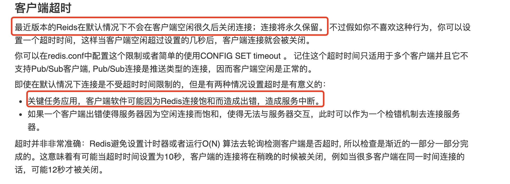

最近线上php模块偶现 `read error on connection`；具体报错日志如下

```
[15-Sep-2021 01:33:31 Asia/Shanghai] PHP Fatal error:  Uncaught RedisException: read error on connection to 100.69.239.54:3030 in /home/webroot/paris/xesci/system/libraries/CRedis.php:127 
```

通过查阅资料，发现两种原因可能导致` phpredis` 返回 `read error on connection`

- 执行超时
- 使用已经断开的连接


## 一、源码分析

php连接`redis` 使用的是`phpredis`扩展，在`phpredis`源码中全文搜索` 'read error on connection'` 可以发现 此错误位于 `phpredis/library.c `文件的 `redis_sock_gets` 函数。

```
/*
 * Processing for variant reply types (think EVAL)
 */

PHP_REDIS_API int
redis_sock_gets(RedisSock *redis_sock, char *buf, int buf_size, size_t *line_size)
{
    // Handle EOF
    if(-1 == redis_check_eof(redis_sock, 0)) {
        return -1;
    }

    if(php_stream_get_line(redis_sock->stream, buf, buf_size, line_size) == NULL)
    {
        char *errmsg = NULL;

        if (redis_sock->port < 0) {
            spprintf(&errmsg, 0, "read error on connection to %s", ZSTR_VAL(redis_sock->host));
        } else {
            spprintf(&errmsg, 0, "read error on connection to %s:%d", ZSTR_VAL(redis_sock->host), redis_sock->port);
        }
        // Close our socket
        redis_sock_disconnect(redis_sock, 1);

        // Throw a read error exception
        REDIS_THROW_EXCEPTION(errmsg, 0);
        efree(errmsg);
        return -1;
    }

    /* We don't need \r\n */
    *line_size-=2;
    buf[*line_size]='\0';

    /* Success! */
    return 0;
}
```

从源码中可以发现如果`php_stream_get_line`读取`stream`数据为NUll的时候就会抛出`read error on connection`这个错误。返回`NULL`的情况对应于php源码的`php-src/main/streams/streams.c` 文件。

```
/* If buf == NULL, the buffer will be allocated automatically and will be of an
 * appropriate length to hold the line, regardless of the line length, memory
 * permitting */
PHPAPI char *_php_stream_get_line(php_stream *stream, char *buf, size_t maxlen, size_t *returned_len)
{
    size_t avail = 0;
    size_t current_buf_size = 0;
    size_t total_copied = 0;
    int grow_mode = 0;
    char *bufstart = buf;

    if (buf == NULL) {
        grow_mode = 1;
    } else if (maxlen == 0) {
        return NULL;
    }

    /*
     * If the underlying stream operations block when no new data is readable,
     * we need to take extra precautions.
     *
     * If there is buffered data available, we check for a EOL. If it exists,
     * we pass the data immediately back to the caller. This saves a call
     * to the read implementation and will not block where blocking
     * is not necessary at all.
     *
     * If the stream buffer contains more data than the caller requested,
     * we can also avoid that costly step and simply return that data.
     */

    for (;;) {
        avail = stream->writepos - stream->readpos;

        if (avail > 0) {
            size_t cpysz = 0;
            char *readptr;
            const char *eol;
            int done = 0;

            readptr = (char*)stream->readbuf + stream->readpos;
            eol = php_stream_locate_eol(stream, NULL);

            if (eol) {
                cpysz = eol - readptr + 1;
                done = 1;
            } else {
                cpysz = avail;
            }

            if (grow_mode) {
                /* allow room for a NUL. If this realloc is really a realloc
                 * (ie: second time around), we get an extra byte. In most
                 * cases, with the default chunk size of 8K, we will only
                 * incur that overhead once.  When people have lines longer
                 * than 8K, we waste 1 byte per additional 8K or so.
                 * That seems acceptable to me, to avoid making this code
                 * hard to follow */
                bufstart = erealloc(bufstart, current_buf_size + cpysz + 1);
                current_buf_size += cpysz + 1;
                buf = bufstart + total_copied;
            } else {
                if (cpysz >= maxlen - 1) {
                    cpysz = maxlen - 1;
                    done = 1;
                }
            }

            memcpy(buf, readptr, cpysz);

            stream->position += cpysz;
            stream->readpos += cpysz;
            buf += cpysz;
            maxlen -= cpysz;
            total_copied += cpysz;

            if (done) {
                break;
            }
        } else if (stream->eof) {
            break;
        } else {
            /* XXX: Should be fine to always read chunk_size */
            size_t toread;

            if (grow_mode) {
                toread = stream->chunk_size;
            } else {
                toread = maxlen - 1;
                if (toread > stream->chunk_size) {
                    toread = stream->chunk_size;
                }
            }

            php_stream_fill_read_buffer(stream, toread);

            if (stream->writepos - stream->readpos == 0) {
                break;
            }
        }
    }

    if (total_copied == 0) {
        if (grow_mode) {
            assert(bufstart == NULL);
        }
        return NULL;
    }

    buf[0] = '\0';
    if (returned_len) {
        *returned_len = total_copied;
    }

    return bufstart;
}
```

从 `php_stream_get_line`方法中可以看出 只有 `bufstart=NULL`的时候才会返回NULL，`bufstart=NULL`说明并未在`buf`缓冲和`stream`中接收到任何数据，包括终止符。


## 二、问题可能性分析

### 1.执行超时

##### 1>问题复现

超时又可以分两种情况：一种是客户端设置的超时时间过短导致的；另外一种是客户端未设置超时时间，但是服务端执行时间超过了默认超时时间设置。测试代码如下

```
$rds = new \Redis();
try {
    $ret = $rds->pconnect("127.0.0.1", 6379);
    if ($ret == false) {
        echo "Connect return false";
        exit;
    }
    $rds->setOption(3,0.0001); // 设置超时时间为 0.1ms
    $rds->get("test_key");
} catch (Exception $e) {
    echo $e->getMessage(), "\n";
}
```

概率出现问题：`read error on connection to 127.0.0.1:6379`，与线上问题一致。`(分析中排除connect_time超时影响，异常为Operation timed out)`

##### 2>可能性分析

查验当前线上环境配置，当前paris没有对read_timeout做单独配置，则走系统默认读超时时间`0.5`，即`500ms`，理论上不可能，查看报警时期 `redis` 实例 `latency`,


### 2.连接断开
连接断开的情况，具体又会划分为三种

- 客户端主动关闭连接，但是接着使用该断开的连接
- 服务端在读之前断开连接
- 连接上redis之后，不断执行命令的过程中，服务端断开

在这个过程中，通过使用`fgetc(STDIN);`进行阻塞操作进行测试，测试完成后，发现，第一种会响应错误`Connection closed`,第二种会出现错误`Connection lost`，第三种情况与本次相符`read error on connection`

##### 1>问题复现

```
<?php
$rds = new Redis();
try {
    $ret = $rds->pconnect("127.0.0.1", 6379);
    if ($ret == false) {
        echo "Connect return false";
        exit;
    }
    while(1){
       $rds->get("aa");
    }
} catch (Exception $e) {
    echo $e->getMessage(), "\n";
}
```
##### 2>可能性分析

首先考虑，是否会是在客户端连接空闲一段时间后自动关闭的，这种情况可以排除。根据文档http://www.redis.cn/topics/clients.html，连接将永久保留的。(文档中最近版本指2.6之后的，线上普遍版本在3.2.8)。但是要注意的是，文档中说明是有**因为Redis连接饱和而造成出错，造成服务中断。**的可能



问题期间Redis的链接情况: 中间出现较大的毛刺，不过跟问题出现时间不符，问题是出现在1:37分时, 并未再毛刺出现时，而且连接数并未超3k，认为完全可以承载的，CPU等也并未报警，故而基本排除此情况问题。


### 3.php-fpm & pconnect

php通过 pconnect 连接redis服务端，虽然业务代码，显示调用close, 但是实际上该连接并未断开，fpm 会维护到redis 的连接，下个请求再次执行pconnect 的时候并不会真正请求redis 建立连接。这样同样会带来一个问题，假如这个连接已经断开了，下个请求可能直接使用上个断开的连接。phpredis 源码有如下注释。因此php-fpm reuse 一个断开的连接可能导致此类错误，也就是很可能redis-server终结了连接，需要讨论情况。


##### 1>问题复现

1. 使用Docker进行复现 *断开服务端容器的网络* `docker network disconnect docker_network docker_redis`

这里出现了两种情况，分别是「已发完PSH包」和「正在发PSH包」

- 已发完PSH包，过一段时间，然后连续发几次`FIN_WAIT1`包，最后断开与服务端的单边连接

- 正在发PSH包，不断重试，重试几次后，如果没有得到服务端的确认，直接发一个F包，然后断开与服务端的单边连接

当客户端主动断开与服务端的连接时，都会返回一个异常 ` read error on connection`，这是可以捕获的。但是，如果在执行`redis`操作，当断开后，的确会返回该异常，然而，下一次再执行`redis`操作的时候，就不走网络了，因为连接已经断开，所以redis客户端会直接返回false。

2. 使用Docker进行复现 *网络恢复* `docker network connect docker_network docker_redis`

网络恢复的时机也分为两种情况，分别对应断开的时机

- 已发完PSH包，此时网络中断，客户端等待1分钟，然后开始发F包。这时，网络恢复了！

- 正在发PSH包，此时网络中断，客户端不断重试，在重试结束前，网络恢复了！

第一种情况因为客户端已经发了F包，就算这时候网络恢复了，也会断开连接，最终结果为，**客户端异常**，第二种情况在客户端重试发PSH包的时候，网络恢复了，连接还在，服务端也会继续返回结果，客户端不再阻塞，**继续运行**


##### 2>解决方案
- 在客户端断开连接并报异常`read error on connection`时，进行异常捕获，开启一个阻塞循环，不断的重连redis，连接成功后才返回

```
当前是支持的，不过需要捕获一场，并将重试次数增大。
```

- 将改成短链接 connect，牺牲些性能

- 缩短keep_alive的心跳发送时长(*操作系统级*)


##### 3>源码分析

建立连接时，先到`连接池`获取连接（最后一个），并移除最后一个连接实例。如果连接是活跃的（PHP_STREAM_OPTION_CHECK_LIVENESS），则直接返回。如果连接已失效，则建立新的连接。`library.c 行：1828`，下方代码需要着重看下。在连接的时候，会通过判断`host`来看是否开启`TCP_KEEPALIVE`。如果是`unix domain socket`，则不会启用`TCP_KEEPALIVE`。然而，在`connect`阶段，根本没有这个配置项，说

```
    /* Attempt to set TCP_NODELAY/TCP_KEEPALIVE if we're not using a unix socket. */
    if (!usocket) {
        php_netstream_data_t *sock = (php_netstream_data_t*)redis_sock->stream->abstract;
        err = setsockopt(sock->socket, IPPROTO_TCP, TCP_NODELAY, (char*) &tcp_flag, sizeof(tcp_flag));
        PHPREDIS_NOTUSED(err);
        err = setsockopt(sock->socket, SOL_SOCKET, SO_KEEPALIVE, (char*) &redis_sock->tcp_keepalive, sizeof(redis_sock->tcp_keepalive));
        PHPREDIS_NOTUSED(err);
    }
```

根据当前配置理论上当前均走了 `keep_alive`， 那么接下来就需要寻找redis对于`keep_alive`的配置时间，保证断网后的数秒内能给服务端发`keepalive`包。从其他博客上得知，可以去设置 `OPT_TCP_KEEPALIVE`, 但是经过尝试，这个并不生效。为了查询原因，则继续追踪源码发现。

```
tcp_keepalive = zval_get_long(val) > 0 ? 1 : 0;
```

这个值仅仅当作一个开关来使用的，震惊。只要是正整数，就把tcp_keepalive设置为1，否则设置为0。但是的确没有其他可供设置的API了。这里猜测php使用的时间是系统的全局默认的TCP_KEEPALIVE配置，如下，即两个小时（7200s）后才发包。

```
sysctl -a | grep keepalive

net.ipv4.tcp_keepalive_time = 7200
net.ipv4.tcp_keepalive_probes = 9
net.ipv4.tcp_keepalive_intvl = 75
```

##### 4>可能性分析

猜测集群网络抖动因素较大，可能是宿主机问题，因为短期内 统一集群出现了 相同的连接问题，分别是 小流量集群 同时发生，以及线上集群同时发生。不过暂时无法找到直接证据证明此原因。因为在那个时间段，其他连接正常，仅该单个redis实例连接出现了问题，并且并未收到其他应用在同一时间产生相同问题。不过有时候零星出现，并且crius高频次出现这个问题的问题不太好解释。

结合追踪到的mysql一个问题，有理由进行怀疑网络问题。

```
[FATAL][2021-09-18T14:28:56.1631946536969+0800][line=/home/webroot/paris/xesci/system/core/Common.php +496 class=CI\core\Exceptions function=CI\core\Exceptions::logException] _com_undef||traceid=||hintcode=||spanid=1e4c340b69678494||logid=215028626844580||uri=script:/home/webroot/paris/index_prod.php||{"argv":["crontab","OrderTimeOut","worker"]}||Severity: Notice  --> mysqli_ping(): send of 5 bytes failed with errno=104 Connection reset by peer /home/webroot/paris/xesci/system/database/drivers/mysqli/Driver.php 194
```


