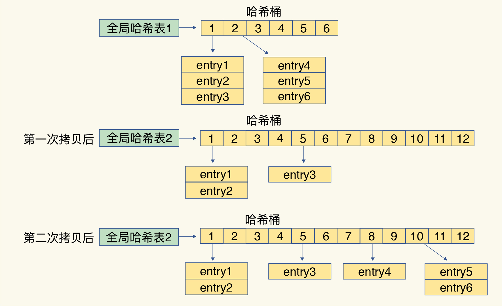

Redis“快”的重要表现：它接收到一个键值对操作后，能以微秒级别的速度找到数据，并快速完成操作。能够这么优秀的原因一方面，这是因为它是内存数据库，所有操作都在内存上完成，内存的访问速度本身就很快。另一方面，这要归功于它的数据结构。

底层数据结构一共有 6 种，分别是简单动态字符串、双向链表、压缩列表、哈希表、跳表和整数数组。

String 类型的底层实现只有一种数据结构，也就是简单动态字符串。而 List、Hash、Set 和 Sorted Set 这四种数据类型，都有两种底层实现结构。通常情况下，我们会把这四种类型称为**集合类型**，它们的特点是一个键对应了一个集合的数据。

## 键和值用什么结构组织？

为了实现从键到值的快速访问，Redis 使用了一个哈希表来保存所有键值对。

一个哈希表，其实就是一个数组，数组的每个元素称为一个哈希桶。所以，我们常说，一个哈希表是由多个哈希桶组成的，每个哈希桶中保存了键值对数据。哈希桶中的元素保存的并不是值本身，而是指向具体值的指针。

这个哈希表保存了所有的键值对，所以，我也把它称为**全局哈希表**。

注意： Redis 中写入大量数据后，可能发现操作有时候会突然变慢了。**哈希表的冲突问题和 rehash 可能带来的操作阻塞。**

## 为什么哈希表操作变慢了？

哈希冲突是不可避免的问题。这里的哈希冲突，也就是指，两个 key 的哈希值和哈希桶计算对应关系时，正好落在了同一个哈希桶中。

Redis 解决哈希冲突的方式，就是链式哈希。链式哈希也很容易理解，**就是指同一个哈希桶中的多个元素用一个链表来保存，它们之间依次用指针连接。**如图所示

但是，这样的话，哈希冲突链上的元素只能通过指针逐一查找再操作，随着数量越来越多，性能将会越来越差，为了解决这个问题，**Redis 会对哈希表做 rehash 操作。**

为了使 rehash 操作更高效，Redis 默认使用了两个全局哈希表：哈希表 1 和哈希表 2。一开始，当你刚插入数据时，默认使用哈希表 1，此时的哈希表 2 并没有被分配空间。随着数据逐步增多，Redis 开始执行 rehash，这个过程分为三步：

- 给哈希表 2 分配更大的空间，例如是当前哈希表 1 大小的两倍；
- 把哈希表 1 中的数据重新映射并拷贝到哈希表 2 中；
- 释放哈希表 1 的空间。

但是这个过程设计了大量的数据拷贝，如果一次性把哈希表 1 中的数据都迁移完，会造成 Redis 线程阻塞。为了避免这个问题，Redis 采用了**渐进式 rehash**。主要是将上述第二步的步骤修改为：

- Redis 仍然正常处理客户端请求，每处理一个请求时，从哈希表 1 中的第一个索引位置开始，顺带着将这个索引位置上的所有 entries 拷贝到哈希表 2 中；等处理下一个请求时，再顺带拷贝哈希表 1 中的下一个索引位置的 entries。

## 不同操作的复杂度

- 单元素操作是基础；
- 范围操作非常耗时；
- 统计操作通常高效；
- 例外情况只有几个。

第一，**单元素操作，是指每一种集合类型对单个数据实现的增删改查操作。**这些操作的复杂度由集合采用的数据结构决定，例如，HGET、HSET 和 HDEL 是对哈希表做操作，所以它们的复杂度都是 O(1)；Set 类型用哈希表作为底层数据结构时，它的 SADD、SREM、SRANDMEMBER 复杂度也是 O(1)。

第二，**范围操作，是指集合类型中的遍历操作，可以返回集合中的所有数据**，比如 Hash 类型的 HGETALL 和 Set 类型的 SMEMBERS，或者返回一个范围内的部分数据，比如 List 类型的 LRANGE 和 ZSet 类型的 ZRANGE。这类操作的复杂度一般是 O(N)，比较耗时，我们应该**尽量避免**。

第三，**统计操作，是指集合类型对集合中所有元素个数的记录，**例如 LLEN 和 SCARD。这类操作复杂度只有 O(1)，这是因为当集合类型采用压缩列表、双向链表、整数数组这些数据结构时，这些结构中专门记录了元素的个数统计，因此可以高效地完成相关操作。

第四，例外情况，是指某些数据结构的特殊记录，例如**压缩列表和双向链表都会记录表头和表尾的偏移量。**这样一来，对于 List 类型的 LPOP、RPOP、LPUSH、RPUSH 这四个操作来说，它们是在列表的头尾增删元素，这就可以通过偏移量直接定位，所以它们的复杂度也只有 O(1)，可以实现快速操作。

