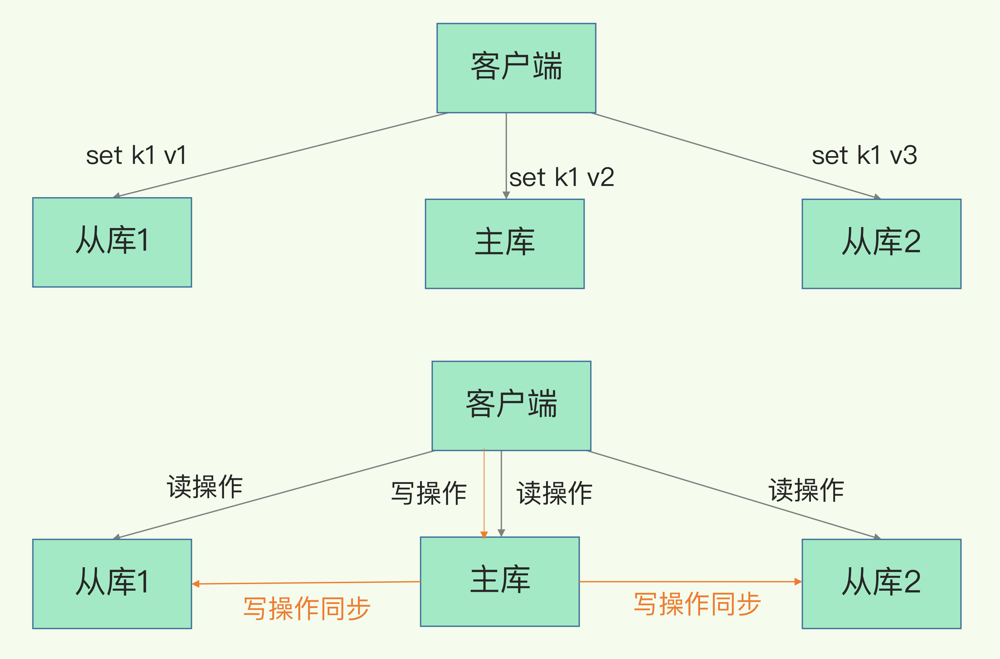
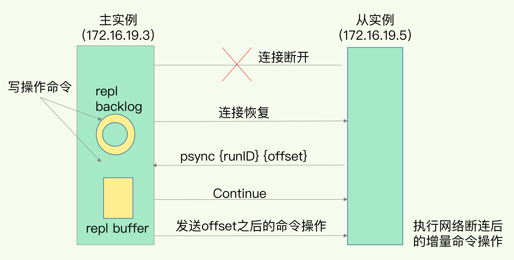

Redis 提供了主从库模式，以保证数据副本的一致，主从库之间采用的是读写分离的方式。

- 读操作：主库、从库都可以接收；
- 写操作：首先到主库执行，然后，主库将写操作同步给从库。




## 主从数据同步

### 一、主从库间如何进行第一次同步？

当我们启动多个 Redis 实例的时候，它们相互之间就可以通过 replicaof（Redis 5.0 之前使用 slaveof）命令形成主库和从库的关系，之后会按照三个阶段完成数据的第一次同步。


第一阶段，从库和主库建立起连接，并告诉主库即将进行同步，主库确认回复后，主从库间就可以开始同步了。从库给主库发送 psync 命令，psync 命令包含了主库的 runID 和复制进度 offset 两个参数。

- runID，是每个 Redis 实例启动时都会自动生成的一个随机 ID，用来唯一标记这个实例。当从库和主库第一次复制时，因为不知道主库的 runID，所以将 runID 设为“？”。
- offset，此时设为 -1，表示第一次复制。

注意： **FULLRESYNC 响应表示第一次复制采用的全量复制，也就是说，主库会把当前所有的数据都复制给从库。**

第二阶段，主库将所有数据同步给从库。从库收到数据后，在本地完成数据加载。

第三个阶段，主库会把第二阶段执行过程中新收到的写命令，再发送给从库。


### 二、在此过程中从库过多时主库压力过大怎么办？

如果从库数量很多，而且都要和主库进行全量复制的话，就会导致主库忙于 fork 子进程生成 RDB 文件，进行数据全量同步。fork 这个操作会阻塞主线程处理正常请求，从而导致主库响应应用程序的请求速度变慢。

此外，传输 RDB 文件也会占用主库的网络带宽，同样会给主库的资源使用带来压力。

**为了分担全量复制时的主库压力，可以将集群设置为“主 - 从 - 从”模式。通过“主 - 从 - 从”模式将主库生成 RDB 和传输 RDB 的压力，以级联的方式分散到从库上。**


### 三、主从数据复制完之后呢？

一旦主从库完成了全量复制，它们之间就会一直维护一个网络连接，主库会通过这个连接将后续陆续收到的命令操作再同步给从库，这个过程也称为**基于长连接的命令传播**，可以避免频繁建立连接的开销。


### 四、主从库间网络断了怎么办？

从 Redis 2.8 开始，网络断了之后，主从库会采用增量复制的方式继续同步。只会把主从库网络断连期间主库收到的命令，同步给从库。

当主从库断连后，主库会把断连期间收到的写操作命令，写入 **replication buffer**，同时也会把这些操作命令也写入 repl_backlog_buffer 这个缓冲区。

repl_backlog_buffer 是一个环形缓冲区，**主库会记录自己写到的位置，从库则会记录自己已经读到的位置。**


刚开始的时候，主库和从库的写读位置在一起，这算是它们的起始位置。随着主库不断接收新的写操作，它在缓冲区中的写位置会逐步偏离起始位置，我们通常用偏移量来衡量这个偏移距离的大小，对主库来说，对应的偏移量就是 master_repl_offset。主库接收的新写操作越多，这个值就会越大。

同样，从库在复制完写操作命令后，它在缓冲区中的读位置也开始逐步偏移刚才的起始位置，此时，从库已复制的偏移量 slave_repl_offset 也在不断增加。正常情况下，这两个偏移量基本相等。

主从库的连接恢复之后，从库首先会给主库发送 psync 命令，并把自己当前的 slave_repl_offset 发给主库，主库会判断自己的 master_repl_offset 和 slave_repl_offset 之间的差距。

在网络断连阶段，主库可能会收到新的写操作命令，所以，一般来说，master_repl_offset 会大于 slave_repl_offset。此时，主库只用把 master_repl_offset 和 slave_repl_offset 之间的命令操作同步给从库就行。

就像刚刚示意图的中间部分，主库和从库之间相差了 put d e 和 put d f 两个操作，在增量复制时，主库只需要把它们同步给从库，就行了。

整理流程示意图如下



注意：**如果从库的读取速度比较慢，就有可能导致从库还未读取的操作被主库新写的操作覆盖了，这会导致主从库间的数据不一致。**可以调整 repl_backlog_size 这个参数，来避免这情况。


# 哨兵

如果主库挂了，我们就需要运行一个新主库，比如说把一个从库切换为主库，把它当成主库。这就涉及到三个问题：

- 主库真的挂了吗？
- 该选择哪个从库作为主库？
- 怎么把新主库的相关信息通知给从库和客户端呢？

在 Redis 主从集群中，哨兵机制是实现主从库自动切换的关键机制，它有效地解决了主从复制模式下故障转移的这三个问题。


哨兵其实就是一个运行在特殊模式下的 Redis 进程，哨兵主要负责的就是三个任务：监控、选主（选择主库）和通知。


### 一、判断主从库下线

哨兵对主库的下线判断有“主观下线”和“客观下线”两种。

哨兵进程会使用 PING 命令检测它自己和主、从库的网络连接情况，用来判断实例的状态。如果哨兵发现主库或从库对 PING 命令的响应超时了，那么，哨兵就会先把它标记为“主观下线”。

`如果检测的是从库，那么，哨兵简单地把它标记为“主观下线”就行了，因为从库的下线影响一般不太大，集群的对外服务不会间断。`

`但是，如果检测的是主库，那么，哨兵还不能简单地把它标记为“主观下线”，开启主从切换。因为很有可能存在这么一个情况：那就是哨兵误判了，其实主库并没有故障。可是，一旦启动了主从切换，后续的选主和通知操作都会带来额外的计算和通信开销。`

为了减少误判，**通常会采用多实例组成的集群模式进行部署，这也被称为哨兵集群。**只有大多数的哨兵实例，都判断主库已经“主观下线”了，主库才会被标记为“客观下线”。


简单来说，“客观下线”的标准就是，当有 N 个哨兵实例时，最好要有 N/2 + 1 个实例判断主库为“主观下线”，才能最终判定主库为“客观下线”。


### 二、如何选定新库

除了要检查从库的当前在线状态，还要判断它之前的网络连接状态。按照从库优先级、从库复制进度以及从库 ID 号来进行筛选。


第一轮：优先级最高的从库得分高。

用户可以通过 slave-priority 配置项，给不同的从库设置不同优先级。比如，你有两个从库，它们的内存大小不一样，你可以手动给内存大的实例设置一个高优先级。在选主时，哨兵会给优先级高的从库打高分，如果有一个从库优先级最高，那么它就是新主库了。如果从库的优先级都一样，那么哨兵开始第二轮打分。

第二轮：和旧主库同步程度最接近的从库得分高。

选择和旧主库同步最接近的那个从库作为主库，判断依据为主从库同步时命令传播的过程repl_backlog_buffer中 master_repl_offset（当前主库的最新写操作未知）与slave_repl_offset（当前从库的复制进度）最接近的。

如果有两个从库的 slave_repl_offset 值大小是一样的，我们就需要给它们进行第三轮打分了。

第三轮：ID 号小的从库得分高。

每个实例都会有一个 ID，这个 ID 就类似于这里的从库的编号。目前，Redis 在选主库时，有一个默认的规定：在优先级和复制进度都相同的情况下，ID 号最小的从库得分最高，会被选为新主库。


注意：**哨兵实例之间可以相互发现，要归功于 Redis 提供的 pub/sub 机制，也就是发布 / 订阅机制。**


# 切片集群

切片集群部署的话，每个“切片”可部单独或主从

切片集群。是日常redis数据过多，横向拓展的一个解决方案，也叫分片集群，就是指启动多个 Redis 实例组成一个集群，然后按照一定的规则，把收到的数据划分成多份，每一份用一个实例来保存。回到我们刚刚的场景中，如果把 25GB 的数据平均分成 5 份（当然，也可以不做均分），使用 5 个实例来保存，每个实例只需要保存 5GB 数据。如图


### 数据切片和实例的对应分布关系

数据和实例之间时通过Redis Cluster方案解决。

Redis Cluster 方案采用哈希槽（Hash Slot，接下来我会直接称之为 Slot），来处理数据和实例之间的映射关系。在 Redis Cluster 方案中，一个切片集群共有 16384 个哈希槽，这些哈希槽类似于数据分区，每个键值对都会根据它的 key，被映射到一个哈希槽中。具体的映射过程分为两大步。

- 首先根据键值对的 key，按照CRC16 算法计算一个 16 bit 的值
- 再用这个 16bit 值对 16384 取模，得到 0~16383 范围内的模数，每个模数代表一个相应编号的哈希槽

我们在部署 Redis Cluster 方案时，可以使用 cluster create 命令创建集群，此时，Redis 会自动把这些槽平均分布在集群实例上。例如，如果集群中有 N 个实例，那么，每个实例上的槽个数为 16384/N 个。（也可以使用 cluster meet 命令手动建立，**在手动分配哈希槽时，需要把 16384 个槽都分配完，否则 Redis 集群无法正常工作。**）


完成后 Redis 实例会把自己的哈希槽信息发给和它相连接的其它实例，来完成哈希槽分配信息的扩散。当实例之间相互连接后，每个实例就有所有哈希槽的映射关系了。


客户端和集群实例建立连接后，实例会把哈希槽的分配信息发给客户端。客户端收到哈希槽信息后，会把哈希槽信息缓存在本地。当客户端请求键值对时，会先计算键所对应的哈希槽，然后就可以给相应的实例发送请求了。


### Redis Cluster重定向机制

在集群中，实例和哈希槽的对应关系并不是一成不变的，最常见的变化有两个：

- 在集群中，实例有新增或删除，Redis 需要重新分配哈希槽；
- 为了负载均衡，Redis 需要把哈希槽在所有实例上重新分布一遍。

实例之间还可以通过相互传递消息，获得最新的哈希槽分配信息，但是，客户端是无法主动感知这些变化的。这就会导致，它缓存的分配信息和最新的分配信息就不一致了，那该怎么办呢？

Redis Cluster 方案提供了一种重定向机制，所谓的“重定向”，就是指，客户端给一个实例发送数据读写操作时，这个实例上并没有相应的数据，客户端要再给一个新实例发送操作命令。当客户端把一个键值对的操作请求发给一个实例时，如果这个实例上并没有这个键值对映射的哈希槽，那么，这个实例就会给客户端返回下面的 MOVED 命令响应结果，这个结果中就包含了新实例的访问地址。

```
GET hello:key
(error) MOVED 13320 172.16.19.5:6379
```


注意，**上述是数据已经全部迁移的情况，还有事数据没有完成迁移**，在这种迁移部分完成的情况下，客户端就会收到一条 ASK 报错信息,这个命令的意思是，让这个实例允许执行客户端接下来发送的命令。然后，客户端再向这个实例发送 GET 命令，以读取数据。

```
GET hello:key
(error) ASK 13320 172.16.19.5:6379
```

ASK 命令表示两层含义：

- 第一，表明 Slot 数据还在迁移中；
- 第二，ASK 命令把客户端所请求数据的最新实例地址返回给客户端，此时，客户端需要给新实例发送 ASKING 命令，然后再发送操作命令。

和 MOVED 命令不同，**ASK 命令并不会更新客户端缓存的哈希槽分配信息。**


