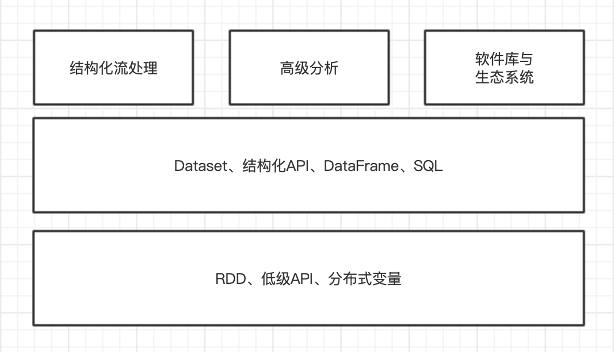

# 一、Spark是什么
**Apache Spark 是一个在集群上运行的统一计算引擎以及一组并行数据处理软件库。**，支持多种常用编程语言，提供支持SQL、流处理、机器学习等多种任务的软件库。

Spark的设计理念，即**构建一个统一的引擎，为通用数据分析任务提供统一的API。**

**Spark的主要目标是编写大数据应用程序提供统一的平台。**它对外提供了一致的、可组合的API，可以使用这些API来构建应用程序、使用代码片段或是从现有的库构建应用程序，还允许在上面编写自己的数据分析库。

**Spark专注于计算引擎。**Spark本身**既不负责持久化数据，也不偏向使用一种特定的存储系统**，主要原因是大多数数据已经存在于混合存储系统中，而移动这些数据的费用特别高。

**Spark有丰富的组件库**。Spark不仅支持引擎附带的标准库，同时也支持开源社区以及第三方包形式发布的大量外部库。
