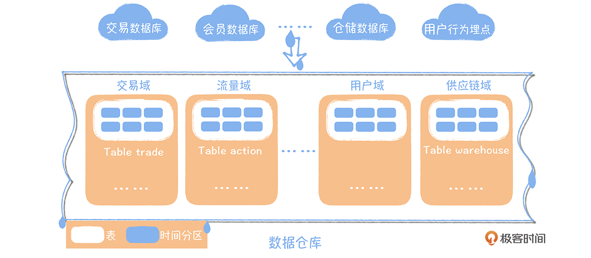
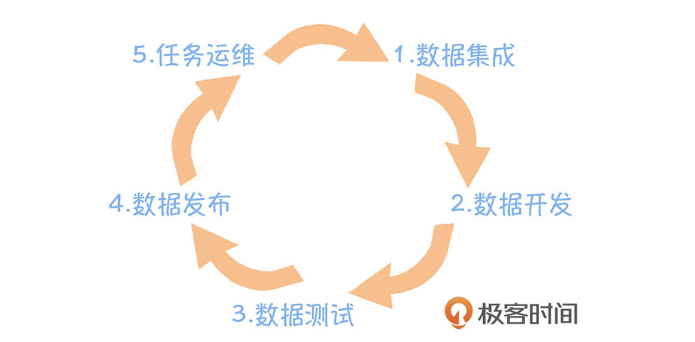
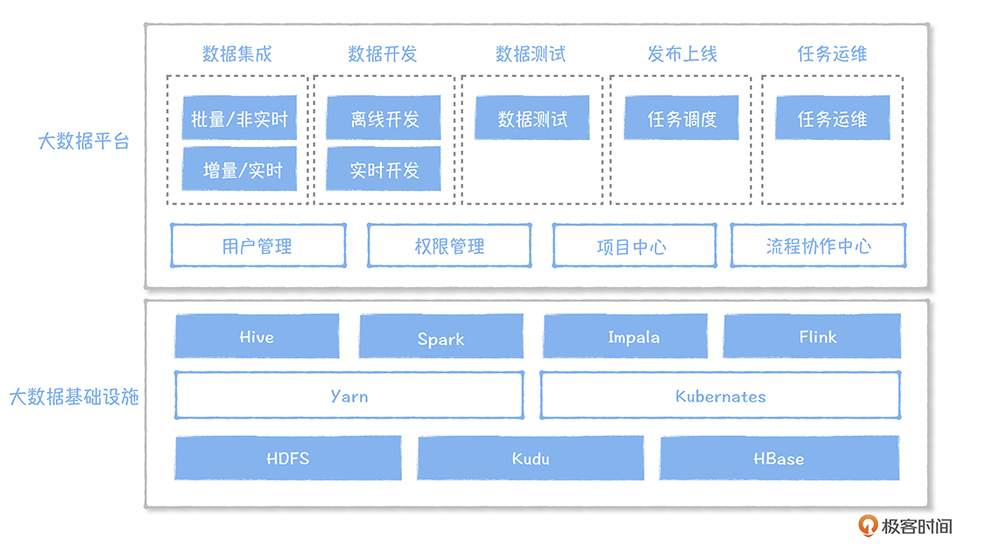
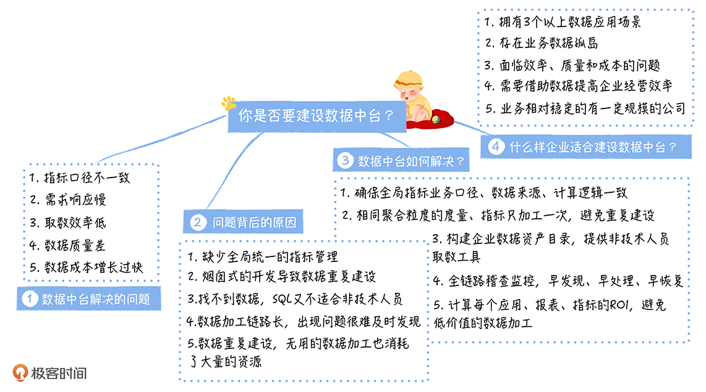

# 一、大数据发展历程

大数据的发展历史，先从数据仓库的出现讲起，途径数据湖，再到大数据平台

## 1.启蒙时代：数据仓库的出现

**数据仓库是在企业管理和决策中面向主题的、集成的、与时间相关的，不可修改的数据集合。**

它起源于商业智能，将企业已有的数据转化为知识，帮助企业做出经营分析决策。而数据分析需要聚合多个业务系统的数据，比如需要集成交易系统的数据，需要集成仓储系统的数据等等，同时需要保存历史数据，进行大数据量的范围查询。传统数据库面向单一业务系统，主要实现的是面向事务的增删改查，已经不能满足数据分析的场景，**这促使数据仓库概念的出现**。

恩门提出的建模方法自顶向下（这里的顶是指数据的来源，在传统数据仓库中，就是各个业务数据库），基于业务中各个实体以及实体之间的关系，构建数据仓库。*比如，在一个最简单的买家购买商品的场景中，按照恩门建模的思维模式，首先你要理清这个业务过程中涉及哪些实体。买家、商品是一个实体，买家购买商品是一个关系。所以，模型设计应该有买家表，商品表，和买家商品交易表三个模型。*

金博尔建模与恩门正好相反，是一种自底向上的模型设计方法，从数据分析的需求出发，拆分维度和事实。那么用户、商品就是维度，库存、用户账户余额是事实。

这两种方法各有优劣，恩门建模因为是从数据源开始构建，构建成本比较高，适用于应用场景比较固定的业务，比如金融领域，冗余数据少是它的优势。金博尔建模由于是从分析场景出发，适用于变化速度比较快的业务，比如互联网业务。**由于现在的业务变化都比较快，所以我更推荐金博尔的建模设计方法。**

## 2. 技术革命：从 Hadoop 到数据湖

进入互联网时代，有两个最重要的变化。

- 一个是数据规模前所未有，知名互联网公司日活过亿，数据仓库难以拓展难以承载
- 另一个是数据类型变得异构化，互联网时代的数据除了来自业务数据库的结构化数据，还有来自 App、Web 的前端埋点数据，或者业务服务器的后端埋点日志，这些数据一般都是半结构化，甚至无结构的。

2005 年 Hadoop 出现的时候，大数据技术才开始普及。你可以把 Hadoop 认为是前面三篇论文的一个开源实现，我认为 Hadoop 相比传统数据仓库主要有两个优势：

- 完全分布式，易于扩展，可以使用价格低廉的机器堆出一个计算、存储能力很强的集群，满足海量数据的处理要求；
- 弱化数据格式，数据被集成到 Hadoop 之后，可以不保留任何数据格式，数据模型与数据存储分离，数据在被使用的时候，可以按照不同的模型读取，满足异构数据灵活分析的需求。

随着 Hadoop 技术日趋成熟，2010 年，Pentaho 创始人兼 CTO James Dixon 在纽约 Hadoop World 大会上提出了数据湖的概念

**数据湖（Data Lake）是一个以原始格式存储数据的存储库或系统。**

## 3.数据工厂时代：大数据平台兴起

对于一个数据开发，在完成一项需求时，常见的一个流程是首先要把数据导入到大数据平台中，然后按照需求进行数据开发。开发完成以后要进行数据验证比对，确认是否符合预期。接下来是把数据发布上线，提交调度。最后是日常的任务运维，确保任务每日能够正常产出数据。

提出大数据平台的概念，就是为了提高数据研发的效率，降低数据研发的门槛，让数据能够在一个设备流水线上快速地完成加工。**大数据平台是面向数据研发场景的，覆盖数据研发的完整链路的数据工作台**

大数据平台按照使用场景，分为数据集成、数据开发、数据测试……任务运维，大数据平台的使用对象是数据开发。大数据平台的底层是以 Hadoop 为代表的基础设施，分为计算、资源调度和存储。

Hive、Spark、Flink、Impala 提供了大数据计算引擎：

- Hive、Spark 主要解决离线数据清洗、加工的场景，目前，Spark 用得越来越多，性能要比 Hive 高不少；
- Flink 主要是解决实时计算的场景；
- Impala 主要是解决交互式查询的场景。

这些计算引擎统一运行在一个称为 Yarn 的资源调度管理框架内，由 Yarn 来分配计算资源。目前最新的研究方向中也有基于 Kubernetes 实现资源调度的，例如在最新的 Spark 版本（2.4.4）中，Spark 已经能够运行在 Kubernetes 管理的集群上，这样的好处是可以实现在线和离线的资源混合部署，节省机器成本。

数据存储在 HDFS、Kudu 和 HBase 系统内。HDFS 不可更新，主要存全量数据，HBase 提供了一个可更新的 KV，主要存一些维度表，Kudu 提供了实时更新的能力，一般用在实时数仓的构建场景中。

大数据平台像一条设备流水线，经过大数据平台的加工，原始数据变成了指标，出现在各个报表或者数据产品中。随着数据需求的快速增长，报表、指标、数据模型越来越多，找不到数据，数据不好用，数据需求响应速度慢等问题日益尖锐，成为阻塞数据产生价值的绊脚石。

## 4.数据价值时代：数据中台崛起

2016 年前后，互联网高速发展，背后对数据的需求越来越多，数据的应用场景也越来越多，有大量的数据产品进入到了我们运营的日常工作，成为运营工作中不可或缺的一部分。在电商业务中，有供应链系统，供应链系统会根据各个商品的毛利、库存、销售数据以及商品的舆情，产生商品的补货决策，然后推送给采购系统。

大规模数据的应用，也逐渐暴露出现一些问题。

业务发展前期，为了快速实现业务的需求，烟囱式的开发导致企业不同业务线，甚至相同业务线的不同应用之间，数据都是割裂的。两个数据应用的相同指标，展示的结果不一致，导致运营对数据的信任度下降。如果你是运营，当你想看一下商品的销售额，发现两个报表上，都叫销售额的指标出现了两个值，你的感受如何? 你第一反应肯定是数据算错了，你不敢继续使用这个数据了。

数据割裂的另外一个问题，就是大量的重复计算、开发，导致的研发效率的浪费，计算、存储资源的浪费，大数据的应用成本越来越高。**这些问题的根源在于，数据无法共享**

**数据中台的核心，是避免数据的重复计算，通过数据服务化，提高数据的共享能力，赋能数据应用。**

数据中台优势：

- 数据中台构建于数据湖之上，具备数据湖异构数据统一计算、存储的能力，同时让数据湖中杂乱的数据通过规范化的方式管理起来。
- 数据中台需要依赖大数据平台，大数据平台完成了数据研发的全流程覆盖，数据中台增加了数据治理和数据服务化的内容。
- 数据中台借鉴了传统数据仓库面向主题域的数据组织模式，基于维度建模的理论，构建统一的数据公共层。

# 二、关键抉择： 到底什么样的企业应该建数据中台？

## 1.建设中台前，我们面临的挑战

大量数据产品的出现，在不断提高企业运营效率的同时，也暴露出很多尖锐的问题，在我看来，主要有五点。

- 1.指标口径不一致。 两个数据产品一个包含税，一个不包含税，它们相同的一个指标名称都是销售额，结果却不一样。运营面对这些指标的时候，不知道指标的业务口径，很难去使用这些数据。

- 2.数据重复建设，需求响应时间长。随着需求的增长，运营和分析师不断抱怨需求的交付时间拉长，面对快速变化的业务，需求响应时间已经无法满足业务对数据的敏捷研发要求。

- 3.取数效率低。 面对数十万张表，我们的运营和分析师找数据、准确地理解数据非常困难，想找到一个想要的数据，确认这个数据和自己的需求匹配，他们往往需要花费三天以上的时间，对新人来说，这个时间会更长。

  除了查找数据效率低，从系统中取数分析对于非技术出身的分析师和运营来说也是一个难题，这就导致大部分的取数工作还是依赖数据开发来完成。数据开发大部分的时间都被临时取数的需求占据，根本无法专注在数仓模型的构建和集市层数据的建设，最终形成了一个恶性循环，一方面是数据不完善，另一方面是数据开发忙于各种临时取数需求。

- 4.数据质量差。数据经常因为 BUG 导致计算结果错误，最终导致错误的商业决策。

- 5.数据成本线性增长。数据成本随着需求的增长而线性增长。

## 2.为什么数据中台可以解决这些问题？

指标口径不一致，可能原因包括三种：**业务口径不一致、计算逻辑不一致、数据来源不一致**。

如果是业务口径不一致，那就要明确区分两个指标不能使用相同的标识，像上面的例子，含税和不含税的两个指标， 不能同时叫销售额。

业务口径的描述往往是一段话，但是对于很多指标，涉及的计算逻辑非常复杂，仅仅一段话是描述不清楚的，此时，两个相同业务口径的指标，恰巧又分别是由两个数据开发去实现的，这样就有可能造成计算逻辑不一致。比如，有一个指标叫做排关单（排关单：把关单的排除；关单：关闭订单）的当天交易额这个指标，A 认为关单的定义是未发货前关闭的订单，B 认为关单是当天关闭的订单，大家对业务口径理解不一致，这样实现的计算结果也就会不一致。

最后，还可能是两个指标的数据来源不一样，比如一个来自实时数据，一个是来自离线的数据，即使加工逻辑一样，最终结果也可能不相同。

**综合看来，要实现一致，就务必确保对同一个指标（重名），只有一个业务口径，只加工一次，数据来源必须相同。**

而数据需求响应慢在于烟囱式的开发模式，导致了大量重复逻辑代码的研发，比如同一份原始数据，两个任务都对原始数据进行清洗。如果只有一个任务清洗，产出一张明细表，另外一个任务直接引用这张表，就可以节省一个研发的清洗逻辑的开发。

**所以，要解决数据需求响应慢，就必须解决数据复用的问题，要确保相同数据只加工一次，实现数据的共享。**

取数效率低，一方面原因是找不到数据，另一方面原因可能是取不到数据。要解决找不到数据的问题，就必须要构建一个全局的企业数据资产目录，实现数据地图的功能，快速找到数据。而非技术人员并不适合用写 SQL 的方式来取数据，所以要解决取不到数据的问题，就要为他们提供可视化的查询平台，通过勾选一些参数，才更容易使用。

数据质量差的背后其实是数据问题很难被发现。我们经常是等到使用数据的人反馈投诉，才知道数据有问题。而数据的加工链路一般非常长，在我们的业务中，一个指标上游的所有链路加起来有 100 多个节点，这是很正常的事情。等到运营投诉再知道数据有问题就太迟了，因为要逐个去排查到底哪个任务有问题，然后再重跑这个任务以及所有下游链路上的每个任务，这样往往需要花费半天到一天的时间，最终导致故障恢复的效率很低，时间很长。

**所以，要解决数据质量差，就要及时发现然后快速恢复数据问题。**

最后一个是大数据的成本问题，它其实与需求响应慢背后的数据重复建设有关，因为重复开发任务的话，这些任务上线肯定会花费双倍的资源。如果我们可以节省一个任务的资源消耗，满足两个数据需求，就可以控制不必要的资源消耗。所以，成本问题背后也是数据重复建设的问题。

数据中台消除了冗余数据，构建了企业级数据资产，提高了数据的共享能力，这与我们需要的能力不谋而合。

**数据中台是企业构建的标准的、安全的、统一的、共享的数据组织，通过数据服务化的方式支撑前端数据应用。**

## 3.数据中台是如何解决这些问题的？

**那么数据中台是怎么实现所有数据只加工一次的呢？**简单来说，就是对于数仓数据，我们要求相同粒度的度量或者指标只加工一次，构建全局一致的公共维表。要实现上述目标，需要两个工具产品：

- 一个是数仓设计中心，在模型设计阶段，强制相同聚合粒度的模型，度量不能重复。
- 另外一个是数据地图，方便数据开发能够快速地理解一张表的准确含义。

**数据中台通过服务化的方式，提高了数据应用接入和管理的效率。**原先数仓提供给应用的访问方式是直接提供表，应用开发自己把数据导出到一个查询引擎上，然后去访问查询引擎。在数据中台中，数仓的数据是通过 API 接口的方式提供给数据应用，数据应用不用关心底层不同的查询引擎访问方式的差异。

**对于非技术人员，数据中台提供了可视化的取数平台**

**数据中台由于数据只能加工一次，强调数据的复用性，这就对数据的质量提出了更高的要求。**

**最后一个是成本问题。**我们在构建数据中台的时候，研发了一个数据成本治理系统，从应用维度、表维度、任务的维度、文件的维度进行全面的治理。 从应用的维度，如果一个报表 30 天内没有访问，这个报表的产出价值就是低的，然后结合这个报表产出的所有上游表以及上游表的产出任务，我们可以计算加工这张表的成本，有了价值和成本，我们就能计算 ROI，根据 ROI 就可以实现将低价值的报表下线的功能。

## 4.什么样的企业适合建数据中台？

数据中台的建设，需要结合企业的现状，根据需要进行选择。我认为企业在选择数据中台的时候，应该考虑这样几个因素。

- 企业是否有大量的数据应用场景： 数据中台本身并不能直接产生业务价值，数据中台的本质是支撑快速地孵化数据应用。所以当你的企业有较多数据应用的场景时（一般有 3 个以上就可以考虑），就像我在课程开始时提到电商中有各种各样的数据应用场景，此时你要考虑构建一个数据中台。
- 经过了快速的信息化建设，企业存在较多的业务数据的孤岛，需要整合各个业务系统的数据，进行关联的分析，此时，你需要构建一个数据中台。比如在我们做电商的初期，仓储、供应链、市场运营都是独立的数据仓库，当时数据分析的时候，往往跨了很多数据系统，为了消除这些数据孤岛，就必须要构建一个数据中台。
- 当你的团队正在面临效率、质量和成本的苦恼时，面对大量的开发，却不知道如何提高效能，数据经常出问题而束手无策，老板还要求你控制数据的成本，这个时候，数据中台可以帮助你。
- 当你所在的企业面临经营困难，需要通过数据实现精益运营，提高企业的运营效率的时候，你需要构建一个数据中台，同时结合可视化的 BI 数据产品，实现数据从应用到中台的完整构建，在我的接触中，这种类型往往出现在传统企业中。
- 企业规模也是必须要考虑的一个因素，数据中台因为投入大，收益偏长线，所以更适合业务相对稳定的大公司，并不适合初创型的小公司。

## 5. 数据中台建设重点

- 效率、质量和成本是决定数据能否支撑好业务的关键，构建数据中台的目标就是要实现高效率、高质量、低成本。
- 
- 数据只加工一次是建设数据中台的核心，本质上是要实现公共计算逻辑的下沉和复用。
- 如果你的企业拥有 3 个以上的数据应用场景，数据产品还在不断研发和更新，你必须要认真考虑建设数据中台。

## 6.中台价值

**如果用一句话来说数据中台的价值，那就是改变原来企业利用数据的形式。数据中台的愿景是打造数据驱动的智能企业。**

过去，数据的利用形式主要是商业智能，说直接一点就是做报表，做报表的目的就是让管理者知道现在的业务在发生什么，为什么会发生这些事情，接下来可能会发生什么，这一切都是提供给我们的管理者去看的，帮助管理者去做出一个业务决策。细细分析下来，**报表并不是我们所需要的，而数据本身也不是我们所需要的，我们所需要的是一个业务决策，一个业务行为。**

