描述的调度算法都是基于单核处理器进行分析的，而多核处理器上的调度算法要比这复杂很多，比如需要考虑处理器之间共**享数据同步**、**缓存亲和性**等。但本质原理依然离不开本文所描述的几种基础调度算法。

## 一、什么是CPU的上下文切换

在研究CPU调度原理之前，我们先了解一下CPU的上下文切换，它是CPU调度的基础。

如今的OS几乎都支持"同时"运行远大于CPU数量的任务，OS会将CPU轮流分配给它们使用。这就要求OS必须知道从哪里加载任务，以及加载后从哪里开始运行，而这些信息都保存在CPU的**寄存器**中，其中即将执行的下一条指令的地址被保存在**程序计数器**（PC）这一特殊寄存器上。**我们将寄存器的这些信息称为CPU的上下文，也叫硬件上下文**。

OS在切换运行任务时，**将上一任务的上下文保存下来，并将即将运行的任务的上下文加载到CPU寄存器上的这一动作，被称为CPU上下文切换**。

CPU上下文属于进程上下文的一部分，我们常说的进程上下文由如下两部分组成：

- **用户级上下文**：包含进程的运行时堆栈、数据块、代码块等信息。
- **系统级上下文**：包含进程标识信息、进程现场信息（CPU上下文）、进程控制信息等信息。


### 1. 上一任务的CPU上下文如何保存下来？

CPU上下文会被保存在进程的**内核空间**（kernel space）上。OS在给每个进程分配虚拟内存空间时，会分配一个内核空间，这部分内存只能由内核代码访问。OS在切换CPU上下文前，会先将当前CPU的通用寄存器、PC等进程现场信息保存在进程的内核空间上，待下次切换时，再取出重新装载到CPU上，以恢复任务的运行。

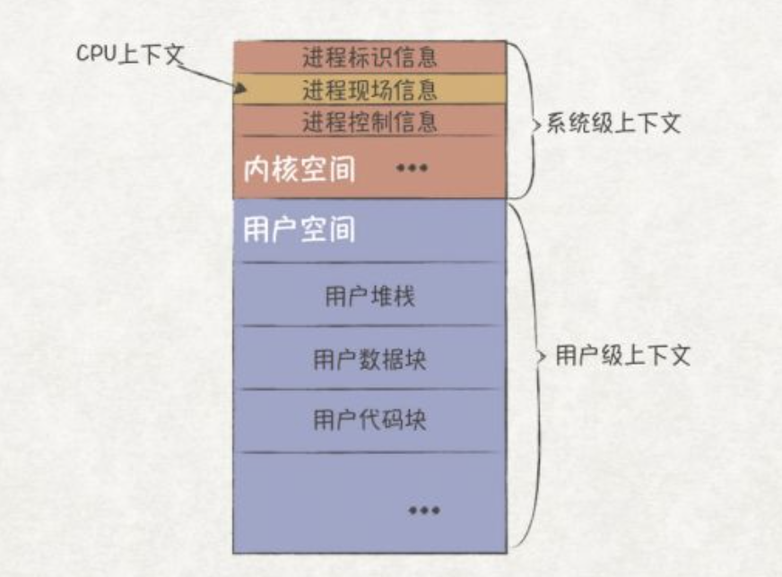


### 2. 什么时候执行上下文切换？

OS要想进行任务上下文切换，必须占用CPU来执行切换逻辑。然而，用户程序运行的过程中，CPU已经被用户程序所占用，也即OS在此刻并未处于运行状态，自然也无法执行上下文切换。针对该问题，有两种解决策略，协作式策略与抢占式策略。

**协作式策略**依赖用户程序主动让出CPU，比如执行系统调用（System Call）或者出现除零等异常。但该策略并不靠谱，如果用户程序没有主动让出CPU，甚至是恶意死循环，那么该程序将会一直占用CPU，唯一的恢复手段就是重启系统了。

**抢占式策略**则依赖硬件的定时中断机制（Timer Interrupt），OS会在初始化时向硬件注册中断处理回调（Interrupt Handler）。当硬件产生中断时，硬件会将CPU的处理权交给来OS，OS就可以在中断回调上实现CPU上下文的切换。

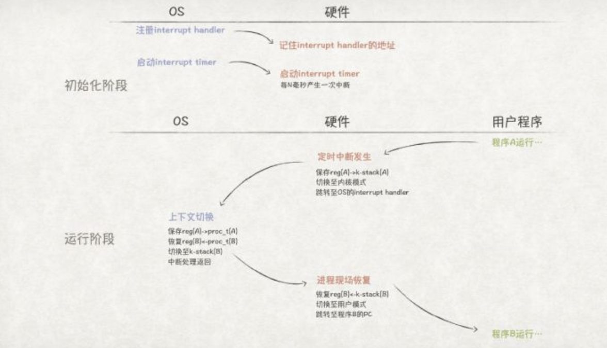

## 二、调度的衡量指标

对于一种CPU调度算法的好坏，一般都通过如下两个指标来进行衡量：

- **周转时间**（turnaround time），指从任务到达至任务完成之间的时间，即T_{turnaround}=T_{completiong}-T_{arrival}*Tturnaround*=*Tcompletiong*−*Tarrival*
- **响应时间**（response time），指从任务到达至任务首次被调度的时间，即T_{response}=T_{firstrun}-T_{arrival}*Tresponse*=*Tfirstrun*−*Tarrival*

两个指标从某种程度上是对立的，要求高的平均周转时间，必然会降低平均响应时间。具体追求哪种指标与任务类型有关，比如程序编译类的任务，要求周转时间要小，尽可能快的完成编译；用户交互类的任务，则要求响应时间要小，避免影响用户体验。


## 三、调度算法分析

### 1. 不存在I/O影响

各类任务运行的状况总是千变万化的，为了理解各类CPU调度算法原理，先对工作负载进行来如下几种假设进行讨论分析：

- **假设1**：所有任务都运行时长都相同。
- **假设2**：所有任务的开始时间都是相同的
- **假设3**：一旦任务开始，就会一直运行，直至任务完成。
- **假设4**：所有任务只使用CPU资源（比如不产生I/O操作）。
- **假设5**：预先知道所有任务的运行时长。


#### 1>. FIFO：先进先出

**先调度首先到达的任务直至结束，然后再调度下一个任务，以此类推**。如果有多个任务同时到达，则随机选一个。

在我们假设的工作负载状况下，FIFO效率良好。比如有A、B、C三个任务满足上述所有负载假设，每个任务运行时长为10s，在t=0时刻到达，那么任务调度情况是这样的：

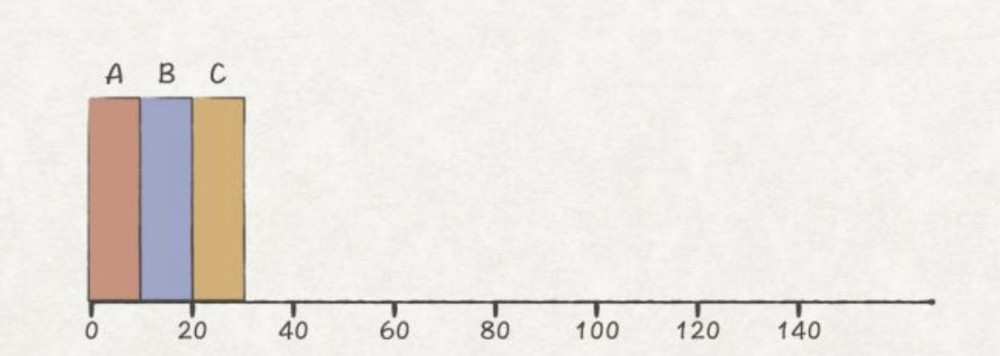

根据FIFO的调度原理，A、B、C分别在10、20、30时刻完成任务，平均周转时间为20s（ \frac {10+20+30}{3}310+20+30），效果很好。但是需要注意的是，如果其中一个进程打破了规则，例如*假设1*，那么调度情况会出现问题如下,导致平均周转时间恶化。

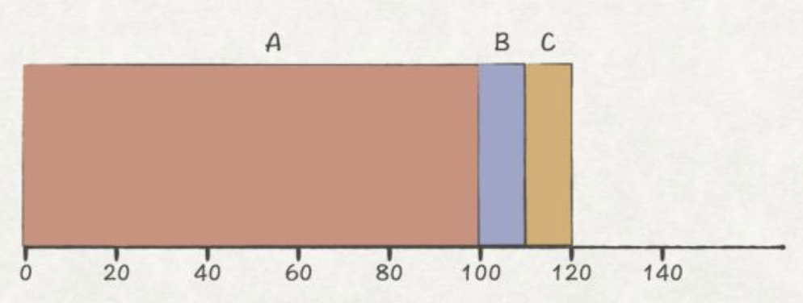

因此，**FIFO调度策略在任务运行时间差异较大的场景下，容易出现任务饿死的问题**！


#### 2>. SJF：最短进程优先

**从相同到达时间的多个任务中选取运行时长最短的一个任务进行调度，接着再调度第二短的任务，以此类推**。称之为最短路径优先，主要是为了解决上述FIFO策略问题。

针对上一节的工作负载，使用SJF进行调度的情况如下，周转时间变成了50s（ \frac {10+20+120}{3}310+20+120），相比FIFO的110s，有了2倍多的提升。

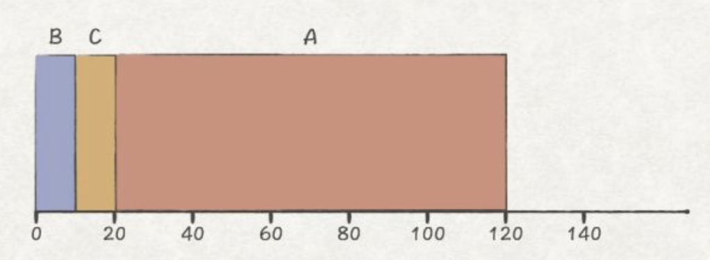

解决了时间差异较大的问题，但是如果当*假设2*被打破，如A在t=0时刻，B和C则在t=10时刻到达，那么调度情况会变成这样。因为任务B和C比A后到，它们不得不一直等待A运行结束后才有机会调度，即使A需要长时间运行。所以也出现了饿死的现象。

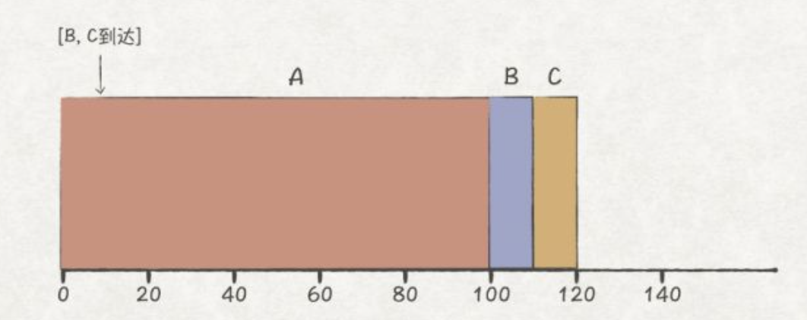


#### 3>. STCF：最短时间完成优先

在协作式调度的SJF算法的基础上，加上抢占式调度算法，就演变成了STCF算法。**当运行时长较短的任务到达时，中断当前的任务，优先调度运行时长较短的任务**。

这需要打破*假设3*的设定，假定*任务在运行过程中是允许被打断的*。使用STCF算法对该工作负载进行调度的情况如下，周转时间优化为50s（\frac {120+(20-10)+(30-10)}{3}3120+(20−10)+(30−10)），解决了上述问题。

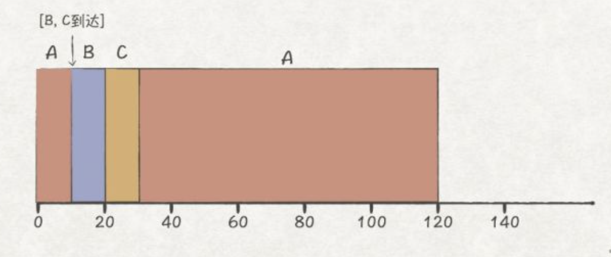


但这存在一个问题。当任务都同时到达且运行时长相同时，最后一个任务必须等待其他任务全部完成之后才开始调度。那么随着任务运行时长的增长，平均响应时长也随之增长，这对于交互类任务来说将会是灾难性的。


#### 4>. RR：基于时间片的轮询调度

为了优化响应时间，出现了基于时间片的调度。**RR（Round Robin，轮训）算法给每个任务分配一个时间片，当任务的时间片用完之后，调度器会中断当前任务，切换到下一个任务，以此类推**。*(需要注意的是，时间片的长度设置必须是中断定时器的整数倍)*

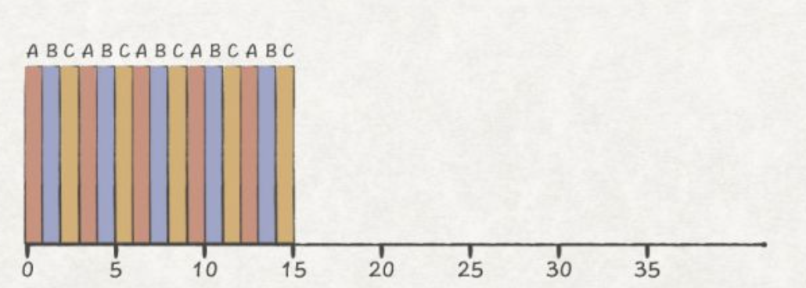

**把时间片设置得越小，平均响应时间也越小。但随着时间片的变小，任务切换的次数也随之上升，也就是上下文切换的消耗会变大。**CPU上下文切换的消耗，不只是保存和恢复寄存器所带来的消耗。程序在运行过程中，会逐渐在CPU各级缓存、TLB、分支预测器等硬件上建立属于自己的缓存数据。当任务被切换后，就意味着又得重来一遍缓存预热，这会带来巨大的消耗。

另外，RR调度算法的周转时间相比于FIFO、SJF和STCF也差了不少。


这也验证了之前所说的，**周转时间和响应时间在某种程度上是对立的**，如果想要优化周转时间，建议使用SJF和STCF；如果想要优化响应时间，则建议使用RR。


### 2. 考虑I/O影响

当触发I/O操作时，进程并不会占用CPU，而是阻塞等待I/O操作的完成。假设考虑任务A和B都在t=0时刻到达，运行时长都是50ms，但A每隔10ms执行一次阻塞10ms的I/O操作，而B没有I/O，如果使用STCF进行调度，调度的情况是这样的：

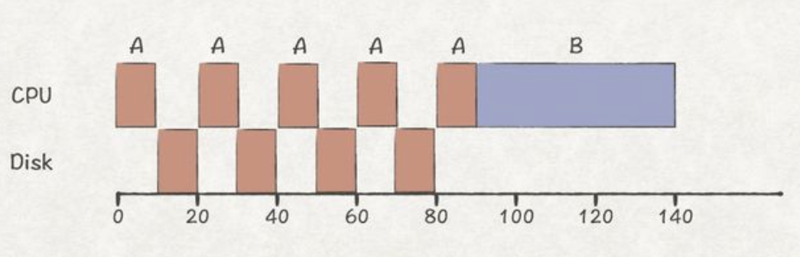

任务A和B的调度总时长达到了140ms，比实际A和B运行时长总和100ms要大。而且A阻塞在I/O操作期间，调度器并没有切换到B，导致了CPU的空转。

要解决该问题，只需使用RR的调度算法，给任务A和B分配10ms的时间片，这样当A阻塞在I/O操作时，就可以调度B，而B用完时间片后，恰好A也从I/O阻塞中返回，以此类推，调度总时长优化至100ms。

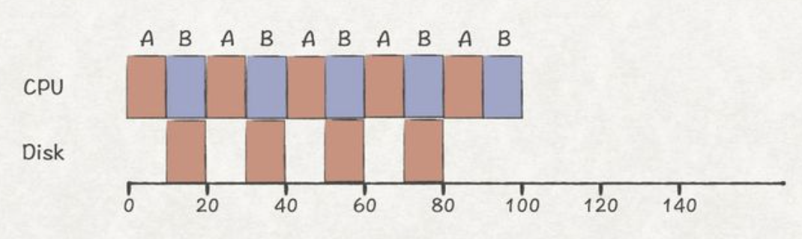

该调度方案是建立在**假设5**之上的，也即要求调度器预先知道A和B的运行时长、I/O操作时间长等信息，才能如此充分地利用CPU。但是，实际的情况远比这复杂，I/O阻塞时长不会每次都一样，调度器也无法准确知道A和B的运行信息。

#### 1>.  MLFQ：多级反馈队列

MLFQ（Multi-Level Feedback Queue，多级反馈队列）调度算法的目标如下：

- 优化周转时间。

- 降低交互类任务的响应时间，提升用户体验。

> **1.1划分任务的优先级**

MLFQ与前文介绍的几种调度算法最显著的特点就是**划分任务的优先级**，新增了优先级队列存放不同优先级的任务，并定下了如下两个规则：

- **规则1**：如果Priority(A) > Priority(B)，则调度A
- **规则2**：如果Priority(A) = Priority(B)，则按照RR算法调度A和B

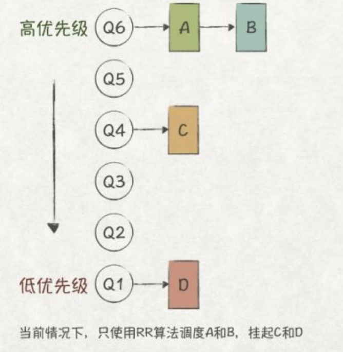


> **1.2优先级的变化**

MLFQ必须考虑改变任务的优先级，否则根据 **规则1** 和 **规则2** ，对于上图中的任务C，在A和B运行结束之前，C都不会获得运行的机会，导致C的响应时间很长。因此，可以定下了如下几个优先级变化规则：

- **规则3**：当一个新的任务到达时，将它放到最高优先级队列中
- **规则4a**：如果任务A运行了一个时间片都没有主动让出CPU（比如I/O操作），则优先级降低一级
- **规则4b**：如果任务A在时间片用完之前，有主动让出CPU，则优先级保持不变

规则3主要考虑到让新加入的任务都能得到调度机会，避免出现任务饿死的问题

规则4a和4b主要考虑到，交互类任务大都是short-running的，并且会频繁让出CPU，因此为了保证响应时间，需要保持现有的优先级；而CPU密集型任务，往往不会太关注响应时间，因此可以降低优先级。

1. 当一个long-running任务A到达时，调度情况

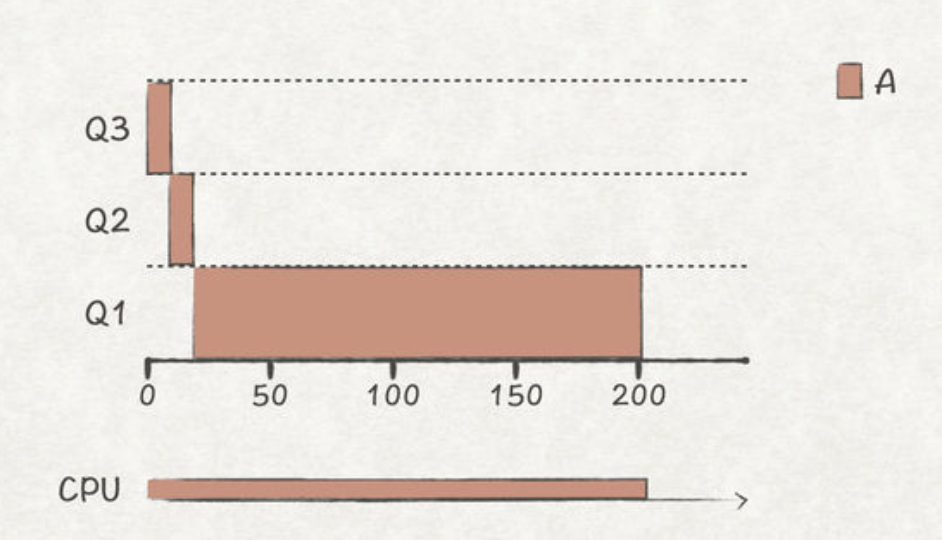

2. 如果在任务A运行到t=100时，short-time任务B到达，调度情况*(MLFQ具备了STCF的优点，即可以优先完成short-running任务的调度，缩短了周转时间。)*

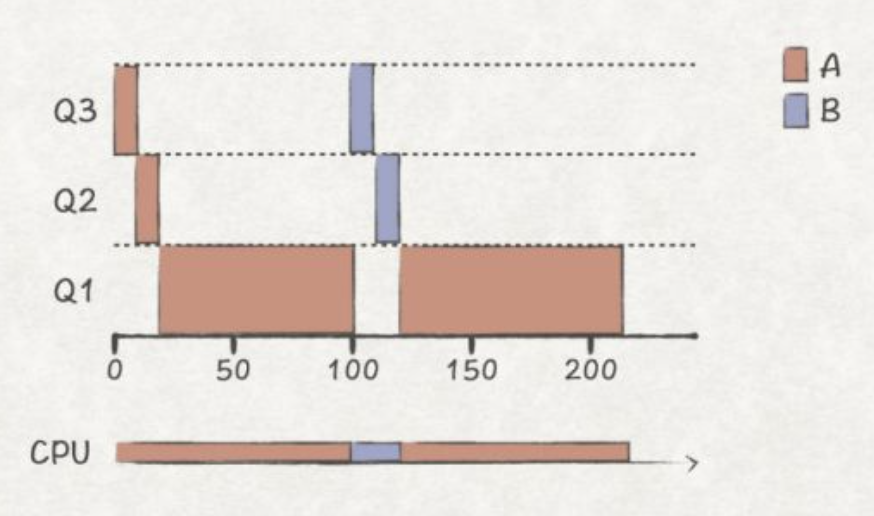

3. 如果任务A运行到t=100时，交互类任务C到达，那么调度情况

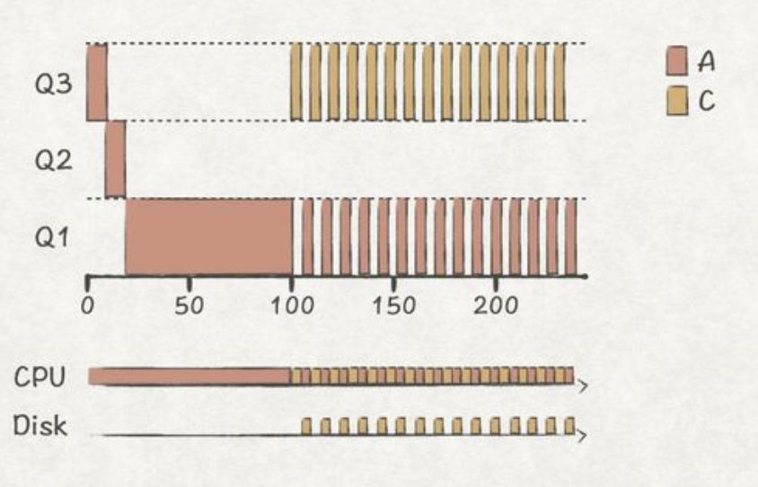

**MLFQ会在任务处于阻塞时按照优先级选择其他任务运行，避免CPU空转**。因此，在上图中，当任务C处于I/O阻塞状态时，任务A得到了运行时间片，当任务C从I/O阻塞上返回时，A再次挂起，以此类推。另外，因为任务C在时间片之内出现主动让出CPU的行为，C的优先级一直保持不变，这对于交互类任务而言，有效提升了用户体验。

> **1.3 CPU密集型任务饿死问题**

考虑任务A运行到t=100时，交互类任务C和D同时到达，调度情况如下，如果当前系统上存在很多交互类任务时，CPU密集型任务将会存在饿死的可能。为了解决该问题，可以设立了如下规则：

- **规则5**：系统运行S时长之后，将所有任务放到最高优先级队列上（**Priority Boost**）

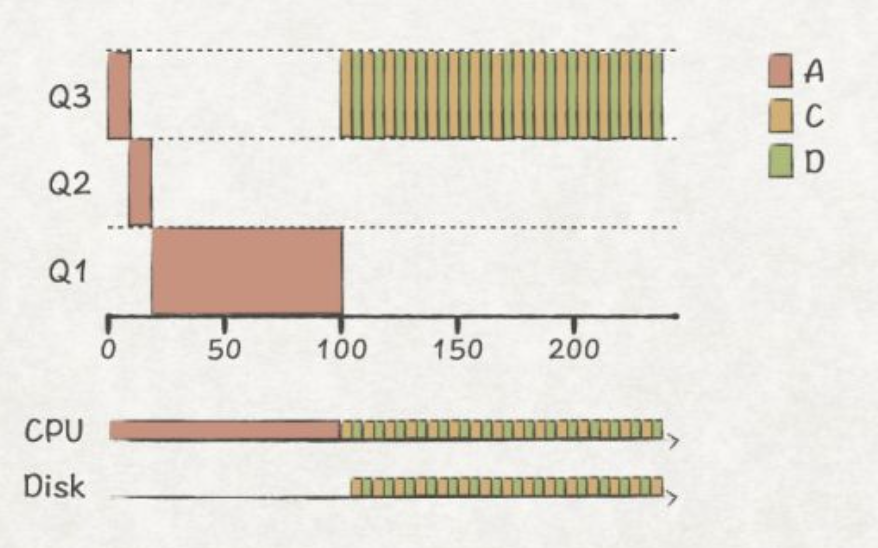


> **1.4 恶意任务问题**

考虑如下一个恶意任务E情况，为了长时间占用CPU，任务E在时间片还剩1%时故意执行I/O操作，并很快返回。根据**规则4b**，E将会维持在原来的最高优先级队列上，因此下次调度时仍然获得调度优先权

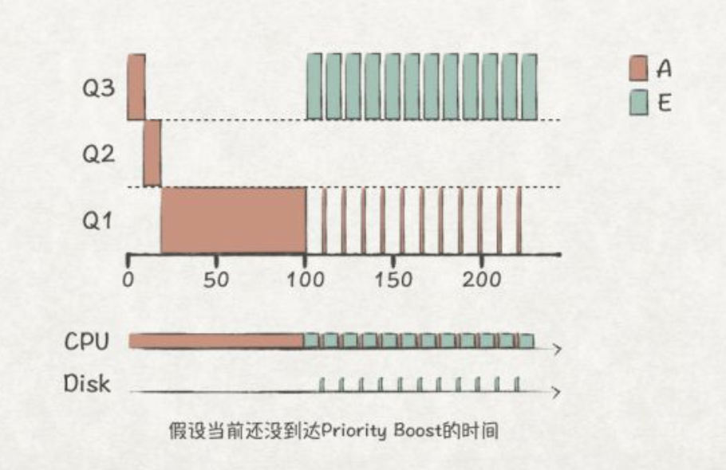

为了解决该问题，我们需要将**规则4**调整为如下规则：

- **规则4**：给每个优先级分配一个时间片，当任务用完该优先级的时间片后，优先级降一级

应用新的**规则4**后，相同的工作负载，调度情况变成了如下所述，不再出现恶意任务E占用大量CPU的问题。

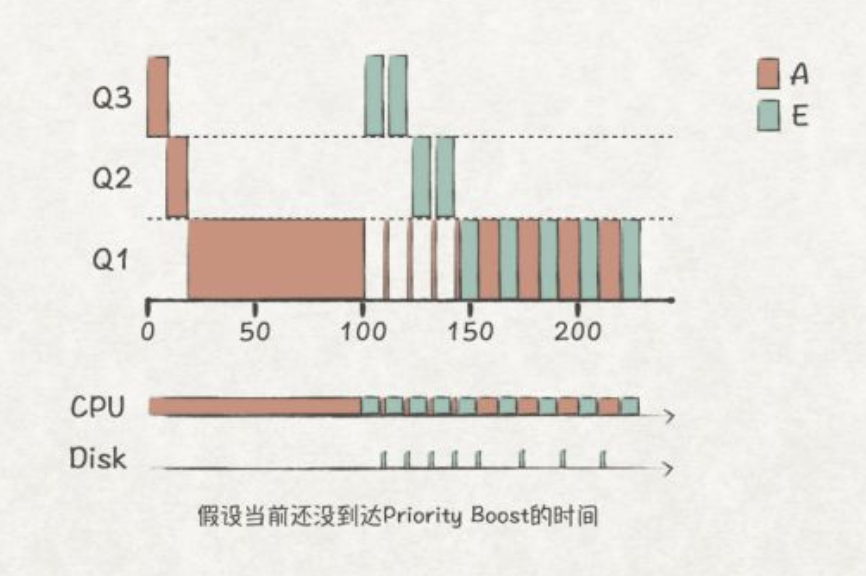


> **1.5 总结**

总结下MLFQ最关键的5项规则：

- **规则1**：如果Priority(A) > Priority(B)，则调度A
- **规则2**：如果Priority(A) = Priority(B)，则按照RR算法调度A和B
- **规则3**：当一个新的任务到达时，将它放到最高优先级队列中
- **规则4**：给每个优先级分配一个时间片，当任务用完该优先级的时间片后，优先级降一级
- **规则5**：系统运行S时长之后，将所有任务放到最高优先级队列上（**Priority Boost**）


> **1.6 思考**

**1、在不预先清楚任务的运行信息（包括运行时长、I/O操作等）的前提下，MLFQ如何权衡周转时间和响应时间**？
```
在预先不清楚任务到底是long-running或short-running的情况下，MLFQ会先假设任务属于shrot-running任务，如果假设正确，任务就会很快完成，周转时间和响应时间都得到优化；即使假设错误，任务的优先级也能逐渐降低，把更多的调度机会让给其他short-running任务。
```
**2、MLFQ如何从历史调度中学习，以便未来做出更好的决策**？
```
MLFQ主要根据任务是否有主动让出CPU的行为来判断其是否是交互类任务，如果是，则维持在当前的优先级，保证该任务的调度优先权，提升交互类任务的响应性。

当然，MLFQ并非完美的调度算法，它也存在着各种问题，其中最让人困扰的就是MLFQ各项参数的设定，比如优先级队列的数量，时间片的长度、Priority Boost的间隔等。这些参数并没有完美的参考值，只能根据不同的工作负载来进行设置。

比如，我们可以将低优先级队列上任务的时间片设置长一些，因为低优先级的任务往往是CPU密集型任务，它们不太关心响应时间，较长的时间片长能够减少上下文切换带来的消耗。
```


#### 2>. CFS：Linux的完全公平调度

**CFS并非以优化周转时间和响应时间为目标，而是希望将CPU公平地均分给每个任务**。CFS也提供了给进程设置优先级的功能，让用户/管理员决定哪些进程需要获得更多的调度时间。


> **2.1 基本原理**

大部分调度算法都是基于固定时间片来进行调度，而CFS另辟蹊径，采用基于计数的调度方法，该技术被称为**virtual runtime**。

CFS给每个任务都维护一个vruntime值，每当任务被调度之后，就累加它的vruntime。比如，当任务A运行了5ms的时间片之后，则更新为vruntime += 5ms。**CFS在下次调度时，选择vruntime值最小的任务来调度**，比如：

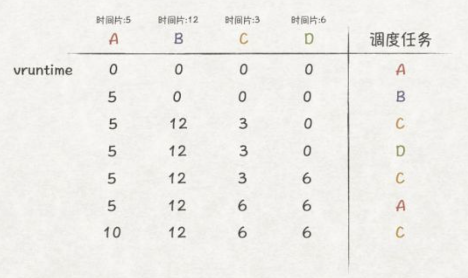

切换得频繁些，任务的调度会更加的公平，但是上下文切换带来的消耗也越大。因此，**CFS给用户提供了个可配参数sched_latency，让用户来决定切换的时机**。CFS将每个任务分到的时间片设置为 time_slice = sched_latency / n（n为当前的任务数） ，以确保在sched_latency周期内，各任务能够均分CPU，保证公平性。

比如将sched_latency设置为48ms，当前有4个任务A、B、C和D，那么每个任务分到的时间片为12ms；后面C和D结束之后，A和B分到的时间片也更新为24ms：

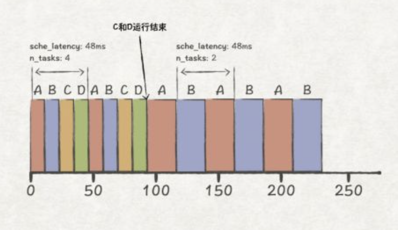

从上述原理上看，在sched_latency 不变的情况下，随着系统任务数的增加，每个任务分到的时间片也随之减少，任务切换所带来的消耗也会增大。为了避免过多的任务切换消耗，CFS提供了可配参数min_granularity来设置任务的最小时间片。比如sched_latency设置为48ms，min_granularity设置为 6ms，那么即使当前任务数有12，每个任务数分到的时间片也是6ms，而不是4ms。


> **2.2 给任务分配权重**

有时候，我们希望给系统中某个重要的业务进程多分配些时间片，而其他不重要的进程则少分配些时间片。**可以给任务分配权重，让权重高的任务更多的CPU**。

加上权重机制后，任务时间片的计算方式变成了这样：


比如，sched_latency还是设置为48ms，现有A和B两个任务，A的权重设置为1024，B的权重设置为3072，按照上述的公式，A的时间片是12ms，B的时间片是36ms。

从上一节可知，CFS每次选取vruntime值最小的任务来调度，而每次调度完成后，vruntime的计算规则为vruntime += runtime，因此仅仅改变时间片的计算规则不会生效，还需将vruntime的计算规则调整为：


还是前面的例子，假设A和B都没有I/O操作，更新vruntime计算规则后，调度情况如下，任务B比任务A能够分得更多的CPU了。

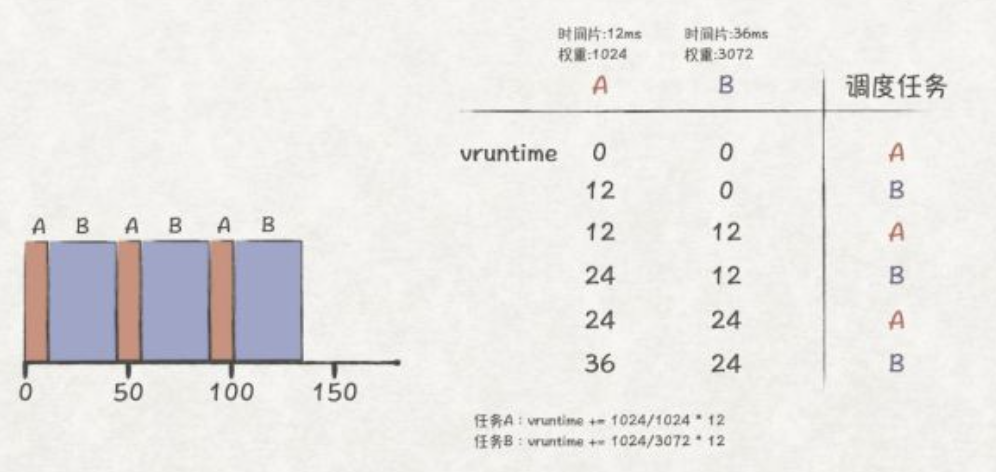

> **2.3 使用红黑树提升vruntime查找效率**

CFS每次切换任务时，都会选取vruntime值最小的任务来调度，因此需要它有个数据结构来存储各个任务及其vruntime信息。

最直观的当然就是选取一个有序列表来存储这些信息，列表按照vruntime排序。这样在切换任务时，CFS只需获取列表头的任务即可，时间复杂度为O(1)。比如当前有10个任务，vruntime保存为有序链表，但是每次插入或删除任务时，时间复杂度会是O(N)，而且耗时随着任务数的增多而线性增长！

为了兼顾查询、插入、删除的效率，CFS使用红黑树来保存任务和vruntime信息，这样，查询、插入、删除操作的复杂度变成了log(N)，并不会随着任务数的增多而线性增长，极大提升了效率。

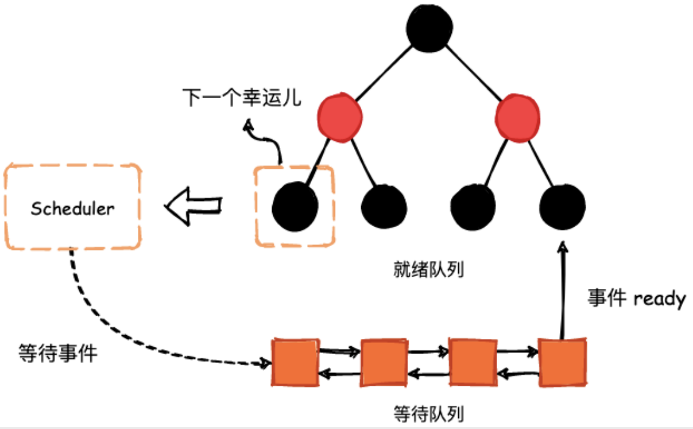

另外，为了提升存储效率，CFS在红黑树中只保存了处于Running状态的任务的信息。


> **2.4 应对I/O与休眠**

每次都选取vruntime值最小的任务来调度这种策略，也会存在任务饿死的问题。考虑有A和B两个任务，时间片为1s，起初A和B均分CPU轮流运行，在某次调度后，B进入了休眠，假设休眠了10s。等B醒来后，vruntime_{B}*vruntimeB*就会比vruntime_{A}*vruntimeA*小10s，在接下来的10s中，B将会一直被调度，从而任务A出现了饿死现象。

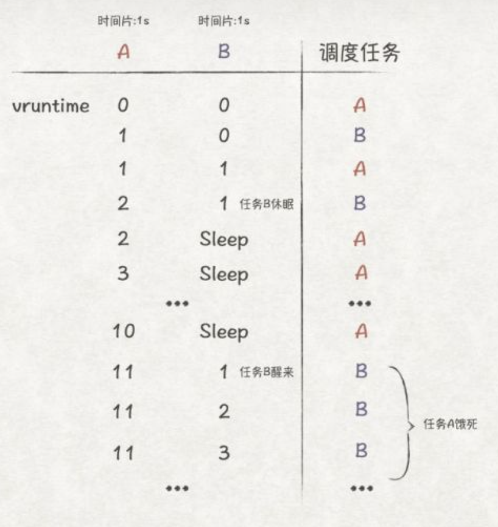

为了解决该问题，CFS规定当任务从休眠或I/O中返回时，该任务的vruntime会被设置为当前红黑树中的最小vruntime值。上述例子，B从休眠中醒来后，vruntime_{B}*vruntimeB*会被设置为11，因此也就不会饿死任务A了。

这种做法其实也存在瑕疵，如果任务的休眠时间很短，那么它醒来后依旧是优先调度，这对于其他任务来说是不公平的。
