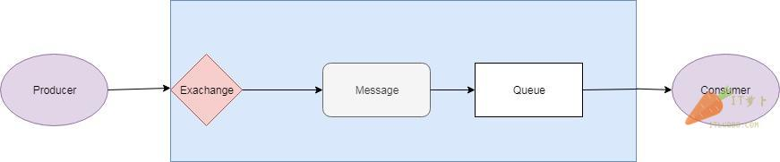
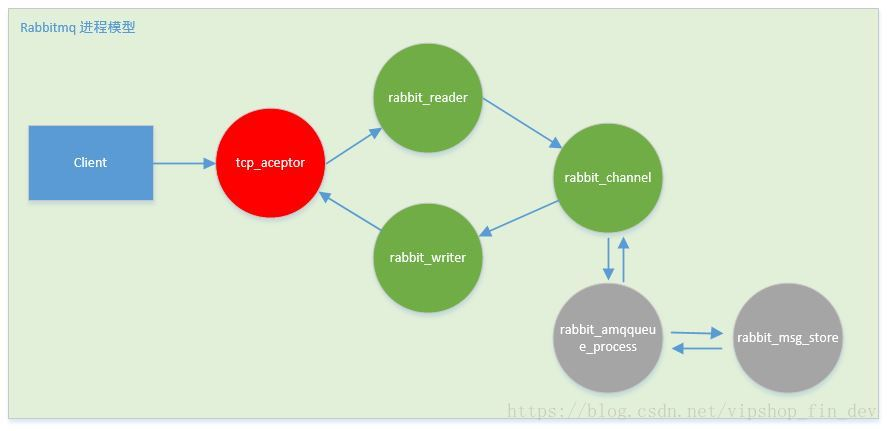
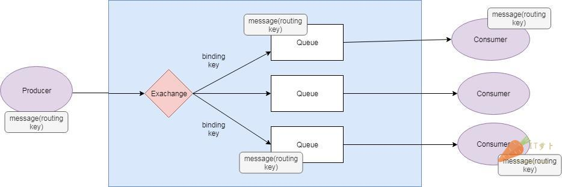
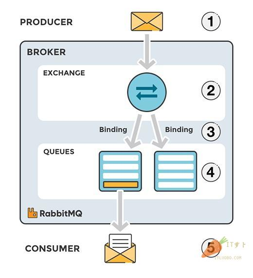
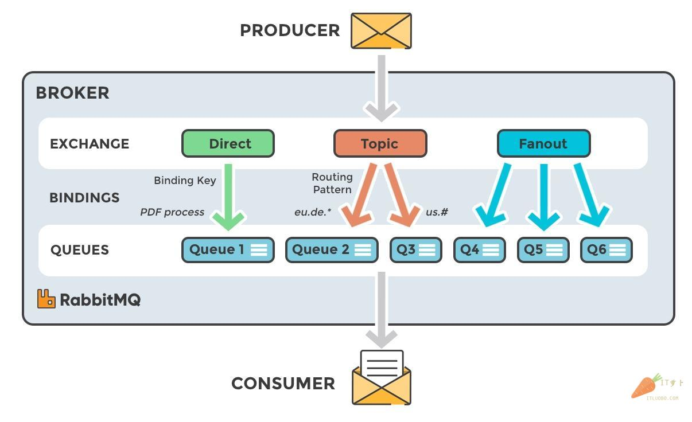
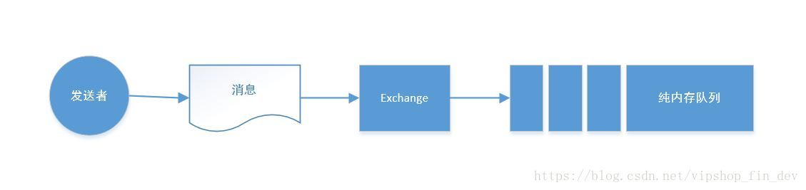
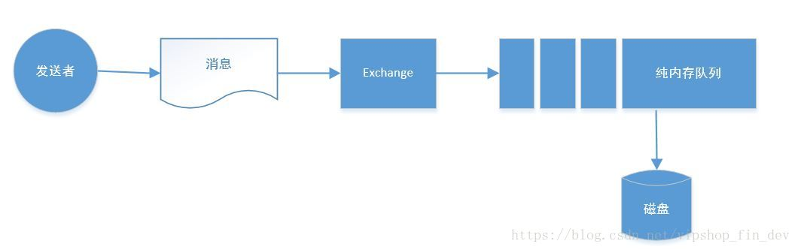
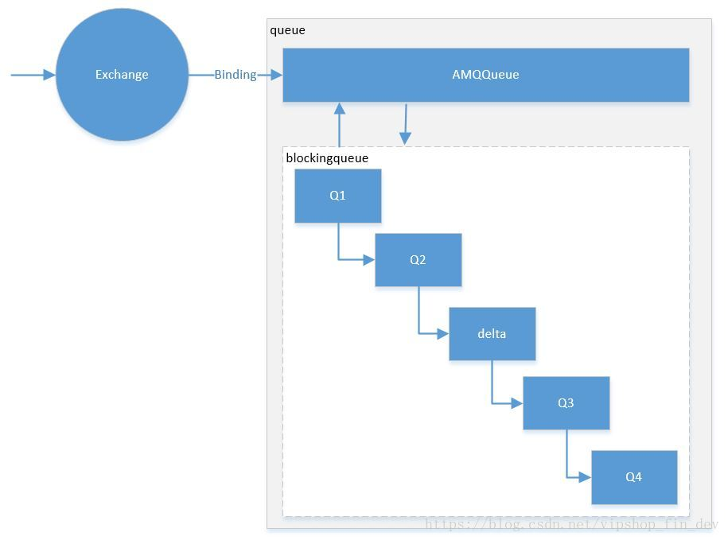

RabbitMQ是一个开源的消息代理中间件。它接收生产者发布的消息并发送给消费者。它扮演中间商的角色，可以用来降低web服务器因发送消息带来的负载以及延时。

### RabbitMQ如何工作的？

我们来简单看看RabbitMQ是如何工作的。

首先来看看RabbitMQ里的几个重要概念：

- 生产者（Producer）：发送消息的应用。
- 消费者（Consumer）：接收消息的应用。
- 队列（Queue）：存储消息的缓存。
- 消息（Message）：又生产者通过RabbitMQ发送给消费者的信息。
- 连接（Connection）：连接RabbitMQ和应用服务器的TCP连接。
- 通道（Channel）：连接里的一个虚拟通道。当你通过消息队列发送或者接收消息时，这个操作都是通过通道进行的。
- 交换机（Exchange）：从生产者那里接收消息，并根据交换类型分发到对应的消息列队里。要实现消息的接收，一个队列必须绑定一个交换机。
- 绑定（Binding）：绑定是队列和交换机的一个链接。
- 路由键（Routing Key）：路由键是供交换机查看并根据键的值来决定如何分发消息到列队的一个键。路由键可以说是消息的目的地址。
- AMQP：AMQP（高级消息队列协议Advanced Message Queuing Protocol）是RabbitMQ使用的消息协议。
- 用户（Users）：在RabbitMQ里，是可以通过指定的用户名和密码来进行连接的。每个用户可以分配不同的权限，例如读权限，写权限以及在实例里进行配置的权限。

**生产者（Producer）**发送/发布消息到代理->**消费者（Consumer）**从代理那里接收消息。哪怕生产者和消费者运行在不同的机器上，**RabbitMQ**也能扮演代理中间件的角色。

当生产者发送消息时，它并不是直接把消息发送到队列里的，而是使用交换机（Exchange）来发送。下面的设计图简单展示了这三个主要的组件之间是如何连接起来的。

交换机代理（exchange agent）负责把消息分发到不同的队列里。这样的话，消息就能够从生产者发送到交换机，然后被分发到消息队列里。这就是常见的“发布”方法。



然后，消息会被消费者从队列里读取并消费，这就是“消费”。

### rabbitmq的进程模型



看到这个图，相信大家应该很熟悉，没错就是事件驱动模型（或者说反应堆模型），这是一种高性能的非阻塞io线程模型，不过在Erlang中称为进程模型。

tcp_acceptor进程接收客户端连接，创建rabbit_reader、rabbit_writer、rabbit_channel进程。
rabbit_reader接收客户端连接，解析AMQP帧；rabbit_writer向客户端返回数据；
rabbit_channel解析AMQP方法，对消息进行路由，然后发给相应队列进程。
rabbit_amqqueue_process是队列进程，在RabbitMQ启动（恢复durable类型队列）或创建队列时创建。
rabbit_msg_store是负责消息持久化的进程。

在整个系统中，存在一个tcp_accepter进程，一个rabbit_msg_store进程，有多少个队列就有多少个rabbit_amqqueue_process进程，每个客户端连接对应一个rabbit_reader和rabbit_writer进程。

### RabbitMQ里的消息流程

- *生产者（producer）*把消息发送给交换机。当你创建交换机的时候，你需要指定类型。交换机的类型接下来会讲到。
- *交换机（exchange）*接收消息并且负责对消息进行路由。根据交换机的类型，消息的多个属性会被使用，例如路由键。
- *绑定（binding）*需要从交换机到队列的这种方式来进行创建。在这个例子里，我们可以看到交换机有到两个不同队列的绑定。交换机根据消息的属性来把消息分发到不同的队列上。
- *消息（message）*消息会一直留在队列里直到被消费。
- *消费者（consumer）*处理消息。

### 往多个队列里发送消息

对一个复杂的应用而言，往往会有多个消息队列，所以消息也会被发往多个队列。



给带有多个队列的交换机发送的消息是通过绑定和路由键来进行分发的。绑定是你设置的用来连接一个队列和交换机的连接。路由键是消息的一个属性。交换机会根据路由键来决定消息分发到那个队列里（取决于交换机的类型）。

### 队列（Queue）

消息队列，提供了FIFO的处理机制，具有缓存消息的能力。rabbitmq中，队列消息可以设置为持久化，临时或者自动删除。

1. 设置为持久化的队列，queue中的消息会在server本地硬盘存储一份，防止系统crash，数据丢失
2. 设置为临时队列，queue中的数据在系统重启之后就会丢失
3. 设置为自动删除的队列，当不存在用户连接到server，队列中的数据会被自动删除

### 交换机（Exchange）

消息并不是直接发布到队里里的，而是被生产者发送到一个交换机上。交换机负责把消息发布到不同的队列里。交换机从生产者应用上接收消息，然后根据绑定和路由键将消息发送到对应的队列里。绑定是交换机和队列之间的一个关系连接。



**交换机类型**

1. **直接（Direct）**：直接交换机通过消息上的路由键直接对消息进行分发。消息发送完全匹配ROUTING_KEY的Queue
2. **扇出（Fanout）**：广播式交换器，不管消息的ROUTING_KEY设置为什么，Exchange都会将消息转发给所有绑定的Queue。
3. **主题（Topic）**：这个交换机会将路由键和绑定上的模式进行通配符匹配。比如，ROUTING_KEY为user.stock的Message会转发给绑定匹配模式为 * .stock,user.stock， * . * 和#.user.stock.#的队列。（ * 表是匹配一个任意词组，#表示匹配0个或多个词组）
4. **消息头（Headers）**：消息头交换机使用消息头的属性进行消息路由。


### 绑定（Binding）

所谓绑定就是将一个特定的 Exchange 和一个特定的 Queue 绑定起来。Exchange 和Queue的绑定可以是多对多的关系。


### AMQP协议

AMQP帧由五个不同的组件组成

```
帧类型
信道编号
以字节为单位的帧大小
帧有效载荷payload
结束字节标志（ASCII值206）
```

AMQP规范定义了五种类型的帧：协议头帧、方法帧、内容帧、消息体帧及心跳帧。每种帧类型都有明确的目的，有些帧的使用频率比其他的高很多：

```
协议头帧用于连接到rabbitmq，进使用一次。
方法帧携带发送给rabbitmq或者从rabbitmq接收到的rpc请求或者响应
内容头包含一条消息的大小和属性。
消息体帧包含消息的内容
心跳帧在客户端与rabbitmq直接进行传递，作为一种校验机制确保连接的两端都可用并且正常工作。
```


### 使用delivery-mode平衡速度和安全

delivery-mode有两个值：1表示非持久化，2表示持久化消息

1.发送消息到纯内存队列中，delivery-mode = 1

特点：非持久化的消息在服务宕机的时候会丢失数据，但是由于不需要磁盘io，尽可能地降低消息投递的延迟性，性能较高。

2.发布消息到支持磁盘存储的队列，delivery-mode = 2

特点：持久化的消息安全性较高，尽管服务宕机，数据也不会丢失，但是在投递消息的过程中需要发生磁盘io，性能相对纯内存投递的方式低，但是尽管是产生了磁盘io，由于日志的记录方式是直接追加到消息日志文件的末尾，属于顺序io，没有随机io，所以性能还是可以接受的。

1. 大概原理：
   所有队列中的消息都以append的方式写到一个文件中，当这个文件的大小超过指定的限制大小后，关闭这个文件再创建一个新的文件供消息的写入。文件名（*.rdq）从0开始然后依次累加。当某个消息被删除时，并不立即从文件中删除相关信息，而是做一些记录，当垃圾数据达到一定比例时，启动垃圾回收处理，将逻辑相邻的文件中的数据合并到一个文件中。
2. 消息的读写及删除：
   rabbitmq在启动时会创建msg_store_persistent,msg_store_transient两个进程，一个用于持久消息的存储，一个用于内存不够时，将存储在内存中的非持久化数据转存到磁盘中。所有队列的消息的写入和删除最终都由这两个进程负责处理，而消息的读取则可能是队列本身直接打开文件进行读取，也可能是发送请求由msg_store_persisteng/msg_store_transient进程进行处理。

在进行消息的存储时，rabbitmq会在ets表中记录消息在文件中的映射，以及文件的相关信息。消息读取时，根据消息ID找到该消息所存储的文件，在文件中的偏移量，然后打开文件进行读取。消息的删除只是从ets表删除指定消息的相关信息，同时更新消息对应存储的文件的相关信息（更新文件有效数据大小）。


### RabbitMQ流量控制

RabbitMQ可以对内存和磁盘使用量设置阈值，当达到阈值后，生产者将被阻塞（block），直到对应项恢复正常。除了这两个阈值，RabbitMQ在正常情况下还用流控（Flow Control）机制来确保稳定性。
Erlang进程之间并不共享内存（binaries类型除外），而是通过消息传递来通信，每个进程都有自己的进程邮箱。Erlang默认没有对进程邮箱大小设限制，所以当有大量消息持续发往某个进程时，会导致该进程邮箱过大，最终内存溢出并崩溃。
在RabbitMQ中，如果生产者持续高速发送，而消费者消费速度较低时，如果没有流控，很快就会使内部进程邮箱大小达到内存阈值，阻塞生产者（得益于block机制，并不会崩溃）。然后RabbitMQ会进行page操作，将内存中的数据持久化到磁盘中。
为了解决该问题，RabbitMQ使用了一种基于信用证的流控机制。消息处理进程有一个信用组{InitialCredit，MoreCreditAfter}，默认值为{200, 50}。消息发送者进程A向接收者进程B发消息，每发一条消息，Credit数量减1，直到为0，A被block住；对于接收者B，每接收MoreCreditAfter条消息，会向A发送一条消息，给予A MoreCreditAfter个Credit，当A的Credit>0时，A可以继续向B发送消息。


### RabbitMQ 多层消息队列

RabbitMQ完全实现了AMQP协议，类似于一个邮箱服务。Exchange负责根据ExchangeType和RoutingKey将消息投递到对应的消息队列中，消息队列负责在消费者获取消息前暂存消息。在RabbitMQ中，MessageQueue主要由两部分组成，一个为AMQQueue，主要负责实现AMQP协议的逻辑功能。另外一个是用来存储消息的BackingQueue。
为了高效处理入队和出队的消息、避免不必要的磁盘IO，BackingQueue进程为消息设计了4种状态和5个内部队列。
(1) 4种状态包括：

```
alpha，消息的内容和索引都在内存中；
beta，消息的内容在磁盘，索引在内存；
gamma，消息的内容在磁盘，索引在磁盘和内存中都有；
delta，消息的内容和索引都在磁盘。
```

对于持久化消息，RabbitMQ先将消息的内容和索引保存在磁盘中，然后才处于上面的某种状态（即只可能处于alpha、gamma、delta三种状态之一）。
(2) 5个内部队列

包括：q1、q2、delta、q3、q4。q1和q4队列中只有alpha状态的消息；q2和q3包含beta和gamma状态的消息；delta队列是消息按序存盘后的一种逻辑队列，只有delta状态的消息。所以delta队列并不在内存中，其他4个队列则是由erlang queue模块实现。

消息从q1入队，q4出队，在内部队列中传递的过程一般是经q1顺序到q4。实际执行并非必然如此：开始时所有队列都为空，消息直接进入q4（没有消息堆积时）；内存紧张时将q4队尾部分消息转入q3，进而再由q3转入delta，此时新来的消息将存入q1（有消息堆积时）。

当内存紧张时触发paging，paging将大量alpha状态的消息转换为beta和gamma；如果内存依然紧张，继续将beta和gamma状态转换为delta状态。Paging是一个持续过程，涉及到大量消息的多种状态转换，所以Paging的开销较大，严重影响系统性能。


### 高可用队列（HA）

在生产环境下，一般都不会允许rabbitmq这种消息中间件单点，以免单点故障导致服务不可用，那么rabbitmq同样可以集群部署来保证服务的可用性，在rabbitmq集群中，我们可以定义HA队列，可以在web管理平台设置，也可以通过AMQP接口设置，当我们定义某个HA队列的时候，会在集群的各个节点上都建立该队列，发布消息的时候，直接发送至master服务，当master服务受到消息后，把消息同步至各个从节点，假如开启事务的情况下，是需要在消息被同步到各个节点之后才算完成事务，所以会带来一定的性能损耗，所以还是回到之前说的，性能和安全直接，需要根据实际业务的需要找到平衡点。

当master服务宕机之后，其中一个slaver节点会升级为master，消息不会丢失（因为已经完成了事务的消息都会在各个节点有备份）
ha-队列可以跨越集群的每台服务，或者仅使用其中一批独立节点。如果是全部节点都为副本的时候，将x-ha-policy参数设置为all，否则设置为nodes，然后在设置另一个参数：x-ha-nodes，该参数指定ha队列所在的节点列表。