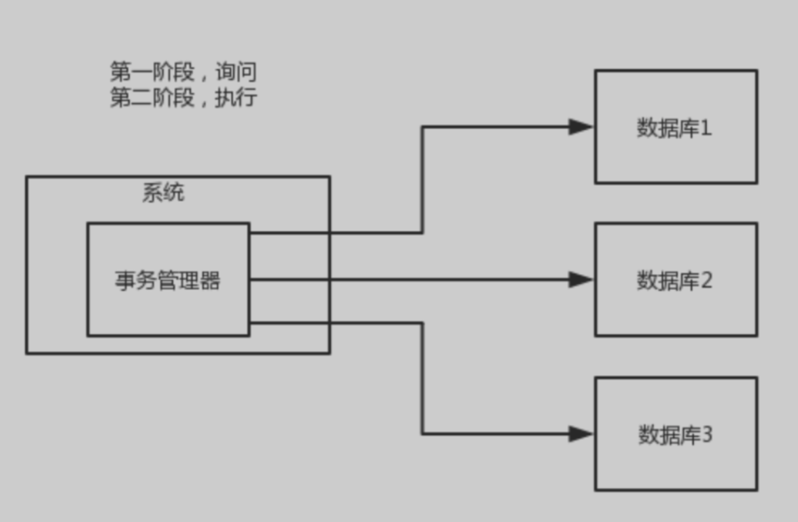
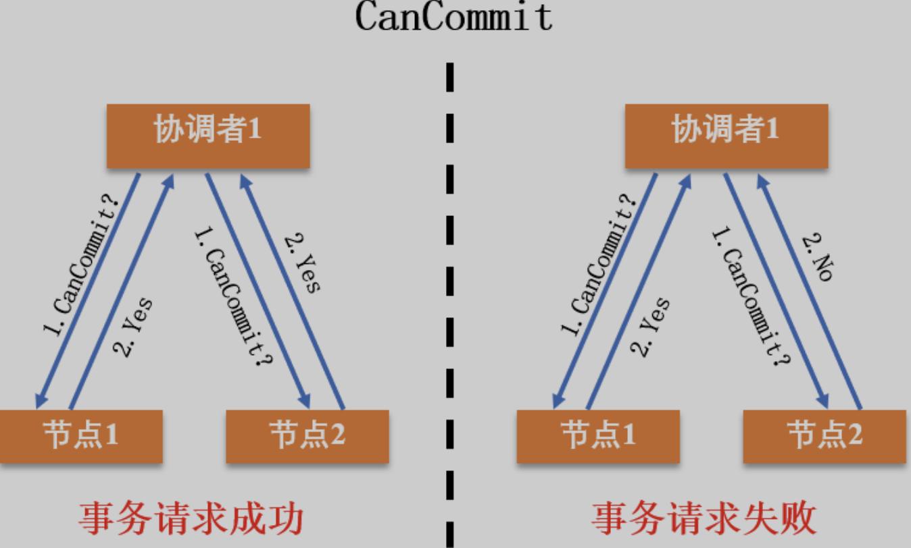
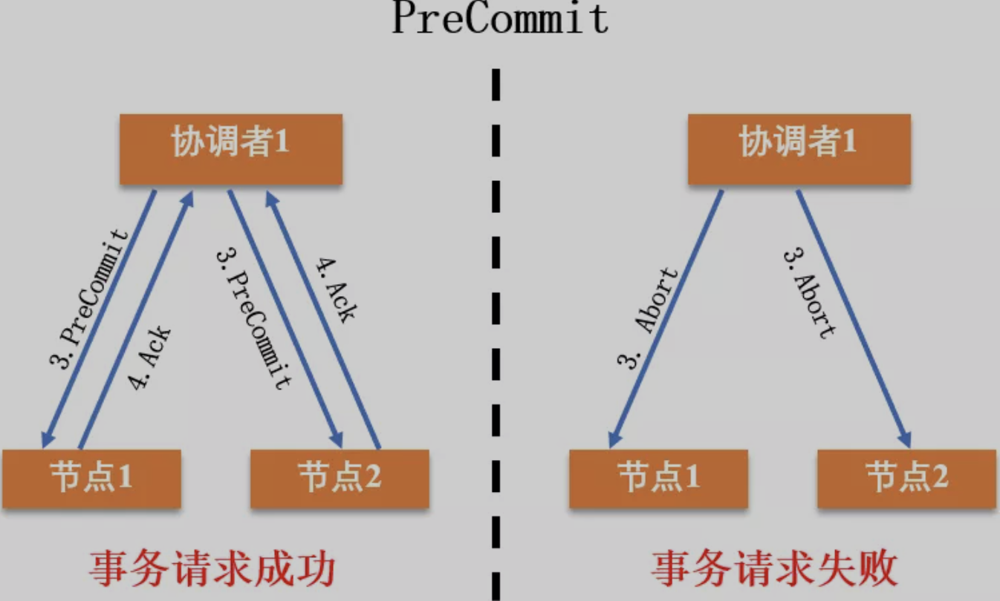
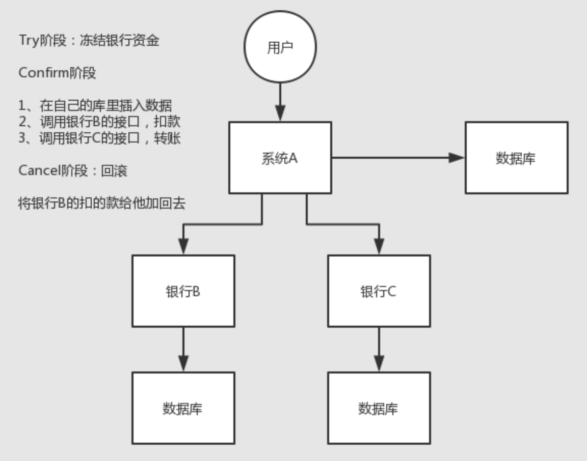
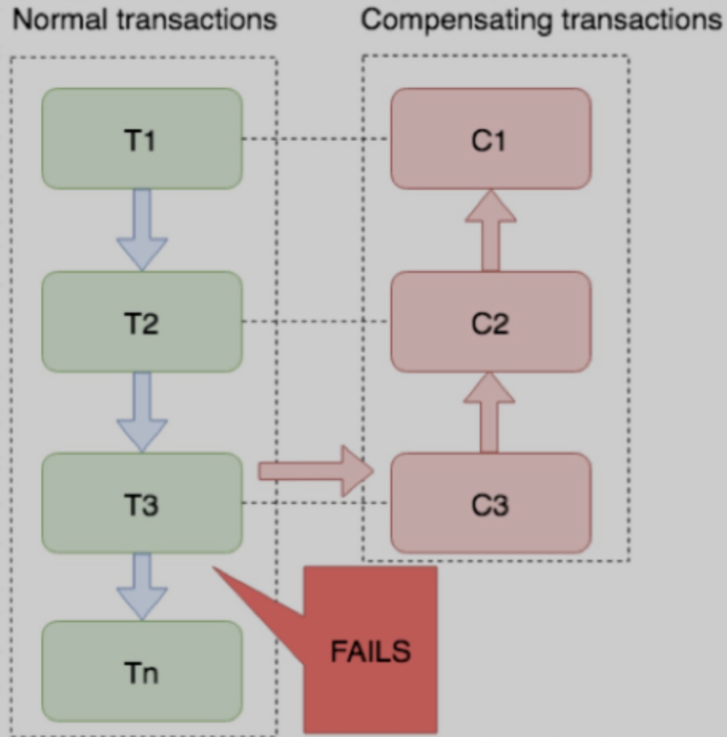
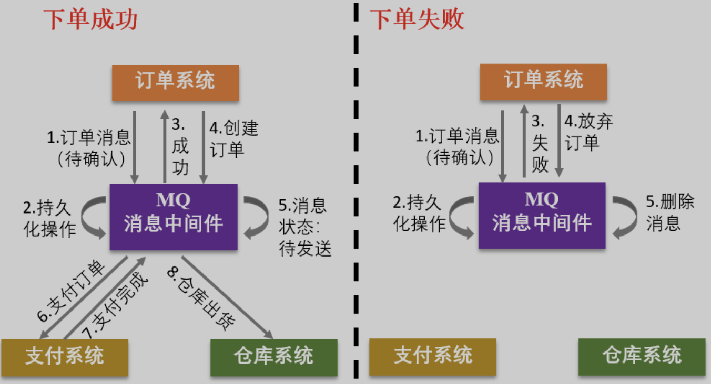

## 一、XA/二阶段提交

> 基于XA协议的二阶段提交

所谓的 XA 方案，即：两阶段提交，有一个**事务管理器**的概念，负责协调多个数据库（资源管理器）的事务，事务管理器先问各个数据库准备好了吗？如果每个数据库都回 ok，那就正式提交事务，在各个数据库上执行操作；如果任何其中一个数据库回答不 ok，那么就回滚事务。

这种分布式事务方案，比较适合单块应用里，跨多个库的分布式事务，而且因为严重依赖于数据库层面来搞定复杂的事务，效率很低，不适合高并发的场景。



### 1.JTA

JTA只是Java实现XA事务的一个规范，全称`Java``事务规范JTA（Java Transaction API)` ，我们日常使用的`@Transactional。`都可以叫JTA事务管理。实际上，JTA是基于XA架构上建模的，

**对于Spring来说，可以使用如JBoss之类的应用服务器提供的JTA事务管理器；可以以使用Atomikos、Bitronix等库提供的JTA事务管理器。Spring都有封装，开箱即用。**


#### 链式

对于Spring，还有个链式事务管理，就是声明一个ChainedTransactionManager 将所有的数据源事务按顺序放到该对象中，则事务会按相反的顺序来执行事务。事务依次提交后提交的事务若出错不能回滚。

```
1.start message transaction
2.receive message
3.start database transaction
4.update database
5.commit database transaction
6.commit message transaction   ##当这一步出现错误时，上面的因为已经commit，所以不会rollback
```

和JTA比起来，更轻量，但只能单机用。

#### 参考

这个方案，很少用，一般来说**某个系统内部如果出现跨多个库**的这么一个操作，是**不合规**的。我可以给大家介绍一下， 现在微服务，一个大的系统分成几十个甚至几百个服务。一般来说，我们的规定和规范，是要求**每个服务只能操作自己对应的一个数据库**。
如果你要操作别的服务对应的库，不允许直连别的服务的库，违反微服务架构的规范，你随便交叉胡乱访问，几百个服务的话，全体乱套，这样的一套服务是没法管理的，没法治理的，可能会出现数据被别人改错，自己的库被别人写挂等情况。
如果你要操作别人的服务的库，你必须是通过**调用别的服务的接口**来实现，绝对不允许交叉访问别人的数据库。

### 2.问题

- **同步阻塞问题**：

  二阶段提交算法在执行过程中，所有参与节点都是事务阻塞型的。

  也就是说，当本地资源管理器占有临界资源时，其他资源管理器如果要访问同一临界资源，会处于阻塞状态。

- **单点故障问题：**基于 XA 的二阶段提交算法类似于集中式算法，一旦事务管理器发生故障，整个系统都处于停滞状态。

  尤其是在提交阶段，一旦事务管理器发生故障，资源管理器会由于等待管理器的消息，而一直锁定事务资源，导致整个系统被阻塞。

- **数据不一致问题：**在提交阶段，当协调者向参与者发送 DoCommit 请求之后，如果发生了局部网络异常，或者在发送提交请求的过程中协调者发生了故障，就会导致只有一部分参与者接收到了提交请求并执行提交操作，但其他未接到提交请求的那部分参与者则无法执行事务提交。

  于是整个分布式系统便出现了数据不一致的问题。


## 二、3PC

三阶段提交协议（Three-phase commit protocol，3PC），是对二阶段提交（2PC）的改进。为了解决两阶段提交的同步阻塞和数据不一致问题，**三阶段提交引入了超时机制和准备阶段**。


- 同时在协调者和参与者中引入超时机制。

  如果协调者或参与者在规定的时间内没有接收到来自其他节点的响应，就会根据当前的状态选择提交或者终止整个事务。

- 在第一阶段和第二阶段中间引入了一个准备阶段，也就是在提交阶段之前，加入了一个预提交阶段。

  在预提交阶段排除一些不一致的情况，保证在最后提交之前各参与节点的状态是一致的。


也就是说，除了引入超时机制之外，3PC 把 2PC 的提交阶段一分为二，这样三阶段提交协议就有 CanCommit、PreCommit、DoCommit 三个阶段。


### 1.canCommit



### 2.precommit

- 如果所有参与者回复的都是“Yes”，那么协调者就会执行事务的预执行：

- - **发送预提交请求。**协调者向参与者发送 PreCommit 请求，进入预提交阶段。

  - **事务预提交**。

    参与者接收到 PreCommit 请求后执行事务操作，并将 Undo 和 Redo 信息记录到事务日志中。

  - **响应反馈**。

    如果参与者成功执行了事务操作，则返回 ACK 响应，同时开始等待最终指令。

- 假如任何一个参与者向协调者发送了“No”消息，或者等待超时之后，协调者都没有收到参与者的响应，就执行中断事务的操作：

- - **发送中断请求**。

    协调者向所有参与者发送“Abort”消息。

  - **终断事务**。

    参与者收到“Abort”消息之后，或超时后仍未收到协调者的消息，执行事务的终断操作。



### 3.doCommit

DoCmmit 阶段进行真正的事务提交，根据 PreCommit 阶段协调者发送的消息，进入执行提交阶段或事务中断阶段。

- **执行提交阶段：**

- - 发送提交请求。

    协调者接收到所有参与者发送的 Ack 响应，从预提交状态进入到提交状态，并向所有参与者发送 DoCommit 消息。

  - 事务提交。

    参与者接收到 DoCommit 消息之后，正式提交事务。

    完成事务提交之后，释放所有锁住的资源。

  - 响应反馈。

    参与者提交完事务之后，向协调者发送 Ack 响应。

  - 完成事务。

    协调者接收到所有参与者的 Ack 响应之后，完成事务。

- **事务中断阶段：**

- - 发送中断请求。

    协调者向所有参与者发送 Abort 请求。

  - 事务回滚。

    参与者接收到 Abort 消息之后，利用其在 PreCommit 阶段记录的 Undo 信息执行事务的回滚操作，并释放所有锁住的资源。

  - 反馈结果。

    参与者完成事务回滚之后，向协调者发送 Ack 消息。


## 三、TCC

TCC 的全称是：`Try` 、 `Confirm` 、 `Cancel` 。

- Try 阶段：

  这个阶段说的是对各个服务的资源做检测以及对资源进行**锁定或者预留**。

- Confirm 阶段：

  这个阶段说的是在各个服务中**执行实际的操作**。

- Cancel 阶段：

  如果任何一个服务的业务方法执行出错，那么这里就需要**进行补偿**，就是执行已经执行成功的业务逻辑的回滚操作。

这种方案说实话几乎很少人使用。因为这个**事务回滚**实际上是**严重依赖于你自己写代码来回滚和补偿**了，会造成补偿代码巨大，非常之恶心。等于一个借口拆成三个。

搜索公众号Linux中文社区后台回复“Spring”，获取一份惊喜礼包。

一般来说跟**钱**相关的，**支付**、**交易**，会用 TCC，严格保证分布式事务要么全部成功，要么全部自动回滚，严格保证资金正确。
而且最好是各个业务执行的时间都比较短。



## 四、Sega

金融核心等业务可能会选择 TCC 方案，以追求强一致性和更高的并发量，而对于更多的金融核心以下的业务系统 往往会选择补偿事务，补偿事务处理在 30 多年前就提出了 Saga 理论，随着微服务的发展，近些年才逐步受到大家的关注。目前业界比较公认的是采用 Saga 作为长事务的解决方案。

### 1.基本原理

业务流程中每个参与者都提交本地事务，若某一个参与者失败，则补偿前面已经成功的参与者。下图左侧是正常的事务流程，当执行到 T3 时发生了错误，则开始执行右边的事务补偿流程，反向执行 T3、T2、T1 的补偿服务 C3、C2、C1，将 T3、T2、T1 已经修改的数据补偿掉。



### 2.使用场景

对于一致性要求高、短流程、并发高 的场景，如：金融核心系统，会优先考虑 TCC 方案。而在另外一些场景下，我们并不需要这么强的一致性，只需要保证最终一致性即可。
比如 很多金融核心以上的业务（渠道层、产品层、系统集成层），这些系统的特点是最终一致即可、流程多、流程长、还可能要调用其它公司的服务。这种情况如果选择 TCC 方案开发的话，一来成本高，二来无法要求其它公司的服务也遵循 TCC 模式。同时流程长，事务边界太长，加锁时间长，也会影响并发性能。
**所以 Saga 模式的适用场景是：**

- 业务流程长、业务流程多；
- 参与者包含其它公司或遗留系统服务，无法提供 TCC 模式要求的三个接口。

#### 优势

- 一阶段提交本地事务，无锁，高性能；
- 参与者可异步执行，高吞吐；
- 补偿服务易于实现，因为一个更新操作的反向操作是比较容易理解的。

#### 缺点

- 不保证事务的隔离性。


## 五、可靠消息最终一致性

### 1.流程

1. A 系统先发送一个 prepared 消息到 mq，如果这个 prepared 消息发送失败那么就直接取消操作别执行了；

2. 如果这个消息发送成功过了，那么接着执行本地事务，如果成功就告诉 mq 发送确认消息，如果失败就告诉 mq 回滚消息；

3. 如果发送了确认消息，那么此时 B 系统会接收到确认消息，然后执行本地的事务；

4. mq 会自动**定时轮询**所有 prepared 消息回调你的接口，问你，这个消息是不是本地事务处理失败了，所有没发送确认的消息，是继续重试还是回滚？

   一般来说这里你就可以查下数据库看之前本地事务是否执行，如果回滚了，那么这里也回滚吧。

   这个就是避免可能本地事务执行成功了，而确认消息却发送失败了。

5. 这个方案里，要是系统 B 的事务失败了咋办？

   重试咯，自动不断重试直到成功，如果实在是不行，要么就是针对重要的资金类业务进行回滚，比如 B 系统本地回滚后，想办法通知系统 A 也回滚；

   或者是发送报警由人工来手工回滚和补偿。

6. 这个还是比较合适的，目前国内互联网公司大都是这么玩儿的，要不你就用 RocketMQ 支持的，要不你就自己基于类似 ActiveMQ？

   RabbitMQ？

   

### 2.下单为例

以下单为例

1. 订单系统把订单消息发给消息中间件，消息状态标记为“待确认”。

2. 消息中间件收到消息后，进行消息持久化操作，即在消息存储系统中新增一条状态为“待发送”的消息。

3. 消息中间件返回消息持久化结果（成功 / 失败），订单系统根据返回结果判断如何进行业务操作。

   失败，放弃订单，结束（必要时向上层返回失败结果）；

   成功，则创建订单。

4. 订单操作完成后，把操作结果（成功 / 失败）发送给消息中间件。

5. 消息中间件收到业务操作结果后，根据结果进行处理：

   失败，删除消息存储中的消息，结束；

   成功，则更新消息存储中的消息状态为“待发送（可发送）”，并执行消息投递。

6. 如果消息状态为“可发送”，则 MQ 会将消息发送给支付系统，表示已经创建好订单，需要对订单进行支付。

   支付系统也按照上述方式进行订单支付操作。

7. 订单系统支付完成后，会将支付消息返回给消息中间件，中间件将消息传送给订单系统。

   订单系统再调用库存系统，进行出货操作。



## 六、最大努力通知方案

这个方案的大致意思就是：

1. 系统 A 本地事务执行完之后，发送个消息到 MQ；

2. 这里会有个专门消费 MQ 的**最大努力通知服务**，这个服务会消费 MQ 然后写入数据库中记录下来，或者是放入个内存队列也可以，接着调用系统 B 的接口；

3. 要是系统 B 执行成功就 ok 了；

   要是系统 B 执行失败了，那么最大努力通知服务就定时尝试重新调用系统 B，反复 N 次，最后还是不行就放弃。

## 七、总结

一般来说，最严格的就是TCC。其他常用的是基于消息的最终一致性。

### 1.Base理论

BASE 理论包括基本可用（Basically Available）、柔性状态（Soft State）和最终一致性（Eventual Consistency）。

- 基本可用：

  分布式系统出现故障的时候，允许损失一部分功能的可用性。

  比如，某些电商 618 大促的时候，会对一些非核心链路的功能进行降级处理。

- 柔性状态：

  在柔性事务中，允许系统存在中间状态，且这个中间状态不会影响系统整体可用性。

  比如，数据库读写分离，写库同步到读库（主库同步到从库）会有一个延时，其实就是一种柔性状态。

- 最终一致性：

  事务在操作过程中可能会由于同步延迟等问题导致不一致，但最终状态下，数据都是一致的。

可见，BASE 理论为了支持大型分布式系统，通过牺牲强一致性，保证最终一致性，来获得高可用性，是对 ACID 原则的弱化。具体到今天的三种分布式事务实现方式，二阶段提交、三阶段提交方法，遵循的是 ACID 原则，而消息最终一致性方案遵循的就是 BASE 理论。
