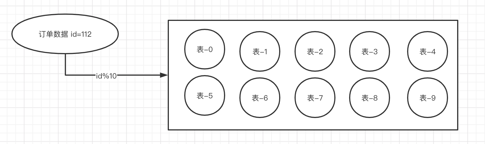
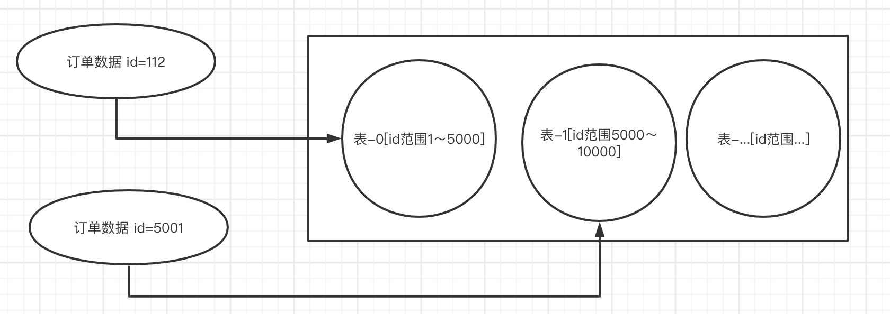
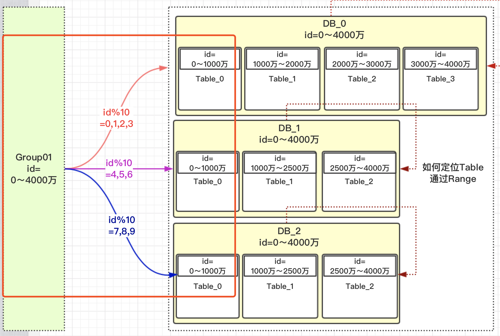
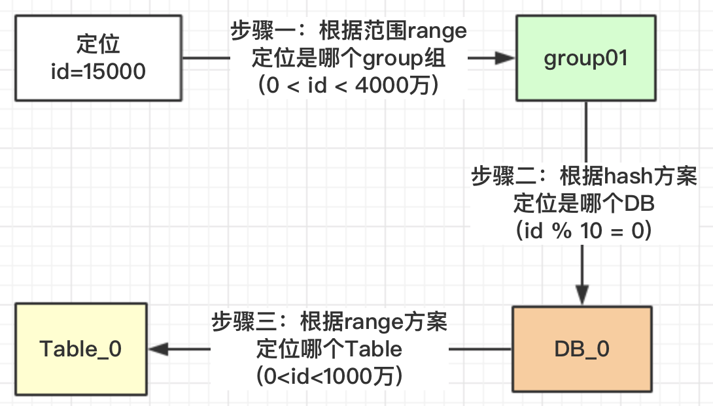
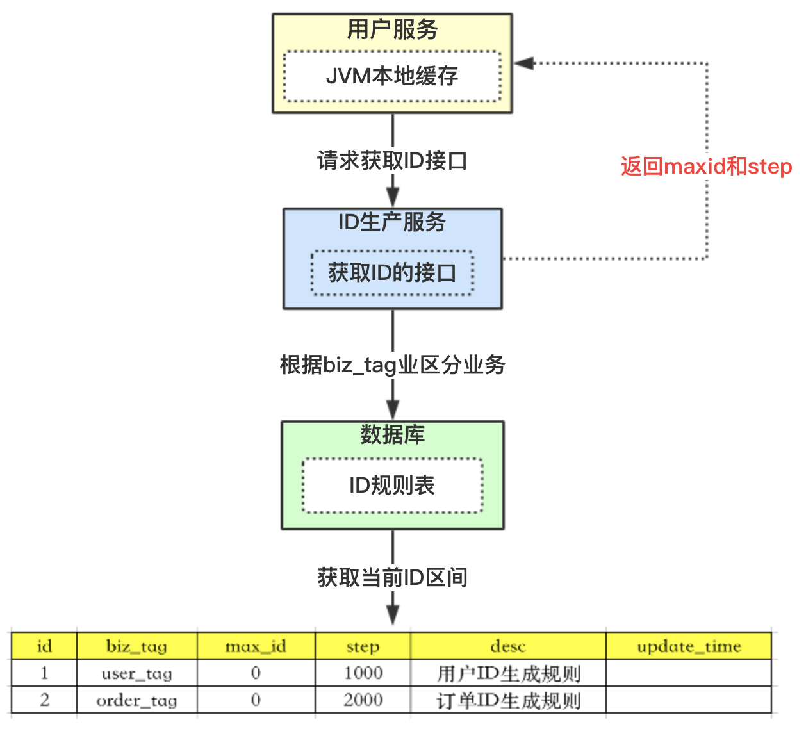
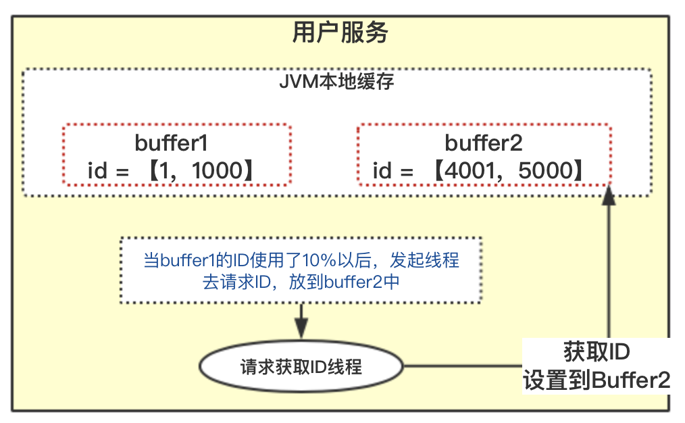

中大型项目中，一旦遇到数据量比较大，就应该对数据进行拆分了，例如mysql，推荐存储百万级数据，不进行处理，mysql单表数据太大，会导致性能变慢。有垂直和水平两种。

**垂直拆分**比较简单，也就是本来一个数据库，数据量大之后，从业务角度进行拆分多个库。例如将原本独立的单库拆分出订单库 和 用户库。

**水平拆分**的概念，是同一个业务数据量大之后，进行水平拆分。例如，将订单表拆分为订单表1、订单表2。

# 一、分库分表解决什么问题

- 性能瓶颈
MySQL是B+树索引，当数据量过大时，索引所消耗的磁盘 IO 越来越多，查询性能下降。高并发情况下，单表数据量过大导致 SQL 性能差，数据库服务器负载太高再次导致性能下降，简直雪上加霜。

- 高可用
微服务架构下，服务化无状态型会导致压力点在数据库上，单机数据库和主从结构已经不能满足需求，同时数据灾备等维护成本也越来越高。

- 安全性
所有不同类型的数据全部存在一个数据库中，当数据库宕机或发生物理性损坏时，容易造成不可估量的损失

# 二、分库分表方案

分库分表方案中有常用的方案，**hash取模和range范围方案**；分库分表方案最主要就是路由算法，**把路由的key按照指定的算法进行路由存放**。当然分库分表还有很多方式，例如分片等，这里不一一讲述。

## 1. Hash取模算法

要求在设计之前，需要对总体数据量有一个预估，例如一共会产生一个亿的数据，每个表的话能够容纳一千万的数据量，我们将设计为使用10个表进行存储。

hash的方案就是对指定的路由key（如：id）对分表总数进行取模，例如上述案例，由于分表分为了10，那么就需要对10去模划分，id=112的订单，对10进行取模，也就是会得到2，那此订单会放到2表中。id=113的订单，取模得到为3，就会放到3表中。如下图所示。（ps:这里取10个单纯为了好理解，如果是4个表，就取4的模）



### 优点

- 订单数据可以**均匀的放到那4张表**中，对此订单进行操作时，**不会有热点问题**。例如频繁操作某一时间段的，不会造成一直集中对一个表进行操作，而对其他的很少。

### 缺点

- 将来的**数据迁移和扩容，会很难**。例如由于效果超出预期，需要额外增加4个表，那这样的话，需要改为取14的模，基数发生了变化，就需要对以前的数据进行迁移。


## 2.Range范围方案

range方案也就是以范围进行拆分数据。把一定范围内的订单，存放到一个表中；**如id=112放到0表中，id=1300万的放到1表中。设计这个方案时就是前期把表的范围设计好。通过id进行路由存放。**如下图所示



### 优点

- **有利于将来的扩容，不需要做数据迁移。**需要扩容的时候，直接加表，后续范围肯定在后面

### 缺点

- **有热点问题。**范围试的id都是连续的，则一段时间产生的数据都在一张表中，导致该表过热，压力过大情况产生。


## 3. 综合方案

**hash是可以解决数据均匀的问题，range可以解决数据迁移问题，那我们可以不可以两者相结合呢？利用这两者的特性呢？**

我们考虑一下数据的扩容代表着，路由key（如id）的值变大了，这个是一定的，那我们先保证数据变大的时候，**首先用range方案让数据落地到一个范围里面**。这样以后id再变大，那**以前的数据是不需要迁移的**。

但又要考虑到**数据均匀**，那是不是可以在**一定的范围内数据均匀**的呢？因为我们每次的扩容肯定会**事先设计好这次扩容的范围大小**，我们只要**保证这次的范围内的数据均匀**是不是就ok了。

为此引入了一个group组概念，一个组里面包含了一些分库以及分表，如下图所示。



假设建立一个组Group1并设定它的range范围是0～4000万，则如果id在这个范围的时候，就会定位到这个组，由于这个组中设置了3个Db库总表数为10再根据Hash取10的模，获取到对应的Db，再根据这个id的range范围，去取最终这个数据表。流程图示如下：



**这里需要注意的是，为什么对表的总数10取模，而不是DB的总数3进行取模？**

在我们安排服务器时，**有些服务器的性能高，存储高，就可以安排多存放些数据，有些性能低的就少放点数据**。如果我们取模是**按照DB总数3，进行取模，那就代表着【0，4000万】的数据是平均分配到3个DB中的**，就不能够实现按照服务器能力适当分配了。

上图所示，就可以理解成如果值为**【0，1，2，3】就路由到DB_0，【4，5，6】路由到DB_1，【7，8，9】路由到DB_2**，DB_0性能较好，承受了更多的数据量。也千万不要被DB_1或DB_2中table的范围也是0～4000万疑惑了，这个是范围区间，也就是id在哪些范围内，落地到哪个表而已。

当涉及到需要扩容的时候，**同理再设计一个group02组**，定义好此group的数据范围就可以了，因为是一个新增的组，所以也就没有什么数据迁移的概念了。


具体实现的话，就把**group，DB，table之间建立好关联关系并存储起来供查询即可。**当然，如果为了之后效率考虑，可以将其缓存起来，缓存方式多种多样，就不一一赘述了。


# 三、分布式唯一ID设计方案

当分析完分库分表的方案后，发现，如果这样采取这种方案的话，**路由key（如：id）的值非常关键的，要求一定是有序的，自增的**，那么如果单表的话，可以依赖于数据库的主键自增，分布式改如何设置呢？

## 1. 方案设计

思路我们可以请求数据库得到ID的时候，可**设计成获得的ID是一个ID区间段**。




```
1、id表示为主键，无业务含义。
2、biz_tag为了表示业务，因为整体系统中会有很多业务需要生成ID，这样可以共用一张表维护
3、max_id表示现在整体系统中已经分配的最大ID
4、step 步长
5、desc描述
6、update_time表示每次取的ID时间
```

整体流程：
```
1、【用户服务】在注册一个用户时，需要一个用户ID；会请求【生成ID服务(是独立的应用)】的接口
2、【生成ID服务】会去查询数据库，找到user_tag的id，现在的max_id为0，step=1000
3、【生成ID服务】把max_id和step返回给【用户服务】；并且把max_id更新为max_id = max_id + step，即更新为1000
4、【用户服务】获得max_id=0，step=1000；
5、 这个用户服务可以用ID=【max_id + 1，max_id+step】区间的ID，即为【1，1000】
6、【用户服务】会把这个区间保存到缓存或应用中
7、【用户服务】需要用到ID的时候，在区间【1，1000】中依次获取id，可采用AtomicLong中的getAndIncrement方法。
8、如果把区间的值用完了，再去请求【生产ID服务】接口，获取到max_id为1000，即可以用【max_id + 1，max_id+step】区间的ID，即为【1001，2000】
```

这个方案解决了**数据库自增的问题**，而且可以**自行定义max_id的起点，和step步长，非常方便扩容**。也**解决了数据库压力的问题**，因为在一段区间内，是在 缓存中 的，而不需要每次请求数据库。即使**数据库宕机了，系统也不受影响**，ID还能维持一段时间。

## 2. 解决竞争问题
如果是多个用户服务，同时获取ID，同时去请求【ID服务】，在获取max_id的时候会存在并发问题。`如用户服务A，取到的max_id=1000 ;用户服务B取到的也是max_id=1000，那就出现了问题，Id重复了。那怎么解决？`其实方案很多，**加分布式锁**，保证同一时刻只有一个用户服务获取max_id。当然也可以用**数据库自身的锁**去解决。如**事务方式加行锁**

```
BEGIN
	UPDATE t_id_rule SET max_id = max_id + step WHERE biz_tag = user_tag
	SELECT biz_tag,max_id,step FROM t_id_rule WHERE biz_tag = user_tag
	COMMIT
END
```

## 3. 解决突发阻塞问题--双Buffer

**多个用户服务获取到了各自的ID区间**，在高并发场景下，id用的很快，如果100个用户服务在**某一时刻都用完**了，**同时去请求【ID服务】**。因为上面提到的竞争问题，所有只有一个用户服务去操作数据库，**其他二个会被阻塞**。当然服务越多，出现的概率越大。

出现的现象就是**一会儿突然系统耗时变长，一会儿好了**，一般就是这个原因导致的。

为了解决这种情况，这里采用双Buffer方案进行处理



主要实现流程如下

- **1、当前获取ID在buffer1中，每次获取ID在buffer1中获取**

- **2、当buffer1中的Id已经使用到了100，也就是达到区间的10%**

- **3、达到了10%，先判断buffer2中有没有去获取过，如果没有就立即发起请求获取ID线程，此线程把获取到的ID，设置到buffer2中。**

- **4、如果buffer1用完了，会自动切换到buffer2**

- **5、buffer2用到10%了，也会启动线程再次获取，设置到buffer1中**

- **6、依次往返**

采用双buffer的方案，就**达到了业务场景用的ID，都是在缓存或JVM中获得的**，从此**不需要到数据库**中获取了。允许数据库宕机时间更长了。

因为会有一个线程，会**观察什么时候去自动获取**。**两个buffer之间自行切换**使用。就解决了突发阻塞的问题。


