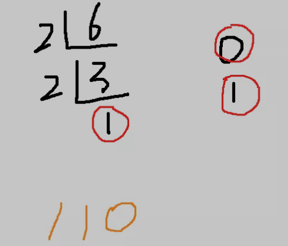
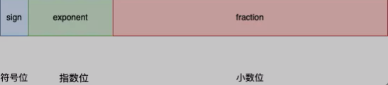
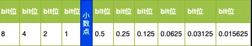
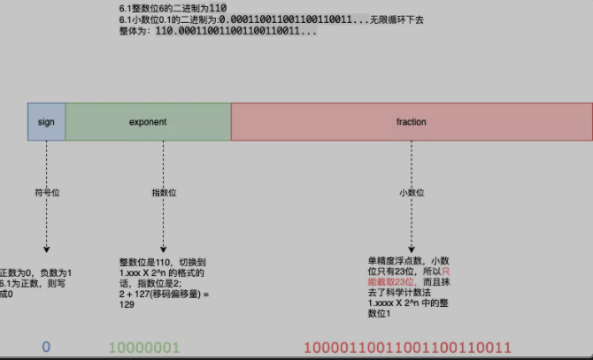

# 一、浮点类型的精度丢失现象

**只要是float类型的数据相加，无论在任何语言、任何数据库、任何中间件中进行加法(减法乘除法)运算，得到的数据，都不会精确。**

```
    var num float32    
    for i := 0; i < 7; i++ {
    	num = num + 0.1    
    }
    fmt.Println(num)
```

答案可能出人意料，是：`0.70000005`

```
    0.70000005
```

试试`C、C++、Java、PHP、SQL`等其他环境的`float`类型相加，也同不精准。


# 二、原因解析

不同于正整数类型的表示方法，float类型在计算机中的表示略显复杂，遵循的是 `IEEE754标准`。

我们首先回顾一下整数类型在计算机中的表示。我们知道:计算机只认识0和1；那么，对于像6一样的这种正整数，我们要做十进制到二进制的转换。



所以，十进制 `6`最终转化为二进制为 `110`。

这很好理解，但是，如何表示 `6.1`等这类小数呢？有人说了，可以找个特殊的符号，用来表示小数点 `.`，把 `6.1`中 `6`和 `1`隔开；听起来是个不错的办法。其实 `IEEE754`还真就是这么做的，只不过思路略有些复杂，总体思路就是：仿照用"科学计数法"！

我们再回顾一下什么是 `科学计数法`。`把一个数表示成a与10的n次幂相乘的形式（1≤|a|<10，a不为分数形式，n为整数），这种记数法叫做科学记数法。`也就是：`1.360X10^4` 这种计数方式。

我们可以仿照科学计数法，来表示浮点数，把二进制数统一表示成 `1.0110101X2^n`这种形式。数据层面怎么表示出这种形式呢？根据 `IEEE754`的标准，将数据分为三部分：



从左到右分别表示：符号位(正负数)、指数位和小数位

以单精度浮点数为例，单精度浮点数一共32位(双精度64位，即平时所说的 `double`类型)，具体内部表示为：


- 1个bit表示符号位
- 8个bit表示指数位
- 23个bit表示小数位

这里有个地方要特别注意：因为数据最终要表示成 `1.0110101X2^n`这种形式，整数位在二进制下，永远都是 `1`，所以在表示float类型的时候，直接把 `1`给去掉了，假如有就占据一个bit的空间，既然那个bit位上永远都是1，所以干脆去掉了。

那么，具体该如何展示呢？例如小数点后的数字怎么表示？`6.1`能否写成 `110.1`呢？如果能的话小数点后这个1代表什么呢？个数一？那添加几个零的话，能否认为是十、一百、一千？似乎是不可以，因为这样只能满足"视觉效果",逻辑层面直接说不通。

要明白在小数点后的数字代表除以2后的数字，例如二进制下小数点后的第一位1代表 1 / 2等于 `0.5`，第二位1代表 1/2/2等于 `0.25`，依次类推第三位1则代表 `0.125`...具体请看下图：



所以，给定一个小数，譬如 `0.1`，要想得到对应的二进制数，应该是和小数点左边的计算方式相反：`乘以2，记录整数位`

```
    0.1 X 2 = 0.2  0    
    0.2 X 2 = 0.4  0    
    0.4 X 2 = 0.8  0    
    0.8 X 2 = 1.6  1    
    (1.6 - 1 = 0.6)    
    0.6 X 2 = 1.2  1    
    (1.2 - 1 = 0.2)     
    0.2 X 2 = 0.4  0    
    0.4 X 2 = 0.8  0    
    0.8 X 2 = 1.6  1    
    (1.6 - 1 = 0.6)    
    0.6 X 2 = 1.2  1    
    (1.2 - 1 = 0.2)     
    0.2 X 2 = 0.4  0    
    0.4 X 2 = 0.8  0    
    0.8 X 2 = 1.6  1
    ...     
    // 无限循环下去
```

所以， `0.1` 用二进制表示为：`0.000110011001100110011...`因此 `6.1` 用二进制应该表示为：`110.000110011001100110011...`用”科学计数法“表示为：`1.10000110011001100110011...X2^2`OK，看来小数位的数可以确定了是 `10000110011001100110011`，即去掉整数位1后，向后截取的23位数(浮点数不精确的本质原因)。

符号位0表示正数，1表示负数，所以可以确定是 `6.1`的符号位是0；现在符号位有了，小数位有了，只剩下指数2如的表示了，该如何表示呢？直接在8位的空间内转化为 `000000010`？

显然不可以，首先，如果指数位用 `原码`表示，那么，针对指数位为负的情况，就得加一个符号位去表示，而且还会出现两个零的情况：`00000000`和 `1000000`，操作起来过程复杂~

有人要问那如果使用补码呢？如果使用补码，会出现以下情况，请看例子：

```
1.01 X 2^-1 和 1.11 X 2^3比较大小？
指数：-1 和 3，分别转化为二进制数 “111”和“011”；
"111"是"7"，"011"是"3"， 7会小于3吗？
```

可见使用补码，也不是很方便，于是，引用了另外一种编码方式——-移码。先说说移码的定义：`将每一个数值加上一个偏置常数(Excess/bias)，通常，当编码位数为n的时候，bias取"2^n-1"或者"2^n-1 - 1"`

承接以上1.01 X 2^-1 和 1.11 X 2^3比较大小的例子：

```
1.01 X 2^-1 和 1.11 X 2^3大小？指数：-1 + 4 = 3，二进制表示为:"011"
3 + 4 = 7 二进制表示为："111"
7 > 3，即 "111" > "011" 比较完毕  
```

就这样，浮点数”科学计数法“的指数位比较变得简单了，而且，消除了”正零“ 和 ”负零“ 不相同的问题。

因为 ：

```
假设偏移量是：4
则移码表示的0只有：0 + 4 = 4，即“100”
```

在 `IEEE754`中，指数位移码的偏移量为指数位数的 `2^n-1-1`，为127。

所以，回到 `6.1`表示的问题上，指数位为：`2+127=129`，二进制表示为：`10000001`

因此， `6.1`在 `IEEE754`单精度浮点数标准的下，表示为：



好了，现在了解了浮点数 `IEEE754`标准的表示方法，知道为何浮点数相加总是不精确了吧？

因为浮点数很多小数在二进制环境下很多都无法完整的表示，只能截取部分数据来近似的表示，两个数相加的话，就是两个近似的数相加的和，如果相加次数足够多，精确度自然也就会越来越低

