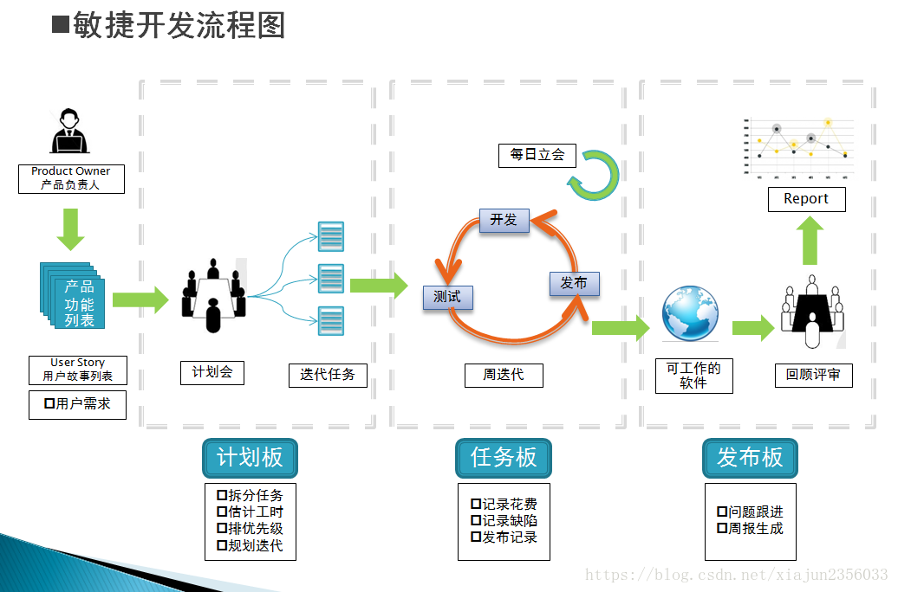
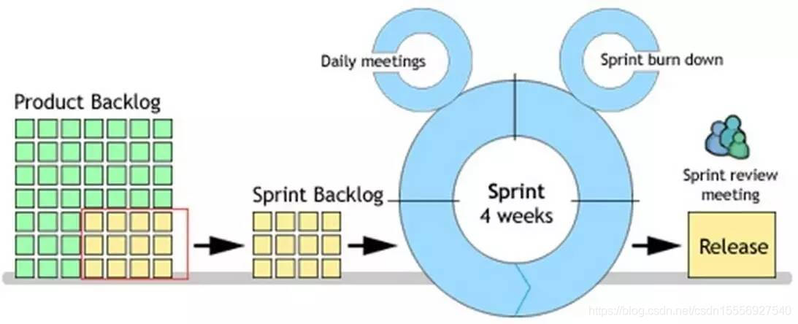

**敏捷开发（Agile）是一种以人为核心、迭代、循序渐进的开发方法。**

在敏捷开发中，软件项目的构建被切**分成多个子项目，各个子项目的成果都经过测试，具备集成和可运行的特征**。 简单地来说，敏捷开发并不追求前期完美的设计、完美编码，而是力求在很短的周期内开发出产品的核心功能，尽早发布出可用的版本。然后在后续的生产周期内，按照新需求不断迭代升级，完善产品。是谁这么厉害，提出了敏捷开发思想？是一位名叫 Martin Fowler 的美国大叔。 大叔不但是敏捷开发的创始人之一，还在面向对象开发、设计模式、UML 建模领域做出了重要贡献。目前担任 ThoughtWorks 公司的首席科学家。

### 敏捷开发模式的分类
敏捷开发的实现主要包括 SCRUM、XP（极限编程）、Crystal Methods、FDD（特性驱动开发）等等。其中 SCRUM 与 XP 最为流行。

同样是敏捷开发，XP 极限编程 更侧重于实践，并力求把实践做到极限。这一实践可以是测试先行，也可以是结对编程等，关键要看具体的应用场景。

SCRUM 则是一种开发流程框架，也可以说是一种套路。SCRUM 框架中包含三个角色，三个工件，四个会议，听起来很复杂，其目的是为了有效地完成每一次迭代周期的工作。在这里我们重点讨论的是 SCRUM。

学习 Scrum 之前，我们先要了解几个基本术语：

- Sprint：冲刺周期，通俗的讲就是实现一个“小目标”的周期。一般需要 2-6 周时间。
- User Story：用户的外在业务需求。拿银行系统来举例的话，一个 Story 可以是用户的存款行为，或者是查询余额等等。也就是所谓的小目标本身。
- Task：由 User Story 拆分成的具体开发任务。
- Backlog：需求列表，可以看成是小目标的清单。分为 Sprint Backlog 和 Product Backlog。
- Daily meeting：每天的站会，用于监控项目进度。有些公司直接称其为 Scrum。
- Sprint Review meeting: 冲刺评审会议，让团队成员们演示成果。
- Sprint burn down：冲刺燃尽图，说白了就是记录当前周期的需求完成情况。
- Release：开发周期完成，项目发布新的可用版本。

