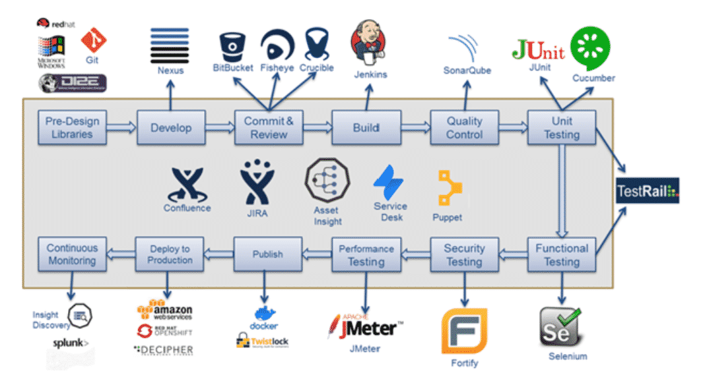

本文谈到DecOps vs DevSecOps区别，随着技术界采用各种哲学和方法论，弄清楚每个人包含的内容可能会造成混淆。如果您更关注整个文化转变，例如DEVOPS 那么即使这种类型的方法也具有与开发人员一样多的不同定义。进一步深入DevOps的是诸如SecOps和DevSecOps之类的意识形态，即使最有经验的团队成员有时也会挠头 . 不用担心。我们汇总了完整的指南，以定义SecOps和DevSecOps之间的差异以及它们如何使您的组织受益。

## 什么是DevOps？

首先，在继续比较其他两个方面之前，有必要了解DevOps的概念。尽管其定义差异很大，但DevOps的核心是工具，实践和理念的结合，从而提高了组织高速交付服务和应用程序的能力。

过去，IT运营（ITOps）必须手动构建基础架构，导致需要几天甚至几周的时间才能对代码进行测试和部署。使用DevOps，整个过程是自动化的。通过整合开发团队和ITOps团队，DevOps增强并简化了当前的软件开发流程，从而允许以更快的速度开发和部署应用程序。

采用DevOps的好处包括：

- 改善协作
- 通过创新更快地将产品推向市场
- 增强问题解决能力
- 有更多时间进行创新
- 投资回报率得到提高

## 什么是SecOps？

SecOps是一种旨在通过将安全团队和ITOps团队结合在一起来自动化安全任务的方法。通过自动化这些关键的任务，将安全性注入产品的整个生命周期中。

与DevOps相似，SecOps是一种哲学，鼓励设计人员，程序员和负责安全的人员之间进行更高水平的协作。该团队能够考虑整个开发周期中的安全威胁，以及这些威胁如何影响软件和可能遇到这些威胁的用户。

SecOps与其他类型的编程思想（例如DevOps或Agile）之间的最大区别在于SecOps专注于确保开发周期团队的每个成员都了解安全性并对其负责。工程师可能会尝试报告代码注入，或者销售代表可能会注意到可疑电子邮件。这种方法旨在在风险尚未成为问题之前就进行预防。

SecOps的一个主要好处是，它可使安全团队进行扩展，将职责分配给其他人员，并随时帮助“缓解”安全风险。安全团队将不再孤立无援，而是将与大多数团队成员，特别是那些参与开发的团队紧密合作。

SecOps对企业的其他好处包括：

- 提高生产力
- 增强资源利用率
- 增加投资回报率
- 应用中断更少
- 更少的云安全威胁
- 更加有效的审核流程

## 什么是DevSecOps？

简而言之，DevSecOps是DevOps和SecOps的集成。与DevOps一样，从某种意义上说，DevSecOps也是通过协作和交流来增强结果，DevSecOps是另一种哲学，它可以在开发过程中促进在应用程序中构建安全性。

使用DevSecOps，开发人员可以在编码期间运行测试，然后运行其他安全性测试，以将其传递部署到生产中。如果它们在任何时候都失败了，那么代码甚至在到达生产阶段之前就被发回给开发人员进行修复。利用此过程，部署带有安全漏洞的软件的风险要低得多。

通过在开发周期的早期发现任何漏洞，实施DevSecOps可以大大提高安全性。它还确保以一种自动化的方式来检查代码并在开发人员之间推广安全的设计模式和原则。这使开发人员在编写代码时考虑安全性，从而增加了价值并降低了成本。

整个软件交付管道中改进的自动化功能减少了停机时间和攻击量，同时还消除了错误。DevSecOps的其他优点包括：

- 团队之间加强协作与沟通
- 安全团队的敏捷性和速度更高
- 早期意识到并缓解代码中的漏洞
- 改进的快速变更能力
- 增加质量保证测试的机会

最后，我们看看devops devsecops的一些区别和联系图解；

