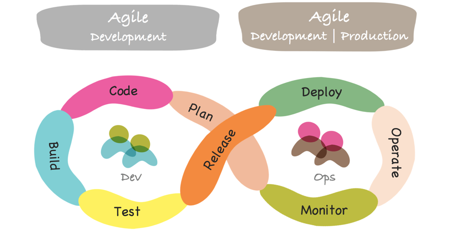

SRE和DevOps有什么区别？今天我们讨论SRE与DevOps和区别， 您可能会说这很大程度上是语义问题，实际上，SRE和DevOps工程师扮演着相同的基本角色。尽管如此，SRE和DevOps之间还是存在一些区别，即使是细微的区别。考虑到这两种角色在很大程度上具有相同的价值观和实践，它们似乎并不重要，但现实是，最终SRE和DevOps工程师满足了不同的需求。了解这些差异是确保您的IT团队尽可能高效地运营的关键。

# 什么是SRE？

SRE(Site Reliability Engineering)是站点可靠性工程或站点可靠性工程师的缩写，**是指使用软件工程原理来帮助维护和管理IT系统。**

至少，这就是 Google的SRE定义，这是在过去几年中推广该概念的公司。正如Google所说，SRE的目的是像对待软件问题一样对待[IT]操作。

这个想法是创新的，因为在传统上，大多数公司在主要负责维护软件的IT运维人员和主要负责编写软件的软件工程师之间存在很大的分歧。这两个小组不仅从事不同类型的工作，而且还以不同类型的方式解决问题。软件工程师倾向于专注于使用代码来解决所有问题，而运维则更习惯于使用各种工具（监视软件，配置管理工具，访问控制框架等）来管理日常工作和软件系统的日常操作。

SRE趋势有助于解释为什么像 基础架构即代码 （IaC）和 声明式配置管理近年来已成为IT系统部署和管理的流行方法。这些实践是使用代码的方式以及软件工程的原理来管理传统上使用不同工具和方法执行的IT流程。它们也恰好是非常适合自动化和可伸缩性的方法，这是SRE优先考虑的价值观。

# 什么是DevOps？

顾名思义，DevOps旨在弥合开发与IT运维之间的鸿沟。

DevOps背后的核心思想本质上是驱动SRE的相同思想：通过允许软件工程师（或开发人员，在大多数情况下基本上是同一件事）和IT运维人员之间更紧密的协作，使整体IT运维更加可靠和高效。。

像SRE一样，DevOps奖励自动化和可扩展性。尽管DevOps也有一些技巧，例如DevOps对话，但IaC之类的方法通常会出现在DevOps对话中CI / CD，与SRE紧密相关。

# SRE VS DevOps

因此，在较高的层次上，DevOps和SRE具有相似的目标和广泛相似的方法。但是DevOps和SRE之间存在重要区别：

- 开发人员扮演的角色: SRE使用开发人员的思维和工具来解决IT运营问题。因此，在SRE中，大多数事情都是从软件工程师的角度完成的。相比之下，DevOps更多地是要结合开发人员和IT操作工程师的技能，而不是使用前者取代后者;

- 文化与实现: 一般而言，DevOps倾向于将重点更多地放在文化目标和优先事项上，而不是特定的实施过程。不需要任何特定工具或方法即可执行"DevOps"。同样，也没有遵循SRE的特定脚本，但是与DevOps相比，SRE总体上提供了关于如何解决问题以及使用哪种类型的工具的更严格的规定;

- 组织结构: 在大多数情况下，DevOps不会取代现有的开发人员和IT运营部门或角色。公司可能会雇用一些DevOps工程师来帮助指导DevOps，但是他们并不会用DevOps工程师代替所有现有的IT角色。相反，SRE角色往往被视为至少替代IT操作的一种方式。（这是一个笼统的陈述，当然也有例外，但是总的来说，SRE涉及对组织结构的更大改变);

- 扩展到其他IT角色: DevOps产生了一个大量分支将DevOps概念扩展到开发和IT运维之间。现在，通常会听到有关DevSecOps的讨论，例如，将DevOps应用于安全性的问题或QAOps，这将QA工程师带入DevOps领域。同时，SRE概念还没有看到这种广泛的使用。