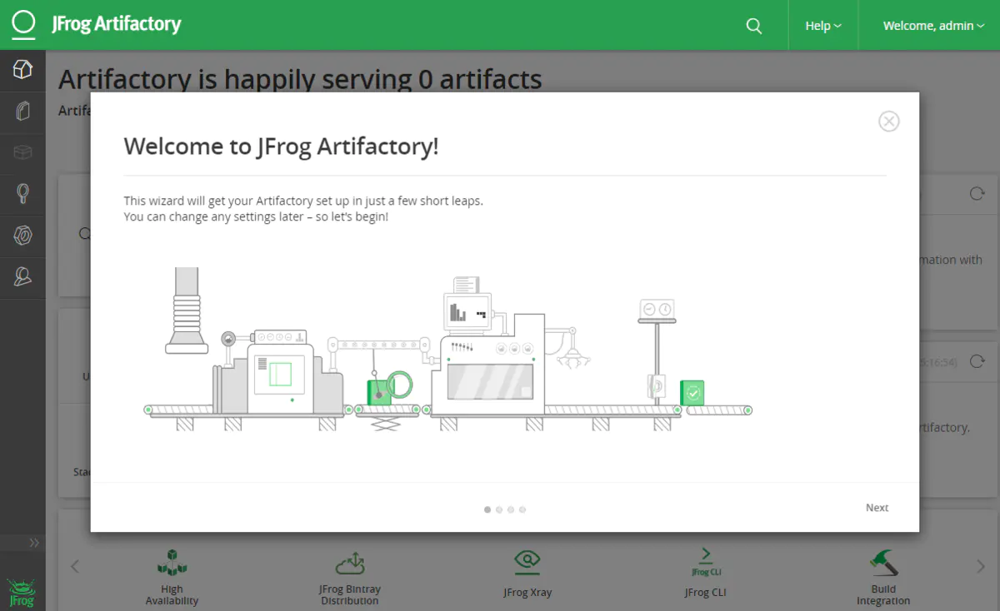

Artifactory 是 JFrog 的一个产品，**用作二进制存储库管理器**。二进制存储库可以将所有这些二进制统一托管，从而使团队的管理更加高效和简单。 就跟你用 Git 一样，Git 是用来管理代码的，Artifactory 是用来管理二进制文件的，通常是指 jar, war, pypi, DLL, EXE 等 build 文件。 我觉得使用 Artifactory 的最大优势是创造了更好的持续集成环境，有助于其他持续集成任务去 Artifactory 里调用，再部署到不同的测试或开发环境，这对于实施 DevOps 至关重要。



从架构图可以全面了解Jfrog Artifactory；

**安装 JFrog [Artifactory](https://links.jianshu.com/go?to=https%3A%2F%2Fjfrog.com%2Fopen-source%2F%23artifactory)；**

- 从官网下载 Open Source [Artifactory](https://links.jianshu.com/go?to=https%3A%2F%2Fjfrog.com%2Fopen-source%2F%23artifactory)，这里演示的是安装到 Linux，所以点击 Download RPM 下载
- 将下载好的 jfrog-artifactory-oss-6.14.0.rpm 上传到 Linux 上

```bash
# 在根目录创建一个文件，你也可以在任何目录创建文件夹
sudo mkdir /artifactory
cd /artifactory
# 将下载好的 jfrog-artifactory-oss-6.15.0.rpm 上传到你的 Linux 上
$ ls
jfrog-artifactory-oss-6.14.0.rpm
# 安装 artifactory
sudo rpm -ivh jfrog-artifactory-oss-6.14.0.rpm
# 启动服务
sudo systemctl start artifactory.service
# 停止服务
sudo systemctl stop artifactory.service
# 查看服务状态
sudo systemctl status artifactory.service
```


**访问 Artifactory;**

Artifactory 默认端口是8040，安装成功后访问：`http://hostname:8040` 即可登录（默认用户名 admin 密码 password）。