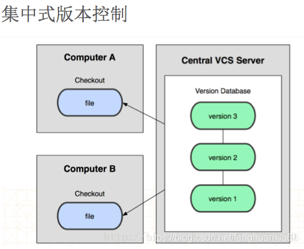
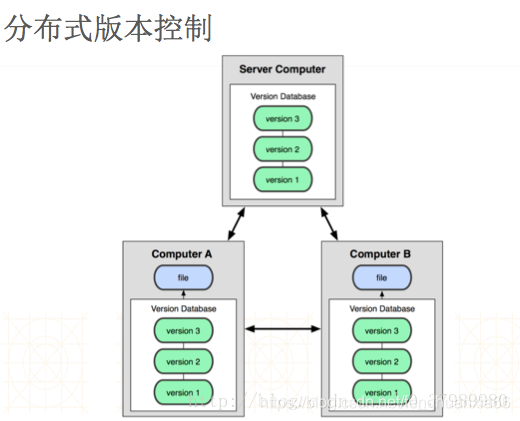
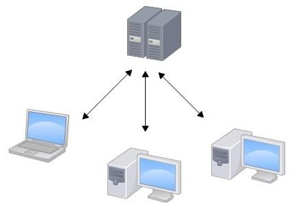
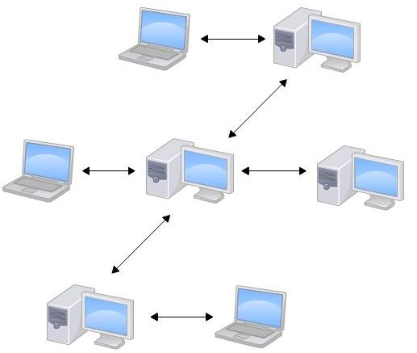
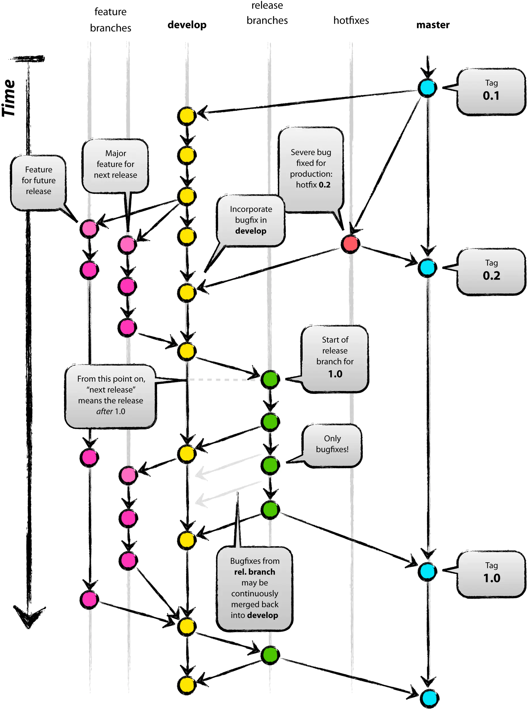
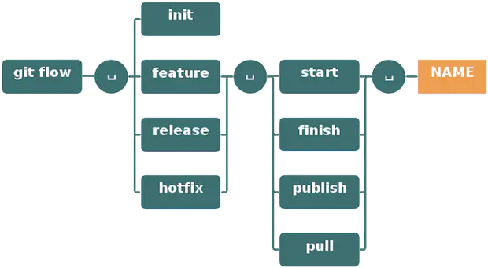

代码管理和分支管理作为研发团队最基础的功能和技术，需要所有研发掌握， 我们发现`rdc`除原有的`分支模式`以外还增加了`master分支开发模式`和`git flow模式`，这是一件非常令人欣喜的事情——毕竟`git flow`是一个流传已久的，大家都普遍接受的开发模式。于是我就把应用删掉了，改用`git flow`模式，目前体验很完美。鉴于很多人可能还不太了解`git flow`,  本文就对此分享一些git 代码版本管理，git flow的经验。


# 引言

在代码管理过程中，主要典型的有以下几个问题：

1. 当我开发某个功能到一半的时候，PM突然给我安排了一个新的紧急任务，我该怎么开始这个任务，而不影响现在的？
2. 当我代码写好了的时候，如何发布？
3. 当我发布后，代码出问题了，如何快速修复？
4. 以上的情况，还要求修复后，还要包含之后开发的所有代码？

大部分开发人员使用git的时候，基本只使用两个甚至一个分支，所以下面的这些理念，显然是打开了一扇新世界的大门了。


# 代码版本管理介绍

常用的代码管理软件主要是svn 和git, svn和git都是常用的版本管理软件，但是git无论在理念或是功能上都比svn更为先进。但是有的公司是以svn作为中央仓库，这时git与svn代码的同步就可以通过 git-svn这个软件进行，从而用git管理svn代码。最后的效果相当于把svn仓库当作git的一个remote（远程仓库），而你本地的代码都是通过git来管理，只有push到svn时才会把你本地的commit同步到svn。





# SVN和GIT代码管理

**集中式版本控制系统（SVN）：**

版本库是集中存放在中央服务器的，而干活的时候，用的都是自己的电脑，所以要先从中央服务器取得最新的版本，然后开始干活，干完活了，再把自己的活推送给中央服务器。中央服务器就好比是一个图书馆，你要改一本书，必须先从图书馆借出来，然后回到家自己改，改完了，再放回图书馆。



**分布式版本控制系统（Git）**

分布式版本控制系统根本没有“中央服务器”，每个人的电脑上都是一个完整的版本库，这样，你工作的时候，就不需要联网了，因为版本库就在你自己的电脑上。既然每个人电脑上都有一个完整的版本库，那多个人如何协作呢？比方说你在自己电脑上改了文件A，你的同事也在他的电脑上改了文件A，这时，你们俩之间只需把各自的修改推送给对方，就可以互相看到对方的修改了。



# GIT FLOW研发分支管理

代码的管理和协同同样需要一个清晰的流程和规范，由此，行业内的通用解决方案是`Git Flow。`



在上面这幅图上，最上面的一行，代表分支，它们分别是

| **名称** | **解释**                                                     |
| -------- | ------------------------------------------------------------ |
| master   | 这个分支最近发布到生产环境的代码，最近发布的Release， 这个分支只能从其他分支合并，不能在这个分支直接修改 |
| Develop | 这个分支是我们是我们的主开发分支，包含所有要发布到下一个Release的代码，这个主要合并与其他分支，比如Feature分支 |
| Feature | 这个分支主要是用来开发一个新的功能，一旦开发完成，我们合并回Develop分支进入下一个Release |
| Release | 当你需要一个发布一个新Release的时候，我们基于Develop分支创建一个Release分支，完成Release后，我们合并到Master和Develop分支 |
| Hotfix | 当我们在Production发现新的Bug时候，我们需要创建一个Hotfix, 完成Hotfix后，我们合并回Master和Develop分支，所以Hotfix的改动会进入下一个Release. |

**研发常用GIT命令**

**Git release 的命令例子如下;**

```bash
git checkout -b release-0.1.0 develop

# Optional: Bump version number, commit
# Prepare release, commit
git checkout master
git merge --no-ff release-0.1.0
git push

git checkout develop
git merge --no-ff release-0.1.0
git push

git branch -d release-0.1.0

# If you pushed branch to origin:
git push origin --delete release-0.1.0   

git tag -a v0.1.0 master
git push --tags
```

- 初始化: git flow init
- 开始新Feature: git flow feature start MYFEATURE
- Publish一个Feature(也就是push到远程): git flow feature publish MYFEATURE
- 获取Publish的Feature: git flow feature pull origin MYFEATURE
- 完成一个Feature: git flow feature finish MYFEATURE
- 开始一个Release: git flow release start RELEASE [BASE]
- Publish一个Release: git flow release publish RELEASE
- 发布Release: git flow release finish RELEASE
  别忘了git push --tags
- 开始一个Hotfix: git flow hotfix start VERSION [BASENAME]
- 发布一个Hotfix git flow hotfix finish VERSION





# 总结

Git 是分布式的工作流程，使得开发者之间的协作更加灵活多样，根据官方的总结，主要有三种模式：集中式工作流、集成管理者工作流、司令官与副官工作流。实际使用中可以选择其中的一种或者将几种进行搭配使用，在这里把官方的介绍进行整理，更加具体的您可以去参考官方文档。 对于产品的主线的版本管理，还是基于Git的集中式管理模式，与我们以前用的SVN差不多，在分支上做了优化，我们创建了这几个分支：develop、bugfix、feature、prelease，加上master，一共五个。

- develop: 开发团队日常开发测试的分支
- bugfix: bug修复分支
- feature：具体功能的开发，开发一些比较独立复杂的功能。
- prelease：发布前的测试，给测试团队用的
- master：发布的版本，每个发布版本会打Tag，标记一下。