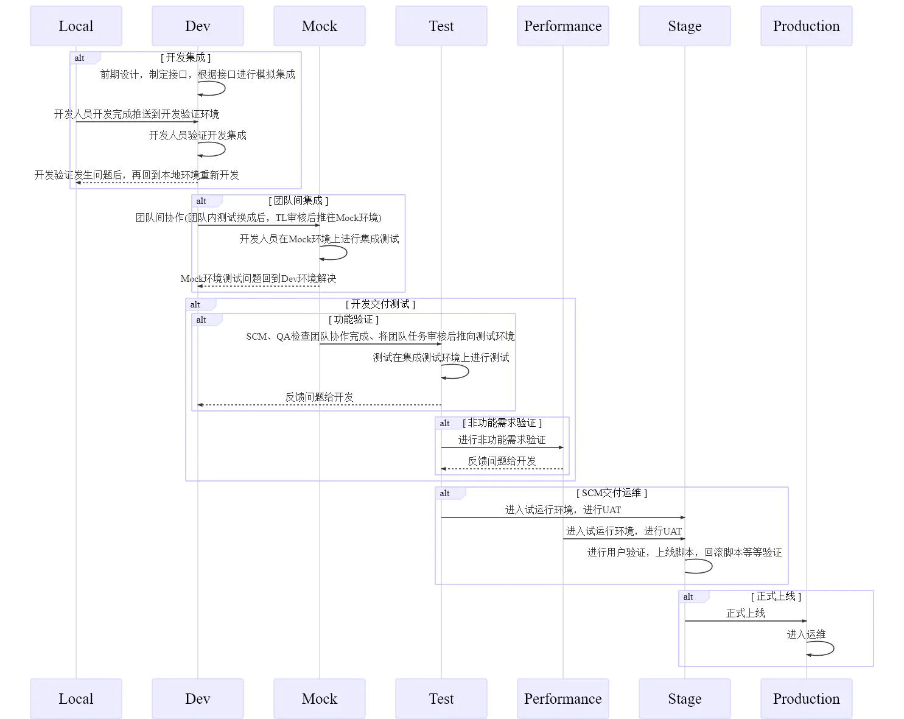
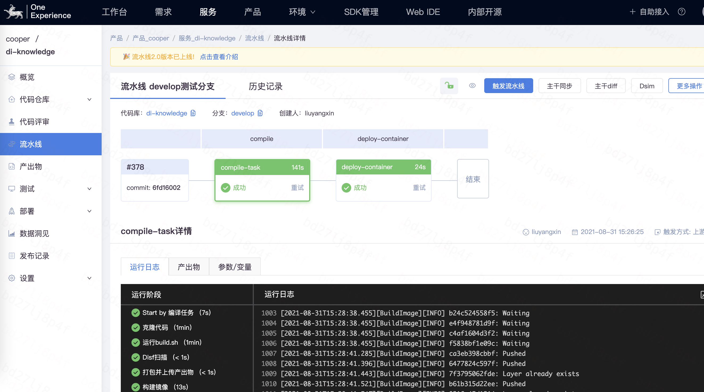
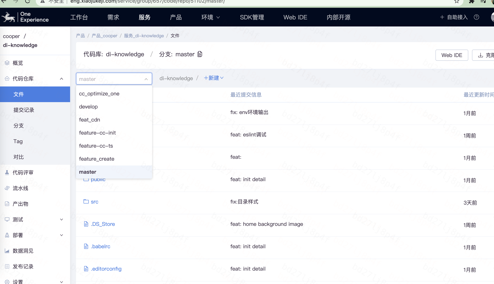
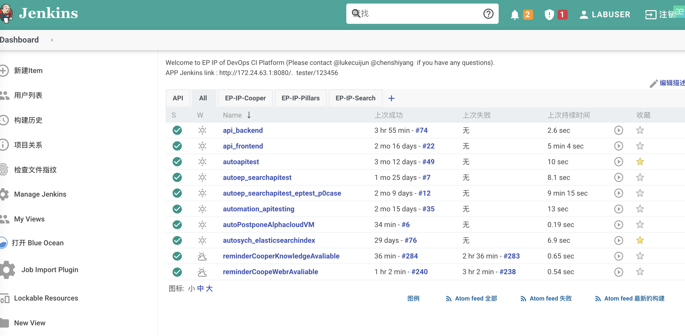
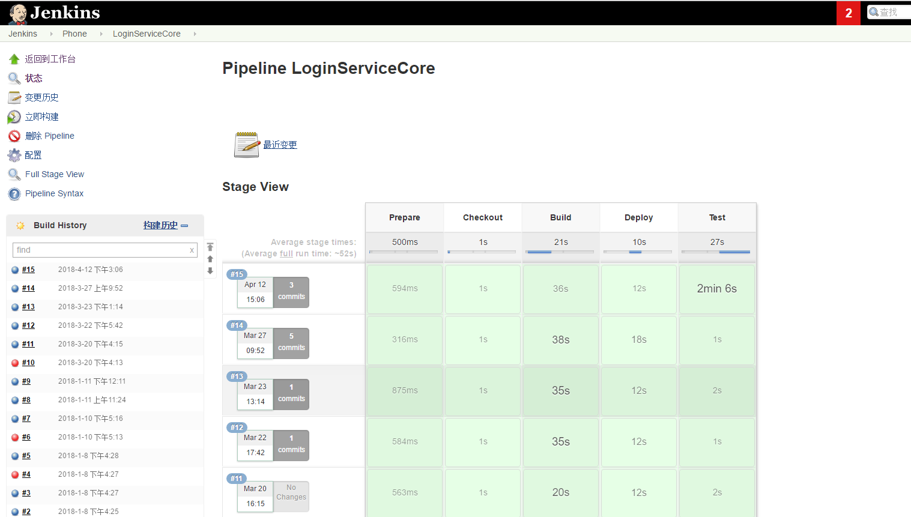
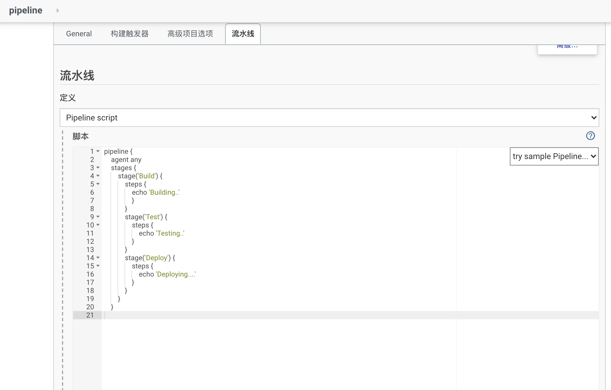
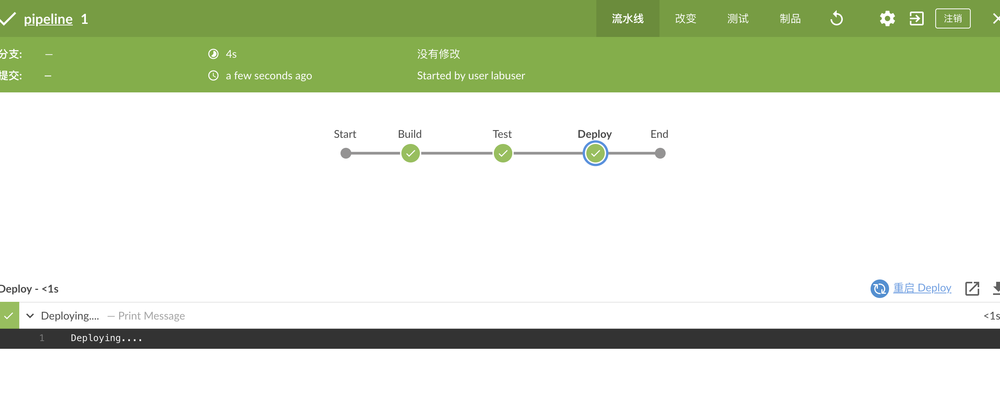
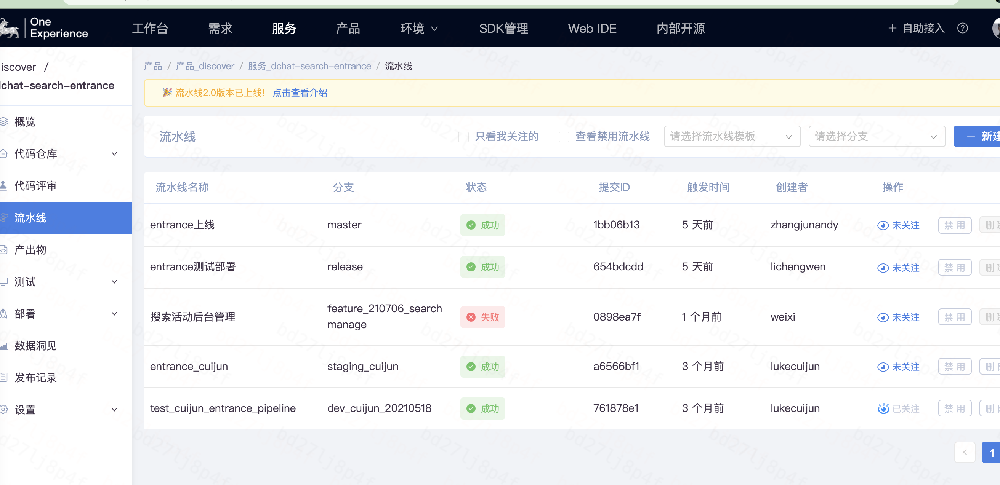
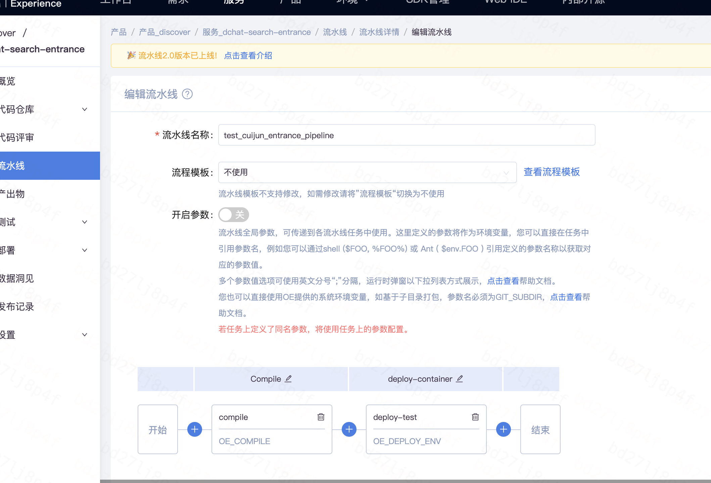
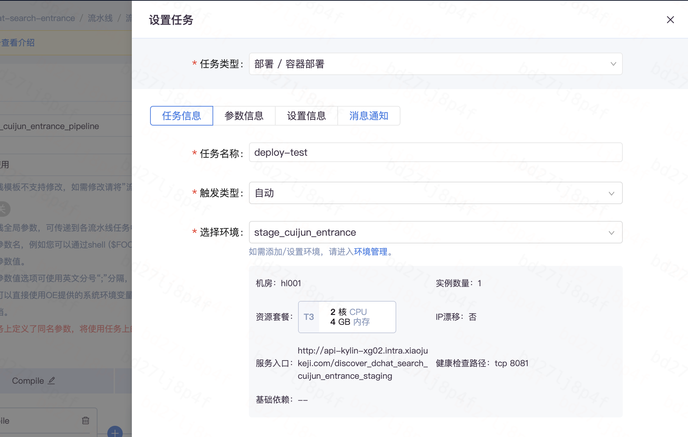

流水线在企业里运用很多，谈到流水线，不能不说明下DevOps，其中DevOps 的概念很火爆，DevOps是一套实践方法，在保证高质量的前提下缩短系统变更从提交到部署至生产环境的时间，其中持续集成和持续交付是 DevOps 里面非常重要的一环。而流水线就是DevOps的一个过程描述的落地和实践，本文讲述了企业运用OE流水线支持各个业务线的部署和交付，并对比了开源的jenkins服务流水线，来描述流水线pipeline构建方法和最佳实践。

# 引言

企业流水线软件工程团队中的流水线是一组自动化流程，使 DevOps 专业人员和开发人员能够可靠而有效地编译，构建并将其代码部署到生产计算平台。在企业的DevOps 流水线中最常见的组件是构建自动化或持续集成、测试自动化和部署自动化。开发人员可以每天多次将其代码检入版本控制的存储库中。这些检查触发了自动构建流水线，从而可以快速，轻松地定位错误检测。 一般企业流水线包含一组工具，这些工具分为以下包含了源代码控制、构建工具、容器化、配置管理、监控和自动化测试等方面.

# 流水线Pipeline的介绍

企业级的软件不同于低频率发布相对较大的版本，实施持续交付的团队希望比通常更频繁地将更小批量的变更投入生产， 例如每周，每天或一天之内就能够发布多个版本。持续集成就会成为企业的选择，那么在使用持续集成的时候，流水线pipeline越来越多的运用到互联网或者软件企业中，一个已经上线的正式产品，软件的核心价值是为软件的使用者带来收益，在过去我们经常听到开发人员说这个功能已经开发完成了。 但是在持续交付中我们认为之后将特性真正的发布到用户手上才以为则完成。第一要务就是运用流水线保证线上系统是稳定可靠运行的。所以需要通过各种手段保证新功能上线，线上系统问题的快速反馈与立即解决。根据不同公司产品形态的不同，每个公司流水线pipleline都需要有一套功能上线流程以保证线上系统的正常运行。

# **滴滴OE流水线Pipeline的介绍**

滴滴公司自研了一套适合自己公司的持续集成系统和流水线，适用于不同业务的快速部署和迭代研发，滴滴公司的流水线pipeline可以和gitlab代码仓库进行无缝隙的结合，完美的对各个业务项目代码进行集成，编译，打包，部署，测试等操作。下面就是滴滴OE集成系统的流水线；

滴滴公司的OE流水线可以完美的和gitlab进行结合，可视化的操作不同的分支和代码信息，具体的操作如下图所示；

# **滴滴OE流水线和Jenkins流水线的对比**

- 1.代码的可视化管理方面，滴滴OE集成系统更好，更能全面的展现代码和分支信息. Jenkins 目前没有代码管理的展现功能。
- 2.流水线的pipeline比较，jenkins的pipeline其实就是通过grovvy描述语言来定义不同的阶段，不同阶段进行不同的任务操作，滴滴OE流水线把各个阶段都有可视化ui的方式进行展示，更方便于开发的操作，滴滴OE流水线的不足之处是脚本描述的通用性不强，更定制化一些。
- 3.对于jenkins流水线pipeline，需要有一定的脚本能力来进行操作和把握，对于滴滴OE流水线更傻瓜化的配置一些，但是对于脚本化的描述支持的比较弱一些；

下面是jenkins 流水线pipeline的一些实践操作，我们可以从如下图中了解到一些区别和优缺点；

**对于jenkins pipeline，我们可以看到分以下一些阶段和步骤;**

- Stage: 阶段，一个Pipeline可以划分为若干个Stage，每个Stage代表一组操作。注意，Stage是一个逻辑分组的概念，可以跨多个Node。
- Node: 节点，一个Node就是一个Jenkins节点，或者是Master，或者是slave，是执行Step的具体运行期环境。
- Step: 步骤，Step是最基本的操作单元，小到创建一个目录，大到构建一个Docker镜像，由各类Jenkins Plugin提供。

**使用滴滴OE流水线对业务进行部署实践**

滴滴的OE流水线主要是UI的配置为主，以业务线为例，首先需要新建服务，然后配置gitlab的代码仓库到服务中，根据项目需要建立自己的流水线，如下图所示；

然后新建自己的流水线，新建环境和需要部署测试环境的域名，然后配置不同的阶段，每个阶段可以定义自己需要做的事情，比如拉取代码，编译代码，打包代码，然后部署或者测试等等。

不同流水线的阶段可以选择不同的环境域名以及一些是否需要自动触发构建的参数，选择了自动触发，那么下一个阶段编译完就会触发下一个阶段的操作，这样OE流水线就会自动化的操作，不需要人为的职守。

# 总结

最好的流水线实践，是在有大量项目的情况下去实现原子操作和流程层，然后在这两层上去实现具体项目的服务。不管是滴滴公司的oe流水线，还是运用开源jenkins pipeline流水线。如果产品型公司，比较好的方式是直接实现流程层和服务层。这样既可以满足业务要求，也可以降低流水线构建的成本，提升研发过程的效率。