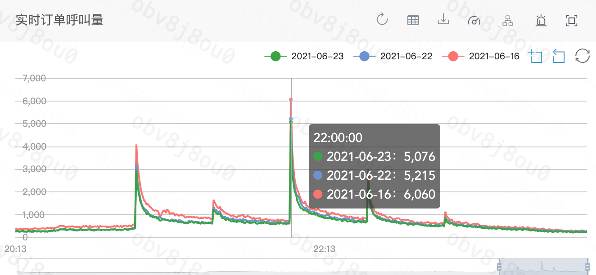
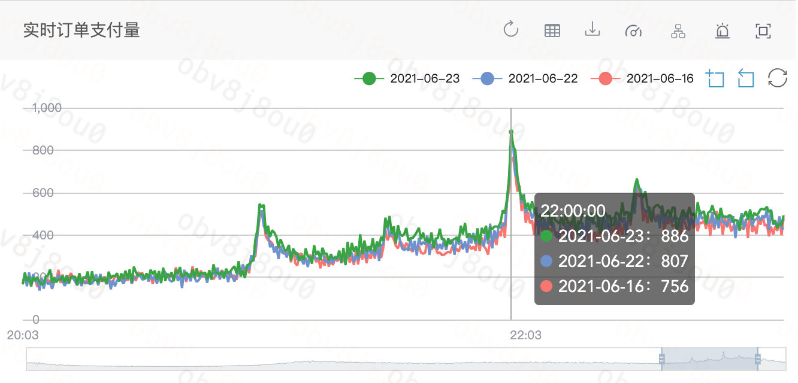
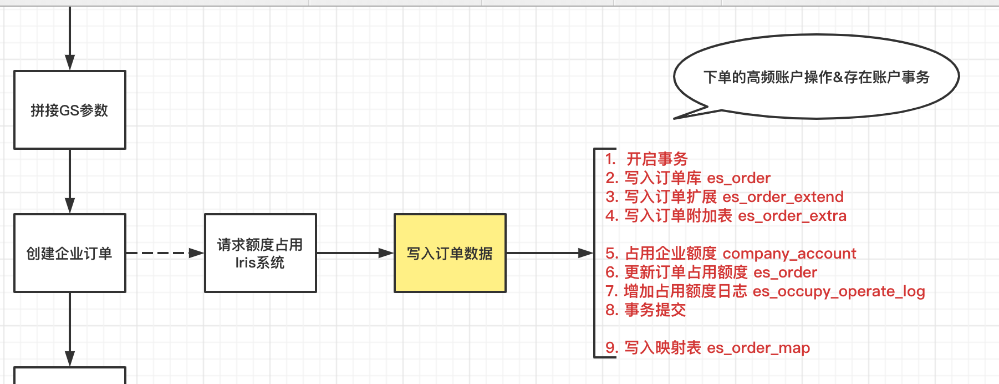
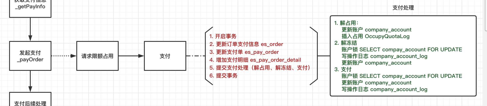
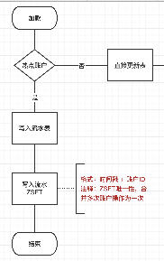

### 企业级热点账户产生

问题产生：晚高峰呼叫量和支付量会同时达到一个峰值

| 步骤 | 流程                                                         | 问题                                                         |
| :--- | :----------------------------------------------------------- | :----------------------------------------------------------- |
| 下单 |  | 同一个企业使用的是一个账户，存放在 es_company_account 表下单：反作弊逻辑会对账户额度进行一次占用(2 * 预估价)支付：解占用、解冻结、支付都会对账户进行额度变更下单和支付逻辑中的操作本身是原子性的，在最初的业务设计中全部放到事务中去处理了 |
| 支付 |  |                                                              |

### 解决方案

(1) ：新增延迟入账【流水表】，新增入账、出账数据先入【流水表】,通过定时任务将【流水表】入账和出账数据同步到业务数据表中，并且负责新增入账数据的缓存同步工作。

| 操作     | 流程                                                         | 详细过程                                                     | 备注                                                         |
| :------- | :----------------------------------------------------------- | :----------------------------------------------------------- | :----------------------------------------------------------- |
| 加款     |  | 1.最新的交易信息写入缓存+流水表（数据库操作和缓存操作放到一个事物里面）ZINCRBY key timestamp accountID | 1.加款主要有两种：用户认款 + 退款，两个操作都属于低频操作，可以考虑直接将将款过程变成数据库操作2.扣款操作从缓存直接操作，之前需要同步数据库数据到缓存3.Job除了需要完成加款操作，还可以做数据库和缓存之间的对账 |
| 扣款     |  | 额度扣减直接从缓存里面，并且写入交易流水（数据库操作和缓存操作在一个事物） |                                                              |
| 定时任务 |  |  |                                                              |

### 2:业界关于热点账户冲扣设计方案

1.并发度控制

同一时刻，对同一账户修改的请求数越多，这个账户的锁等待问题就越严重，所谓*并发度控制*就是要控制同一时刻对热点账户请求的数量，可以通过控制上游支付系统并发请求数据或者账务系统处理的并发请求数来实现。这一方案的缺点是对业务是有损的，当热点账户出现的时候，支付或者账务处理失败率会增加，用户的体验会变差，较大的银行或者第三方支付公司用地比较少。 ---- 目前Paris使用的方案

#### 2.汇总明细记账

实时的交易全部是insert账务明细（insert的开销很小，能够支持高并发。如果基于分布式部署，insert的并发容量理论上可以无限大），然后定时(比如每半个小时)将之前半个小时内的账务明细sum出一个结算总金额，一笔入账结算到指定账户。这个方案的缺点就是：交易不能实时入账，其实如果控制好定时汇总入账的频度，比如分钟级，用户也是可以接受的。这种方式对收单类业务（账户加钱）非常实用，但是对支出类业务（账户减钱）类来说，有账户透支地风险。

#### 3.缓冲入账

将实时同步的记账请求进行异步化，以达到记账实时性和系统稳定性之间平衡的记账手段，这就是”削峰填谷“。详细地讲，假如账务系统对同一个账户的处理阈值为100笔/s，24小时不间断服务(一天能处理86400000笔)。当业务高峰期来临的时候，热点账务的请求数会达到200笔/s。当账户的交易低于100笔/秒的时候，账务系统几乎还是实时地处理了记账请求，而当交易大于100笔/秒的时候，账务系统先返回结果，把账务处理丢到可靠的处理队列中，等并发量不大的时候慢慢消化，对用户来说感受到的体验还是很快就记账成功了。 　　这个方案是有个前提是：热点账户在某几个高峰时间点需要缓冲记账来削峰填谷，并且能在日间填完。一旦账户的日间交易量暴增，导致日间队列根本来不及消化，整个队列越来越长，那就不存在谷可以填，这时候肯定会带来用户大量的投诉。另外这种方案对支出类业务（账户减钱）来讲，也会有账户透支地风险

#### 4.子账户拆分

具体来讲就是创建与热点账户对应的多个影子账户，所述影子账户与所述账户的数据结构相同，将所述影子账户设置为隐藏，并将所述账户的余额分散至各个影子账户。当账务系统接收到账务请求的时候，通过前置进行hash分配（具体的hash函数会有更多方案）选择影子账户进行记账，这样就将原来对一个账户的请求分散到多个影子账户中，分散了账务热点。 　　这个方案也有缺点：通过算法选择的影子账户扣款，影子账户的余额可能是不足的，但账户的总余额是够的，这样可能影响账务处理的成功率。

#### 5.内存数据库+缓存入账

提高单台数据库服务器处理能力（I/O,CPU,memory）或者选取内存数据库实时地处理记账请求，然后异步地存储到可靠数据库上。

### 3：几种方案的对比

1：并发度控制

对单个账户并发操作进行限流降级控制，使得系统健康的完成入账出账操作，但是在并发很高的情况下还是会杀死很多正常的冲扣功能，会极大的提高冲扣的失败率，所以对我们账务系统来说不是允许的。

2：汇总明细入账

对账户的冲扣操作已流水的形式记录下来，通过定时job来将出入账流水更新到业务表中。这种做法对于频繁的入账来说性能提高明显，但是因为没有对总金额进行校验，对支出类业务（账户减钱）类来说，有账户透支地风险。并且对于金额的校验需要通过流水数据和当前可用余额来判定，有并发问题，计算很难准确。并且我们实际线上业务是【频繁出账，低频入账】，所以此办法不可取。

3：缓冲入账

需要动态判断流量低峰高峰，维护请求队列，有账户透支地风险，并且异步请求中结果不可控。

4：子账户拆分

子账户拆分方案中对于子账户的扣款进行负载，可以满足对同一账户的高频访问负载到其子账户上，极大满足了并发的需求，子账户的余额可能是不足的，但账户的总余额是够的，这样可能影响账务处理的成功率，并且处理对子账户的扣款和入账来说需要做到金额相对平均比较复杂，对记录账户期初余额期末余额处理涉及到并发，相对复杂。

5：内存数据库实时地处理记账,异步入库

使用redis做数据前置处理，将数据库中的热点账户金额初始同步到redis中，然后将操作记录流水，通过job定时任务刷新流水到业务表。这样将db和缓存分开极大的加大了并发性能，但是却衍生出来一个问题如下

假设redis初始金额为100，

（1） 当线程1对redis账户金额进行原子减操作时，剩余金额40,并记录流水表等待异步入账

（2） 当线程2对redis账户金额进行原子减操作时，剩余金额-20,此时金额已经为负，按照业务要求金额不能为负所以必须要做反向操作

（3） 当线程2还没有对redis余额进行反向操作维护的时候又出现线程3进行充值操作，此时金额又变成-20+100=80，已经出现金额混乱，对业务要求的期初余额期末余额无法准确的满足，所以对redis的金额进行同时冲扣会带来余额的并发问题。

但是对缓存进行操作和延迟批量流水入账可以极大的满足我们对性能的需求，所以在【2.汇总明细记账】和【5.内存数据库+缓存入账】的基础上进行改良来满足对我们的业务需求