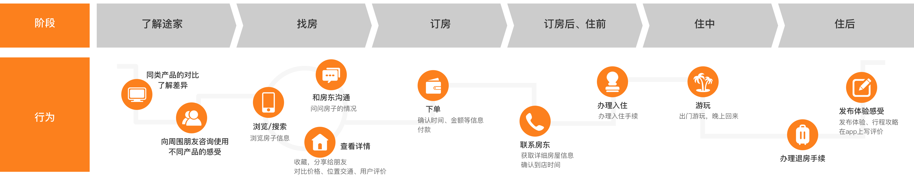

> 用户体验地图是通过“故事化+图形化”的方式，直观的展示用户在产品使用过程中的情绪曲线，帮助我们从全局视角审视产品。

## **一、概述**

**用户体验地图**User Experience Map，也被叫User/CustomerJourney Map，它是**用户增长策略**体系的一部分，是**产品优化**的重要工具。

它从用户视角了解产品流程，可以帮助我们找到用户的痛点、发现产品存在问题的阶段，从而有的放矢的进行优化，因此它更**适用于产品从1-∞的阶段**（0-1阶段的产品的用户是虚拟的、数据是缺失的，因此整个体验地图可靠性低）。

在日常工作中，用户体验地图通常是由产品或者用研团队负责，但是因为很多公司团队人员配置有限，以及随着全链路设计师、产品设计师等职位的推行，UI/UE设计师也需要去扩充自己的能力边界，参与体验地图的制作过程。

## **二、组成**

一个标准的用户体验地图一般包含以下三大组成部分：

1. **用户：**用户画像persona、用户目标user goals/needs；
2. **用户和产品：**用户行为doing、触点touch point、想法thinking、情绪曲线feeling/experience；
3. **产品机会：**痛点pain point、机会点opportunities。

如下图，**raileurope体验地图**，它的时间比较早，但因为非常全面和标准，包含体验地图相关的所有要素，至今仍然被各大公司当作参照的模板。

原版是英文，为了方便大家理解和参考，我把这个体验地图做了汉化。

因为体验地图完成整个步骤耗时长，时间成本和人力成本高。它**比较适合用来梳理产品的整体流程线和主业务线。**

当然，上面的3大部分内容不都是必须的，体验地图**也可以根据需求进行简化**。它适用于周期短、团队人员有限、分析产品业务支线的需求

——就如同Airtable的这个体验地图，直接分析用户的痛点和情绪，直接梳理用户的痛点、接触点、情绪，以表格的形式呈现。

## **三、为什么要做用户体验地图？**

1. 避免产品设计者和决策者的管理员视角，真正考虑用户要什么，而不是有什么放什么。
2. 能够帮助我们梳理场景中可能存在的问题，精准的找到用户的痛点，对产品优化更加有的放矢，提升用户体验。
3. 创建一个共同视角，团队中各环节的同事都能参与进来，对用户行为、痛点等内容达成一致，认同感强。利于各个环节工作的协调，对产品的用户体验达成共识、有效沟通和协作。

## **四、如何绘制用户体验地图？**

### 4.1 用户画像

本次主要通过途家的案例来示范如何制作一个标准的用户体验地图。

在产品的1-∞阶段的，通常团队内已经有构建好的用户画像，所以直接调用即可。

注意：如果产品的用户层跨度大，那么需要对不同的用户类型分别做体验地图。

### 4.2 用户目标

明确用户要完成的任务或者目标。 在案例中，用户的目标就是在整个订房流程中，他的要求，或者说需求。列出用户目标，可以让我们真正考虑用户在每个环节，想要的是什么

### 4.3 提炼用户行为

用户行为是用户在使用产品时的采取的行为、操作，通常是根据用户调研、用户追踪的资料进行收集整理。用户行为讲述的是每一个阶段用户的执行细节。

### 4.4 用户想法和情绪曲线

根据对应的阶段的用户行为，写下当时用户的思考和想法，可以将它们以便利贴的形式整理出来。

然后提炼用户每个节点的情绪，提炼情绪时，为了防止个人主观判断导致的误差，建议两个人一组用相同的数据进行提炼。

### **4.5 归纳痛点和机会点**

通过用户每个阶段的行为和情绪曲线，整理出每个阶段的痛点和问题；以及思考痛点背后的原因、此处是否可以采取什么措施，来满足用户的目标，提升用户的体验，这就是机会点。

### 4.6 后续工作

后续的工作首先是对体验地图进行整理和美化产出。然后整理出地图中的机会点，根据重要程度和难易程度来排出优先级来安排执行。优化用户体验地图中的痛点，帮助用户实现目标；或者确立新的产品功能的方向。

## **五、总结**

本文主要通过途家的示例讲述了用户体验地图的制作流程。

当然这只是一种标准的状态，实际工作中会灵活很多。比如如果产品已经很成熟，有稳定的客户跟踪渠道，那么就可以跳过123阶段，直接讨论4和5。

除此之外，体验地图的问题可能存在于产品五个要素中的任意一层，依次解决痛点只能是一种理想情况，以及同时存在用户目标和产品目标的冲突，但是无论如何，产品体验地图能够帮助我们从全局视角梳理产品，找到用户增长的问题点和空白点，聚焦决策点。

- 参考:

https://cdc.tencent.com/2016/08/31/suzymao/
