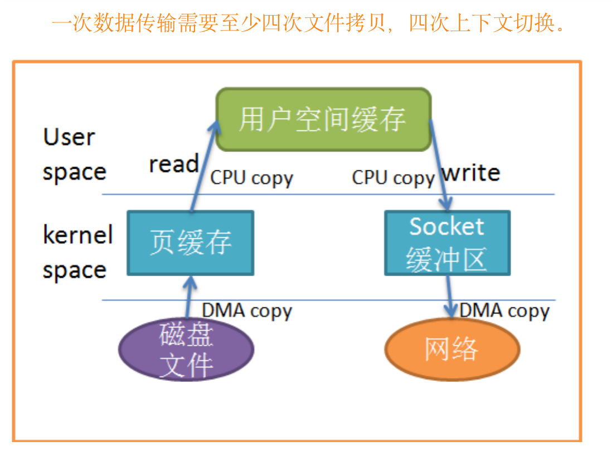
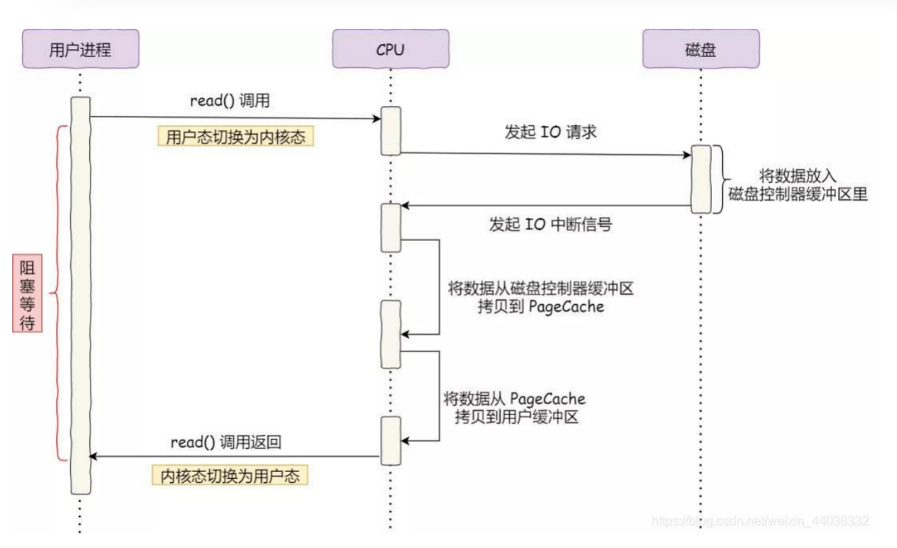
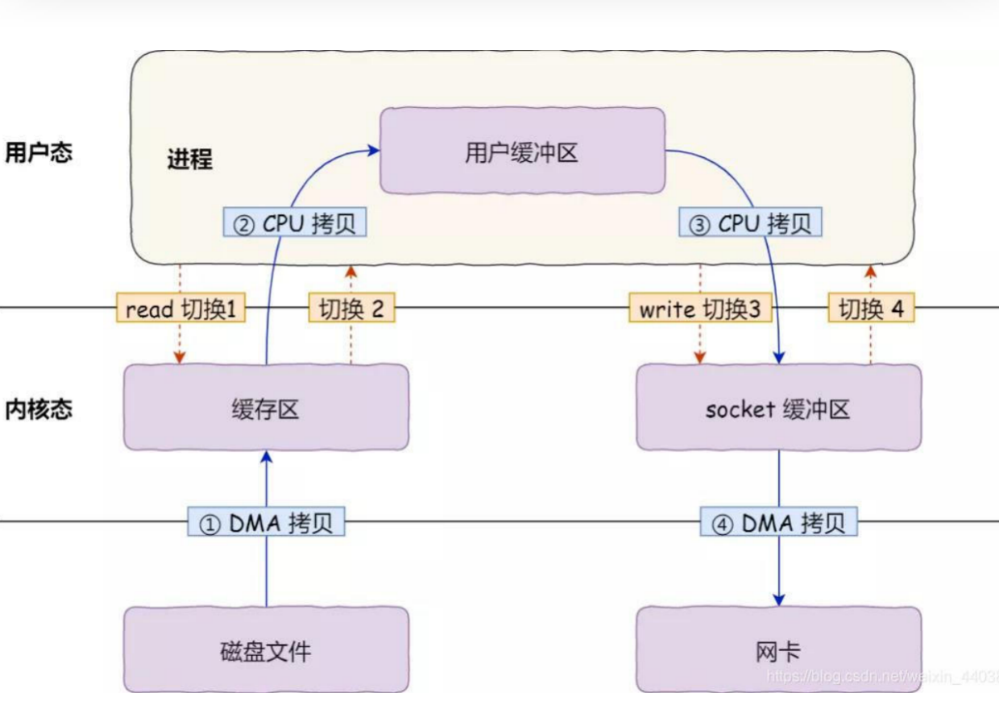
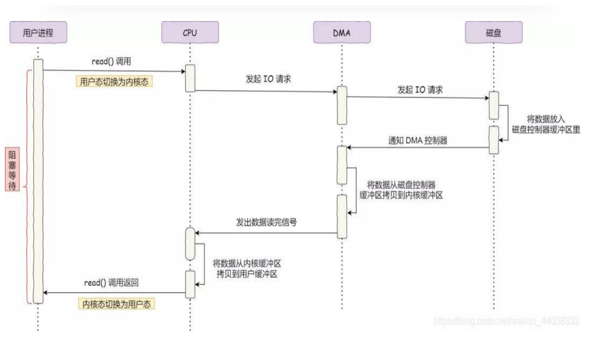
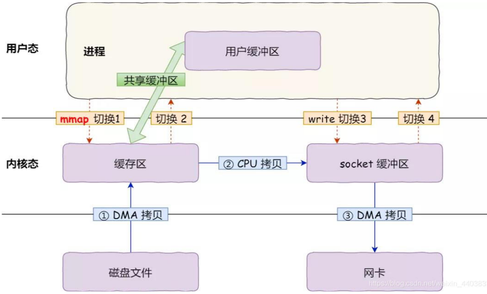
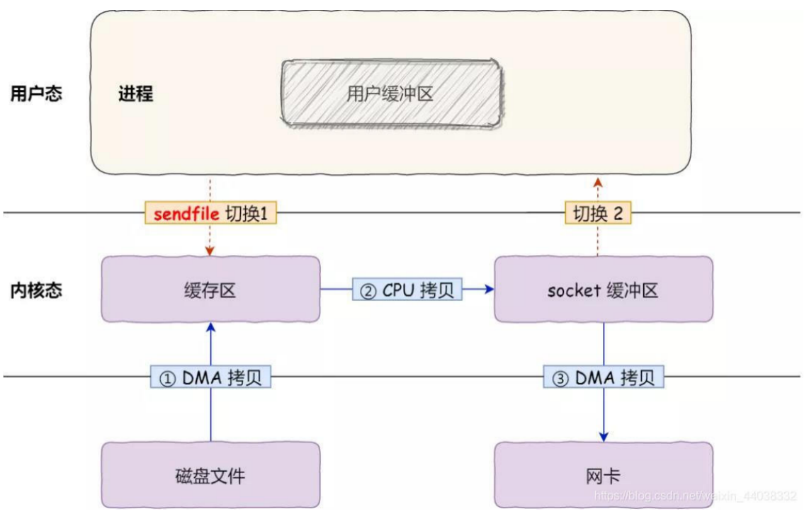

# 一、传统传输

考虑这样一种常用的情形：开发者需要将静态内容（类似图片、数据表、文件）展示给远程的用户。那么这个情形就意味着开发者需要先将静态内容从磁盘中拷贝出来放到一个内存buf中，然后将这个buf通过socket传输给用户，进而用户或者静态内容的展示。这看起来再正常不过了，但是实际上这是很低效的流程。

首先，read文件时，数据文件A拷贝到了内核态；之后，CPU控制将内核态数据复制到用户态下；调用write时，先将用户态下的内容复制到到内核态下的socket的buffer中；最后将内核态下的socket buffer的数据复制到网卡设备中传送。从上面的过程可以看出，数据白白从内核态到用户态走了一圈，浪费了2次copy。

# 二、DMA技术

在进行IO设备和内存的数据传输时，数据搬运的工作全部交给DMA控制器，CPU不参与任何与数据搬运相关的事，这样CPU就可以去处理别的事务。

在没有DMA之前，IO过程需要CPU全程参与，不能做其他事。解决以下问题：

- 1.cpu发出指令给磁盘控制器，然后返回。
- 2.磁盘控制器收到指令，开始准备数据，把数据放入到磁盘控制器的内部缓冲区中，然后产生一个中断。
- 3.cpu收到中断信号后，把手里活放下，把磁盘缓冲区的数据一个字节一个字节的读进寄存器，然后把寄存器的数据写入到内存，而在数据传输期间CPU无法执行其他任务。

**read调用流程**

1. 用户进程调用read方法，向操作系统发出IO请求，请求读取数据到自己的内存缓冲区中，进程进入阻塞状态。

2. 操作系统收到请求后，进一步将IO请求发送给DMA，然后CPU执行其他任务。

3. 磁盘收到DMA的IO请求，把数据从磁盘读取到磁盘控制器的缓冲区中，当磁盘控制器的缓冲区被读满，向DMA发起中断信号，告知缓冲区已满。
4. DMA收到磁盘缓冲区已满的信号后，将磁盘缓冲区的数据拷贝到内核缓冲区，此时不占用CPU，CPU可以执行其他任务。
5. 当DMA收集到足够多的数据后，发送中断信号给CPU
6. CPU收到DMA的信号，知道数据已经准备好，再将数据从内核拷贝到用户控件，系统调用返回。

有一定的优化，但是也存在这问题。期间上下文切换还是4次，一次数据传输需要至少拷贝四次数据，两次DMA拷贝，另外两次CPU拷贝。搬运一份数据，拷贝四份无疑消耗了CPU资源，多了很多不必要的开销，大大降低系统性能。

# 三、零拷贝技术的实现

## 1. mmap代替read()系统调用

read()可以把内核缓冲区数据拷贝到用户缓冲区，为了减少这一部分开销，用mmap()代替read()系统调用函数。

**调用流程**

- 系统调用mmap()之后，DMA会把磁盘的数据拷贝到内核的缓冲区里
- 应用进程和操作系统共享这个缓冲区
- 应用进程在调用write()，操作系统会直接将内核缓冲区的数据拷贝到socket缓冲区中，这一切都发生在内核态，由cpu来搬运数据。
- 最后，把内核的socket()缓冲区里的数据，拷贝到网卡的缓冲区中，这个过程由DMA搬运

mmap()代替read()减少了一次数据拷贝，但是cpu仍然需要把内核缓冲区数据拷贝到socket缓冲区，仍然需要4次上下文切换。

## 2. sendfile

sendfile()是一个专门发送文件的系统调用函数。
#include <sys/socket.h>
ssize_t sendfile(int out_fd,  int in_fd,   off_t *offset,   size_t count);
前两个参数分别是目的端和源端文件描述符，后面两个参数是源端偏移量和复制数据的长度，返回值是实际复制数据的长度。

代替前面的read()和write()系统调用，这样就可以减少一次系统调用，也就减少了两次上下文切换开销。
其次，该系统调用，可以直接把内核缓冲区里的数据拷贝到socket缓冲区里，不再拷贝到用户态，这样只有两次上下文切换，和三次数据拷贝。

## 3. PageCache  内存缓存磁盘数据

内核缓冲区实际上是磁盘高速缓存(PageCache)，我们可以用pageCache来缓存最近被访问的数据，当空间不足是淘汰最久未被访问过的缓存。

**优点**

缓存最近被访问的数据；预读功能。

**缺点**

在传输大文件的时候，PageCache不会起作用，那就会浪费DMA多做了一次数据拷贝，造成性能降低，即使使用了PageCache的零拷贝也会损失性能。

**大文件一般采用异步和直接io方式传输**

