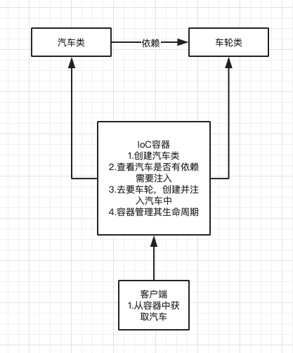

首先说明下，此次讲的内容是简述开发解耦而使用的服务容器，例如Laravel服务容器，而并不是Linux 的容器技术，例如Docker。有需要的话可以继续往下看。

在翻Laravel、Thinkphp等框架的手册的时候，在介绍中，总是提到了一个容器的概念，什么是容器呢？定义上讲，它是**类的依赖项通过构造函数，或者某些情况下通过「setter」方法「注入」到类中，用于管理类的依赖 和执行依赖注入的工具**。简单的说**容器就是一个装东西的，好比碗。而服务就是这个碗要装的饭呀，菜呀，等等东西。当我们需要饭时，我们就能从这个碗里拿到。如果你想在饭里加点菜（也就是饭依赖注入了菜），我们从碗里直接拿饭就可以了，而这些依赖都由容器解决了（这也就是控制反转）**。

那么为了更好的理解这个“夹菜吃饭”的过程，下面咱们慢慢了解下 依赖注入和控制反转都是什么。

一、什么是依赖注入？

从定义上讲，依赖注入是控制反转的一种实现方式。要实现控制反转，通常的解决方案是将创建被调用者实例的工作交由IoC容器来完成，然后在调用者中注入被调用者（一般通过构造器/方法注入实现），这样我们就实现了调用者和被调用者的解耦，该过程被成为依赖注入。

为了更好的解释下，我们可以讲依赖和注入的流程类比成，汽车与车轮的例子
```
# 这里的 car 的类依赖了 wheel 车轮的 类
class Car
{
    protected $wheel;
    public function __construct()
    {
        $this->wheel = new Wheel();
    }
}
```
**一个类需要另一个类才能进行作业，那么这也就是依赖**
```
# 这里的Car类依赖注入了Wheel类。
class Car
{
    protected $wheel;
    public function __construct(Wheel $wheel)
    {
        $this->wheel = $wheel;
    }
}
$car = new Car(new Wheel());
```
**将Wheel类外部创建加入到Car中，这种形式进行组合，可以称之为注入**
那么我们可以简单的认为**所需要的类通过参数的形式传入的就是依赖注入。**

二、控制反转又是什么？

控制反转（IoC）简单的讲就是说**将依赖类的控制权交出去，由主动变为被动。**要说明的的是，它不是什么技术，而是一种设计思想，它很好的体现了面向对象设计法则之一—— 好莱坞法则：“别找我们，我们找你”；即由IoC容器帮对象找相应的依赖对象并注入，而不是由对象主动去找。使用它意味着将你设计好的对象交给容器控制，而不是传统的在你的对象内部直接控制。

理解好IoC的关键是要明确“谁控制谁？控制什么？为何是反转？哪些方面反转了？”，如果理解这4个问题，你就可以很好的明白IoC是什么，参看图例效果更佳。

>（1）谁控制谁？控制什么？
>传统程序设计中，我们直接在对象内部通过new进行创建对象，是程序主动去创建依赖对象（可以简单了解下组合模式）。而IoC是有专门一个容器来创建这些对象，即由Ioc容器来控制对象的创建。那么是谁控制谁？当然是IoC 容器控制了对象。究竟控制什么？那就是主要控制了外部资源获取（不只是对象包括比如文件等）。

>（2）为何是反转？哪些方面反转了？
>有反转就有正转，传统应用程序是由我们自己在对象中主动控制去直接获取依赖对象，也就是正转；而反转则是由容器来帮忙创建及注入依赖对象。为何是反转？因为由容器帮我们查找及注入依赖对象，对象只是被动的接受依赖对象，所以是反转。哪些方面反转了？依赖对象的获取被反转了。




三、再来看什么是容器

容器**它的目的就是解耦依赖。**

依旧是汽车和轮子的例子，汽车有很多种不同的车轮（不同尺寸、品牌、等等）的情况。传统的写法如下
```
class Car
{
    protected $wheel;
    public function __construct(string $type)
    {
        if($type == 'a') $this->wheel = new WheelA();
        if($type == 'b') $this->wheel = new WheelB();
        else $this->wheel = new Wheel();
    }
}
```
劣势显而易见，如果我们又要增加一钟车轮，那我们又得对这个类进行修改。这样下去，这个类会变得庞大且耦合程度过高。那如何使用咱们今天的容器去解决这个问题呢？

首先我们先为这个轮子定义接口，他们都需要有相同的和汽车做对接的规范才能够被很好的安装。
```
    interface Wheel {
        public function type();
    }
    
    class WheelA implements Wheel {
        public function type(){
            echo '普通轮子A';
        }
    }
    
    class WheelB implements Wheel {
        public function type(){
            echo '普通轮子B';
        }
    }
    
    class Car
    {
        protected $wheel;
        public function __construct(Wheel $wheel)
        {
            $this->wheel = $wheel;
        }
    }
    $car = new Car(new WheelB());
```
可是这样也有问题，如果我们后续对这台汽车使用的轮子不满意要进行替换呢？ 我们又回到原点了，必须去修改传入的轮子类。那能不能做成可配置的呢？让我们简单实现一个容器。
```
class Container
{
    protected $binds;
    protected $instances;

    public function bind($abstract, $concrete)
    {
        if ($concrete instanceof Closure) {
            $this->binds[$abstract] = $concrete;
        } else {
            $this->instances[$abstract] = $concrete;
        }
    }

    public function make($abstract, $parameters = [])
    {
        if (isset($this->instances[$abstract])) {
            return $this->instances[$abstract];
        }

        array_unshift($parameters, $this);

        return call_user_func_array($this->binds[$abstract], $parameters);
    }
}
```
下面是见证奇迹的时刻。
```
    $container = new Container;
    
    $container->bind('Wheel', function($container){
        return new WheelA;
    });
    
    $container->bind('Car',function($container,$module){
        return new Car($container->make($module));
    });
    
    $car = $container->make('Car',['Wheel']);
```
解释一下
```
    bind(name,function($container){
        return new Name;
    })
    
    这里的name和Name之间的关系是：
    当我需要name类的时候你就给我实例化Name类。
    
    make(name)方法是对name进行生产返回一个实例。

    那么让咱们尝试下直接去更换车轮
    $container->bind('Wheel', function($container){
        return new WheelB;
    });
```

当然，真正的实际应用场景要比这几行代码要复杂的多得多，你心中的“容器”是什么样的呢？